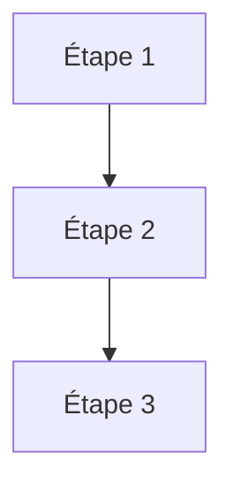

# Charte documentaire Forge

Document de référence interne pour la rédaction et la révision de toute documentation Forge.  
Toute nouvelle page ou refonte doit respecter ces règles avant d'être committée.

---

## 1. Principe général

La documentation Forge s'adresse en priorité à **deux profils** :

- un élève ou débutant Python qui suit une procédure depuis une VM Debian vierge ;
- un développeur Python expérimenté qui cherche une référence précise.

Une page doit être lisible par les deux. Elle ne présuppose pas de configuration implicite.  
Chaque page doit pouvoir être suivie telle quelle, sans aller chercher d'autres onglets.

---

## 2. Structure d'une page

### 2.1 Patron général

```
# Titre court (h1 unique par page)

[bandeau HTML optionnel pour les starters]

[cards de résumé optionnelles]

[!!! abstract ou !!! tip si applicable]

---

## Section 1

## Section 2

...

---

## Dépannage rapide   ← obligatoire pour les guides procéduraux

## Reconstruction     ← si applicable
```

### 2.2 Règles sur les titres

| Niveau | Usage |
|---|---|
| `#` (h1) | Titre de page — un seul par fichier |
| `##` (h2) | Sections principales |
| `###` (h3) | Sous-sections |
| `####` (h4) | Exceptionnellement pour des blocs très détaillés |

- **Pas de sommaire manuel.** MkDocs génère la table des matières automatiquement.
- **Pas d'ancres HTML** (`<a id="..."></a>`). MkDocs génère les ancres à partir des titres.
- Les titres h2 des guides procéduraux sont numérotés : `## 1. Titre`, `## 2. Titre`, etc.
- Les titres h2 des pages de référence ne sont pas numérotés.

---

## 3. Conventions de code

### 3.1 Blocs de code

Toujours annoter la langue :

```
```bash       ← commandes shell
```python     ← code Python
```env        ← fichiers d'environnement
```json       ← fichiers JSON
```sql        ← requêtes SQL
```text       ← sorties texte, arborescences, pseudo-code
```jinja2     ← templates Jinja
```

- Pas de `$` devant les commandes bash (facilite le copier-coller).
- Chaque bloc bash contient une seule opération logique sauf si les commandes sont destinées à être copiées ensemble.

### 3.2 Fichiers d'environnement

Le fichier d'environnement Forge s'appelle `env/dev` (pas `.env`).

Variables administrateur MariaDB :
```env
DB_ADMIN_HOST=localhost
DB_ADMIN_PORT=3306
DB_ADMIN_LOGIN=root
DB_ADMIN_PWD=<mot_de_passe_root_mariadb>
```

**Règle** : la procédure principale utilise `root` avec mot de passe. `forge_admin` n'apparaît que dans une `!!! note "Recommandation"` optionnelle.

Ne jamais montrer `DB_ADMIN_PWD=` (vide) comme exemple valide.

### 3.3 Commandes Forge

| Commande | Ortographe exacte |
|---|---|
| Initialiser la base | `forge db:init` |
| Appliquer le SQL | `forge db:apply` |
| Lister les routes | `forge routes:list` |
| Vérifier l'env | `forge doctor` |
| Créer une entité | `forge make:entity NomEntite` |
| Générer le modèle | `forge build:model` |
| Générer le CRUD | `forge make:crud NomEntite` |
| Vérifier le modèle | `forge check:model` |
| Construire un starter | `forge starter:build N` |

---

## 4. Admonitions

Utiliser les admonitions Material MkDocs selon ces règles strictes :

| Type | Quand l'utiliser |
|---|---|
| `!!! tip` | Raccourci, astuce non obligatoire, commande rapide alternative |
| `!!! note` | Information complémentaire, recommandation optionnelle |
| `!!! warning` | Risque d'erreur fréquente, ordre à respecter, point d'attention |
| `!!! success` | Checkpoint — "Avant de continuer, vérifier que…" |
| `!!! danger` | Fichier régénérable à ne pas modifier, perte de données possible |
| `!!! abstract` | Présentation du but pédagogique d'une page (starters uniquement) |
| `!!! info` | Note neutre, limite assumée |
| `??? example` | Exemple long à masquer par défaut (JSON canonique complet, script, etc.) |

**Règle** : maximum 2 admonitions consécutives. Ne pas empiler 3 admonitions d'affilée.

---

## 5. Diagrammes Mermaid

Ajouter un diagramme Mermaid pour :

- le cycle de vie d'une requête ;
- le parcours de développement d'un starter ;
- l'architecture d'entités et leurs relations ;
- tout flux qui implique plus de 3 étapes séquentielles.

Ne pas ajouter de diagramme pour :
- une liste simple (utiliser une table ou une liste à puces) ;
- un bloc de code qui se suffit à lui-même.

Format standard :

````

````

---

## 6. Terminologie officielle

Utiliser exclusivement ces termes :

| Terme correct | Terme à éviter |
|---|---|
| `env/dev` | `.env`, `fichier env`, `fichier de configuration` |
| modèle canonique | modèle JSON, descripteur, schéma |
| projection | fichier dérivé, sortie |
| fichier généré | fichier auto-généré |
| fichier manuel | fichier applicatif |
| `forge db:init` | initialisation MariaDB, création de la base |
| compte administrateur MariaDB | compte root, user admin |
| `DB_ADMIN_LOGIN` / `DB_ADMIN_PWD` | `DB_ADMIN_USER` / `DB_ADMIN_PASSWORD` |
| `DB_APP_LOGIN` / `DB_APP_PWD` | `DB_APP_USER` / `DB_APP_PASSWORD` |
| `core/` | noyau, framework core |
| `mvc/` | couche applicative |
| VM Debian vierge | machine vierge, nouvelle VM |

---

## 7. Structure des pages procédurales (guides, starters)

Toute page procédurale suivie par un élève doit respecter ce patron :

```
## Prérequis

### Prérequis généraux
[liste courte]

### Prérequis spécifiques
[liste courte]

---

## Partie 1 — Installer Forge sur une VM Debian vierge
[si la page peut être utilisée sur une VM vierge]

### 1. Mettre à jour Debian
### 2. Installer les dépendances système
### 3. Activer pipx dans le PATH
### 4. Démarrer MariaDB
### 5. Vérifier l'accès administrateur MariaDB
### 6. Installer Forge avec pipx

---

## Partie 2 — [Titre de l'action principale]

[procédure]

---

## Dépannage rapide
[table des erreurs fréquentes]
```

---

## 8. Pages de référence

Une page de référence décrit ce qui **existe**, pas comment l'utiliser.

Structure :
- Tables de commandes avec colonnes : Commande | Description | Options principales
- Tables d'API avec colonnes : Méthode/Propriété | Type | Description
- Pas de narrative
- Pas d'exemples détaillés (les renvoyer vers le guide)
- Pas de numérotation des sections

---

## 9. Anti-patterns à éliminer

| Anti-pattern | Raison | Correction |
|---|---|---|
| Sommaire manuel avec liens internes | Devient désynchronisé | Supprimer — MkDocs génère la TOC |
| `<a id="section-name"></a>` | Ancre HTML obsolète | Supprimer — MkDocs génère les ancres |
| `DB_ADMIN_PWD=` (vide) | Exemple invalide en production | Utiliser `<mot_de_passe_root_mariadb>` |
| `forge_admin` dans l'exemple principal | Complexifie inutilement | Réserver à `!!! note "Recommandation"` |
| `unix_socket` comme procédure principale | Ne fonctionne pas pour les élèves | Mentionner en avertissement, pas en procédure |
| Section installation incomplète (sans MariaDB dev, sans pipx) | Plante sur VM vierge | Utiliser la liste complète de la Partie 1 |
| Méga-fichier tout-en-un | Difficile à maintenir et à naviguer | Découper en pages thématiques |
| Explication de ce que fait le code dans les commentaires | Redondant | Nommer le code explicitement, ne commenter que le pourquoi |

---

## 10. Installation système de référence

Le bloc `apt install` de référence, à utiliser dans toute page procédurale :

```bash
sudo apt install -y \
  git \
  curl \
  ca-certificates \
  build-essential \
  pkg-config \
  python3 \
  python3-venv \
  python3-pip \
  pipx \
  mariadb-server \
  mariadb-client \
  libmariadb-dev \
  openssl
```

Vérification minimale après installation :

```bash
python3 --version
git --version
pipx --version
mariadb --version
mariadb_config --version
openssl version
```

---

## 11. Longueur et découpage

| Type de page | Longueur cible | Maximum absolu |
|---|---|---|
| Guide procédural complet | 400–800 lignes | 1 000 lignes |
| Page de référence | 300–600 lignes | 900 lignes |
| Page conceptuelle | 100–250 lignes | 400 lignes |
| Page starter | 200–600 lignes | 900 lignes |

Si une page dépasse le maximum absolu, la découper en sous-pages dans la navigation.

---

## 12. Checklist avant commit

- [ ] Pas de sommaire manuel ni d'ancre HTML
- [ ] Tous les blocs de code ont une annotation de langue
- [ ] `DB_ADMIN_LOGIN=root` avec mot de passe (pas vide, pas `forge_admin` en exemple)
- [ ] `forge_admin` absent sauf dans une `!!! note "Recommandation"`
- [ ] Admonitions ≤ 2 consécutives
- [ ] Les pages procédurales ont une section "Dépannage rapide"
- [ ] Les pages compatibles VM vierge ont une "Partie 1"
- [ ] Terminologie officielle respectée (voir section 6)
- [ ] Longueur dans les limites (section 11)
