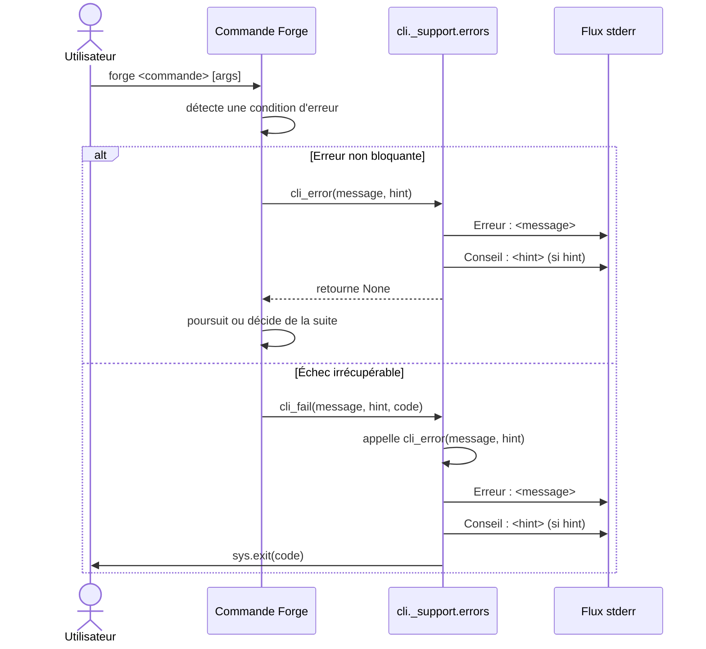

# Les erreurs CLI dans Forge

Ce document décrit les helpers d'erreur standardisés du CLI Forge.
Il explique comment une commande signale un échec à l'utilisateur, où part le message et quel code de sortie est utilisé.
Le fichier de code correspondant est `cli/_support/errors.py`.

## 1. Rôle

Ce module fournit deux fonctions pour signaler une erreur de commande de façon uniforme.
Toutes les commandes Forge partagent la même mise en forme et la même convention de flux.
Le message d'erreur part toujours sur `stderr`, jamais sur `stdout`.

La convention de rendu est constante :

```text
Erreur : <message>
Conseil : <suggestion>   (optionnel)
```

Le code de sortie par défaut est `1`, qui signale une erreur utilisateur.
La ligne `Conseil :` n'est émise que si un `hint` non vide est fourni.

## 2. Vue d'ensemble rapide

| Élément | Valeur |
|---|---|
| Module Python | `cli._support.errors` |
| Catégorie | outillage CLI (support partagé) |
| Rôle | signaler une erreur de commande de façon uniforme |
| Entrées | un message, un conseil facultatif, un code de sortie |
| Sorties | texte sur `stderr` ; `cli_fail` termine le processus |
| Flux | `stderr` uniquement (jamais `stdout`) |
| Code de sortie par défaut | `1` (erreur utilisateur) |
| Mode Forge | affiche (écrit un message, ne touche aucun fichier) |
| ADR | ADR-043 (regroupement de la racine `cli/`) |

Ce module est un point de passage de frontière : il se trouve entre le code métier d'une commande et le terminal de l'utilisateur ou un pipeline CI.

## 3. Schémas UML

Le diagramme suivant montre le déroulé d'un signalement d'erreur depuis une commande jusqu'au terminal.

### 3.1 Diagramme de séquence

Le diagramme de séquence montre l'ordre des opérations quand une commande échoue.
Il permet de comprendre la différence entre `cli_error`, qui n'interrompt pas, et `cli_fail`, qui termine le processus.



À retenir :

- le message d'erreur part toujours sur `stderr` ;
- `cli_error` affiche puis rend la main à la commande ;
- `cli_fail` réutilise `cli_error`, puis termine le processus avec `sys.exit` ;
- le code de sortie non nul permet à un pipeline CI de détecter l'échec.

## 4. API publique

Les deux fonctions ci-dessous sont les seules exposées par le module.

| Fonction | Signature | Rôle |
|---|---|---|
| `cli_error` | `cli_error(message: str, hint: str = "") -> None` | affiche l'erreur sur `stderr` sans terminer le processus |
| `cli_fail` | `cli_fail(message: str, hint: str = "", code: int = 1) -> NoReturn` | affiche l'erreur sur `stderr` puis termine le processus avec `sys.exit(code)` |

Le paramètre `hint` est facultatif : s'il est vide, la ligne `Conseil :` n'est pas émise.
`cli_fail` est typée `NoReturn` : l'appel ne rend jamais la main.

## 5. Contextes d'utilisation

| Besoin | Fonction |
|---|---|
| Signaler une saisie invalide sans interrompre la commande | `cli_error(...)` |
| Interrompre la commande avec un code retour non nul | `cli_fail(...)` |
| Permettre à un pipeline CI de détecter l'échec | `cli_fail(...)` (code de sortie non nul) |
| Guider l'utilisateur vers la correction | passer un `hint` à l'une des deux fonctions |

## 6. Exemples d'utilisation

Les exemples suivants montrent les usages courants depuis le code d'une commande.

Signaler un échec irrécupérable avec un conseil, en terminant le processus :

```python
from cli._support.errors import cli_fail

if len(args) < 2:
    cli_fail(
        "argument manquant pour «forge new».",
        hint="indique le nom du projet. Exemple : forge new GestionVentes",
    )
```

Sortie produite sur `stderr` :

```text
Erreur : argument manquant pour «forge new».
Conseil : indique le nom du projet. Exemple : forge new GestionVentes
```

Signaler une erreur sans interrompre la commande :

```python
from cli._support.errors import cli_error

cli_error("fichier de configuration absent")
```

Sortie produite sur `stderr` (sans ligne `Conseil :`, car `hint` est vide) :

```text
Erreur : fichier de configuration absent
```

## 7. Détails techniques

!!! note "Flux de sortie"
    Le message d'erreur part toujours sur `stderr`.
    Cela laisse `stdout` réservé à la sortie utile de la commande, ce qui simplifie le filtrage en CI et dans les scripts.

!!! tip "Code de sortie"
    Le code de sortie par défaut de `cli_fail` est `1`, qui signale une erreur utilisateur.
    Un appelant peut passer un autre code via le paramètre `code` pour distinguer plusieurs types d'échec.

## Voir aussi

- [Le formatage de sortie CLI](output.md) : tags de statut sur la sortie standard.
- [L'aide générale du CLI](help.md) : sommaire global des commandes.
- [L'aide par commande](help_dispatch.md) : aide détaillée d'une commande donnée.
