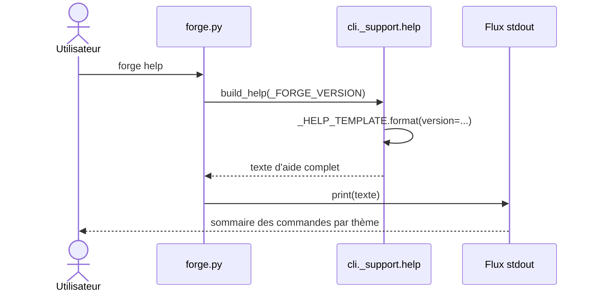

# L'aide générale du CLI dans Forge

Ce document décrit le texte d'aide global affiché par `forge help` et `forge --help`.
Il explique le rôle du sommaire des commandes et la façon dont la version y est injectée.
Le fichier de code correspondant est `cli/_support/help.py`.

## 1. Rôle

Ce module porte le sommaire de toutes les commandes Forge.
Il regroupe les commandes par thème : Projet, Entités, Pages publiques, Base de données, Sécurité, opt-ins et autres.
C'est la vue d'ensemble qu'un utilisateur voit en premier quand il lance `forge` sans argument.

Le module ne documente pas chaque commande en détail : c'est le rôle de l'aide par commande.
Voir l'aide par commande pour le détail d'une commande précise.

## 2. Vue d'ensemble rapide

| Élément | Valeur |
|---|---|
| Commande Forge | `forge help`, `forge --help`, `forge -h`, ou `forge` sans argument |
| Module Python | `cli._support.help` |
| Catégorie | outillage CLI (support partagé) |
| Rôle | afficher le sommaire de toutes les commandes, groupées par thème |
| Entrées | le numéro de version, passé par l'appelant |
| Sorties | le texte d'aide complet sur `stdout` |
| Fichiers touchés | aucun |
| Mode Forge | affiche (n'écrit aucun fichier) |
| ADR | ADR-043 (regroupement de la racine `cli/`) |

Le texte est porté par un gabarit interne (`_HELP_TEMPLATE`).
La version est passée par l'appelant : ce module ne lit pas lui-même `pyproject.toml`.

## 3. Schémas UML

Le diagramme suivant montre comment `forge help` produit son sommaire.

### 3.1 Diagramme de séquence

Le diagramme de séquence montre l'enchaînement depuis l'invocation utilisateur jusqu'à l'affichage du sommaire.
Il permet de voir que la version vient de l'appelant (`forge.py`), pas du module d'aide lui-même.



À retenir :

- `forge.py` fournit le numéro de version au module d'aide ;
- le module formate le gabarit interne et retourne le texte ;
- l'affichage est fait par l'appelant, pas par le module ;
- le même sommaire répond à `forge help`, `forge --help`, `forge -h` et `forge` sans argument.

## 4. API publique

Le module expose une seule fonction.

| Fonction | Signature | Rôle |
|---|---|---|
| `build_help` | `build_help(version: str) -> str` | construit le texte d'aide complet en y injectant le numéro de version |

L'invocation côté utilisateur :

```text
forge help
forge --help
forge -h
forge            # sans argument : même sommaire
```

## 5. Contextes d'utilisation

| Besoin | Commande |
|---|---|
| Afficher le sommaire complet | `forge help` |
| Afficher le sommaire avec un drapeau | `forge --help` ou `forge -h` |
| Découvrir les commandes disponibles | `forge` sans argument |
| Repérer la commande utile par thème | parcourir les groupes du sommaire |

## 6. Exemples d'utilisation

Afficher le sommaire complet depuis le terminal :

```bash
forge help
```

Début de la sortie produite :

```text
Forge 1.0.0rc3 - Framework MVC Python

  forge <commande> [arguments]

Projet
  new <NomProjet>    Crée un nouveau projet Forge.
  run                Lance Forge (dev) ou affiche la stratégie WSGI (prod).
  ...
```

Construire le texte depuis du code Python :

```python
from cli._support.help import build_help

print(build_help("1.0.0rc3"))
```

## 7. Détails techniques

!!! note "Version injectée par l'appelant"
    Le module ne lit pas `pyproject.toml`.
    Le numéro de version est passé par `forge.py`, ce qui garde le module d'aide simple et sans dépendance de configuration.

!!! tip "Sommaire et aide détaillée"
    Le sommaire reste volontairement compact : une ligne par commande.
    Pour le détail d'une commande (usage, effets, prérequis, options), utiliser `forge <commande> --help`, géré par l'aide par commande.

## Voir aussi

- [L'aide par commande](help_dispatch.md) : aide détaillée d'une commande donnée.
- [Le formatage de sortie CLI](output.md) : tags de statut.
- [Les erreurs CLI](errors.md) : sortie d'erreur et code retour.
