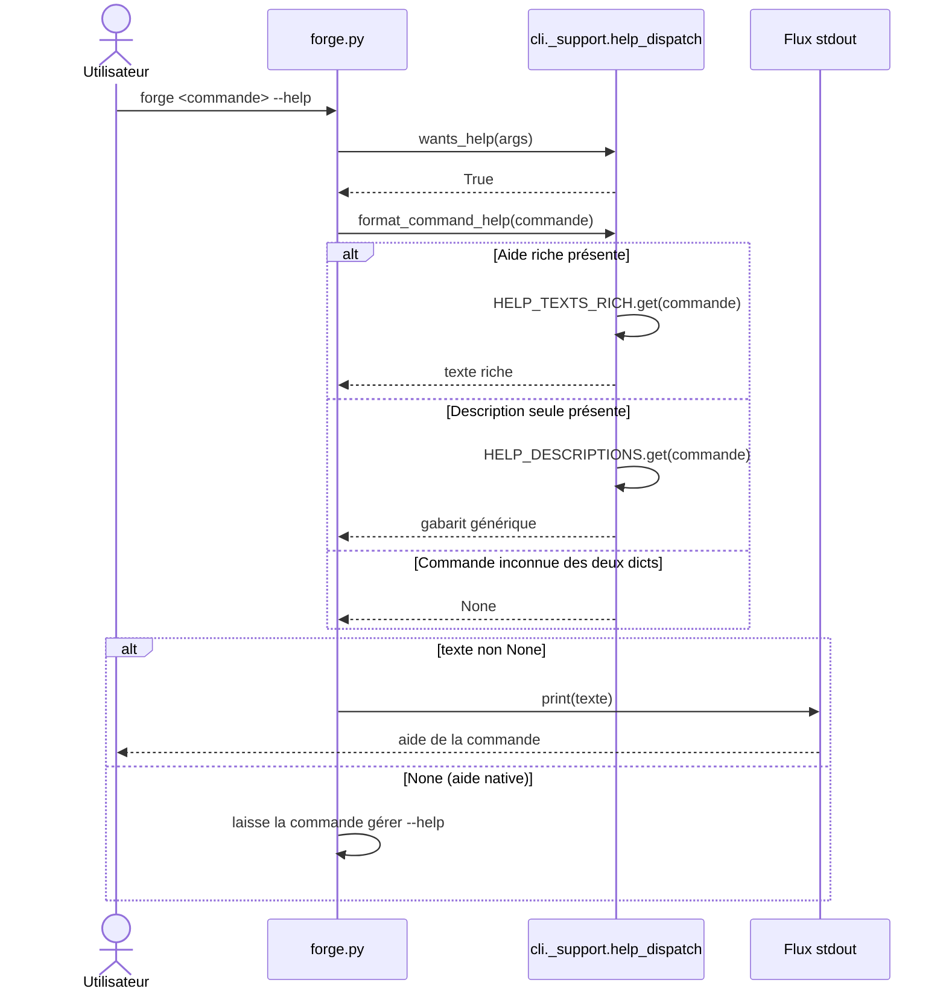

# L'aide par commande dans Forge

Ce document décrit l'interception centrale des drapeaux `--help` et `-h` pour les commandes du CLI Forge.
Il explique comment Forge fournit une aide détaillée aux commandes qui ne la gèrent pas elles-mêmes.
Le fichier de code correspondant est `cli/_support/help_dispatch.py`.

## 1. Rôle

Certaines commandes Forge ne gèrent pas elles-mêmes le drapeau `--help`.
Ce module fournit une aide centralisée pour ces commandes, sans toucher à leur `main()`.

Les commandes qui possèdent déjà une aide native ne sont pas listées ici.
C'est le cas des commandes argparse (par exemple `auth:user:*`) et de celles qui font déjà un contrôle manuel de `--help` (par exemple `make:entity`, `make:relation`, `db:apply`, `migration:make`, `module:*`).
Leur propre `main()` reste responsable d'afficher leur aide détaillée.

L'architecture repose sur deux dictionnaires :

- `HELP_TEXTS_RICH` porte l'aide longue par commande (Usage, Description, Effets, Prérequis, Options, Limites).
- `HELP_DESCRIPTIONS` porte une description d'une seule ligne, qui sert de filet de sécurité.

Si une commande figure dans `HELP_DESCRIPTIONS` sans entrée riche correspondante, un gabarit générique est produit automatiquement.
Aucune commande connue n'est ainsi laissée sans aide.

## 2. Vue d'ensemble rapide

| Élément | Valeur |
|---|---|
| Commande Forge | `forge <commande> --help` ou `forge <commande> -h` |
| Module Python | `cli._support.help_dispatch` |
| Catégorie | outillage CLI (support partagé) |
| Rôle | intercepter `--help` / `-h` et retourner l'aide d'une commande |
| Entrées | les arguments de ligne de commande, le nom de la commande |
| Sorties | le texte d'aide d'une commande, ou `None` si non gérée |
| Drapeaux reconnus | `--help`, `-h` (ensemble figé `HELP_FLAGS`) |
| Mode Forge | affiche (n'écrit aucun fichier) |
| Ticket | CLI-HELP-FLAGS-DISPATCHER-001 et suivants ; ADR-043 |

L'interception est faite par `forge.py` avant toute exécution métier : le drapeau d'aide arrête la commande avant qu'elle ne fasse quoi que ce soit.

## 3. Schémas UML

Le diagramme suivant montre l'interception du drapeau d'aide et la résolution du texte.

### 3.1 Diagramme de séquence

Le diagramme de séquence montre l'ordre des opérations quand un utilisateur ajoute `--help` à une commande.
Il permet de comprendre la priorité de l'aide riche sur le gabarit générique, et le cas où aucune aide centrale n'existe.



À retenir :

- `wants_help` détecte le drapeau d'aide dans les arguments ;
- `format_command_help` cherche d'abord l'aide riche, puis la description ;
- une commande inconnue des deux dictionnaires retourne `None` ;
- quand le retour est `None`, `forge.py` laisse la commande gérer son propre `--help`.

## 4. API publique

Le module expose deux fonctions et un ensemble de drapeaux.

| Symbole | Signature | Rôle |
|---|---|---|
| `HELP_FLAGS` | `frozenset[str]` | ensemble figé des drapeaux reconnus (`--help`, `-h`) |
| `wants_help` | `wants_help(args: list[str]) -> bool` | retourne `True` si un drapeau d'aide figure dans `args` |
| `format_command_help` | `format_command_help(command: str) -> str \| None` | retourne le texte d'aide d'une commande, ou `None` si non gérée |

`format_command_help` cherche d'abord l'aide riche dans `HELP_TEXTS_RICH`.
À défaut, il construit un texte court depuis `HELP_DESCRIPTIONS`.
Il renvoie `None` quand la commande n'est connue d'aucun des deux dictionnaires.

L'invocation côté utilisateur :

```text
forge <commande> --help
forge <commande> -h
```

## 5. Contextes d'utilisation

| Besoin | Élément |
|---|---|
| Afficher l'aide d'une commande sans aide native | `forge <commande> --help` |
| Détecter le drapeau d'aide dans les arguments | `wants_help(args)` |
| Résoudre le texte d'aide d'une commande | `format_command_help(command)` |
| Garantir une aide cohérente sans modifier le code de la commande | `HELP_TEXTS_RICH` ou `HELP_DESCRIPTIONS` |

## 6. Exemples d'utilisation

Afficher l'aide détaillée d'une commande depuis le terminal :

```bash
forge settings:init --help
```

Sortie produite (extrait) :

```text
Usage:
  forge settings:init

Description:
  Prépare la migration SQL de l'opt-in forge-mvc-settings (table app_settings)
  dans mvc/migrations/, sans exécuter de SQL.
...
```

Utiliser les fonctions depuis du code Python :

```python
from cli._support.help_dispatch import format_command_help, wants_help

if wants_help(["settings:init", "--help"]):
    texte = format_command_help("settings:init")
    if texte is not None:
        print(texte)
```

## 7. Détails techniques

!!! note "Deux dictionnaires, une priorité"
    `HELP_TEXTS_RICH` porte l'aide longue ; `HELP_DESCRIPTIONS` porte une ligne par commande.
    L'aide riche est consultée en priorité.
    Une commande présente uniquement dans `HELP_DESCRIPTIONS` reçoit un gabarit générique (Usage, Description, Options), sans effet de bord.

!!! tip "Commandes à aide native"
    Les commandes argparse et celles qui contrôlent déjà `--help` ne figurent pas dans ce module.
    Leur `main()` reste responsable de leur aide détaillée, et `format_command_help` retourne `None` pour elles.

!!! warning "Garde-fou de classification"
    Une commande dispatchée par `forge.py`, absente des deux dictionnaires et sans aide native, déclenche une erreur de test.
    Le garde-fou se trouve dans `tests/meta/test_cli_help_flags_closing_audit_001.py`.
    Aucune commande ne peut ainsi être livrée sans aide.

## Voir aussi

- [L'aide générale du CLI](help.md) : sommaire global des commandes.
- [Le formatage de sortie CLI](output.md) : tags de statut.
- [Les erreurs CLI](errors.md) : sortie d'erreur et code retour.
