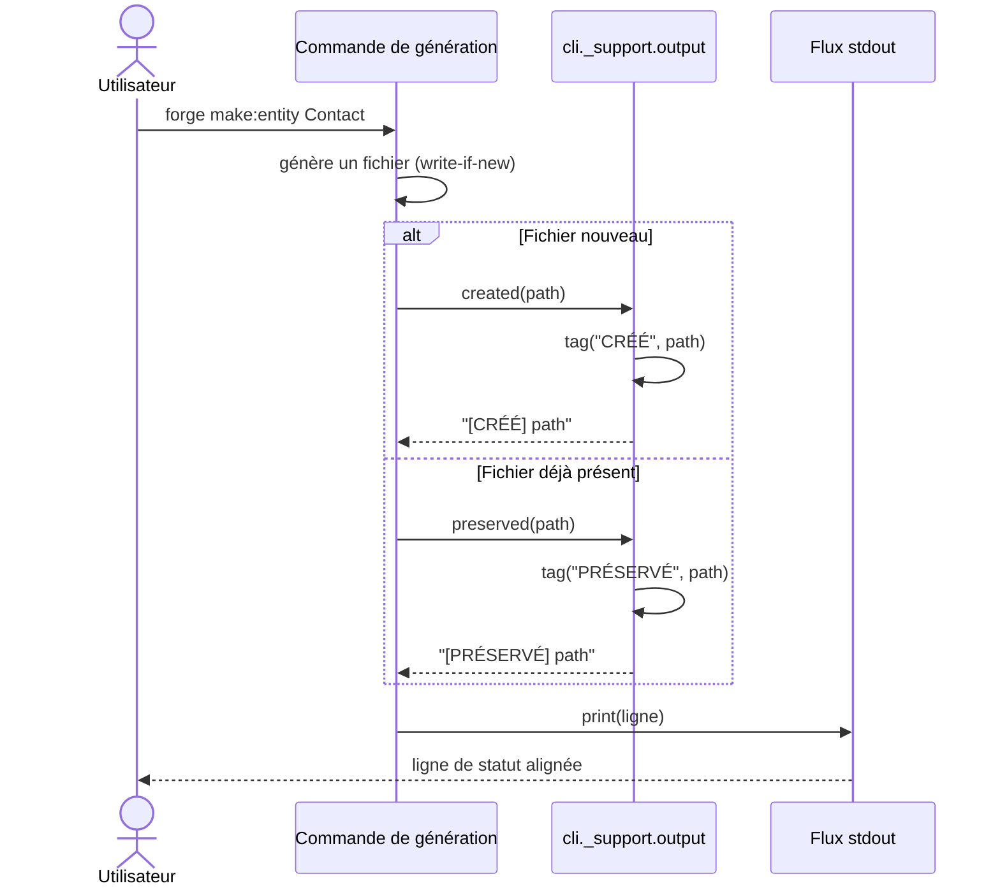

# Le formatage de sortie CLI dans Forge

Ce document décrit les helpers de formatage des messages du CLI Forge.
Il explique comment les commandes affichent des lignes de statut alignées et cohérentes.
Le fichier de code correspondant est `cli/_support/output.py`.

## 1. Rôle

Ce module centralise le formatage des messages tagués émis par les commandes Forge.
Un tag est une étiquette courte placée en tête de ligne, par exemple `[CRÉÉ]` ou `[PRÉSERVÉ]`.
Toutes les commandes passent par ce module pour que la sortie partage le même vocabulaire visuel et le même alignement.

Chaque fonction construit une chaîne de caractères, elle ne l'affiche pas elle-même.
L'appelant reste libre d'utiliser `print` ou un autre flux.

## 2. Vue d'ensemble rapide

| Élément | Valeur |
|---|---|
| Module Python | `cli._support.output` |
| Catégorie | outillage CLI (support partagé) |
| Rôle | formater les lignes de statut taguées des commandes |
| Entrées | un label et un message, ou un chemin |
| Sorties | une chaîne formatée, label aligné sur 12 caractères |
| Mode Forge | affiche (construit du texte, ne touche aucun fichier) |
| ADR | ADR-043 (regroupement de la racine `cli/`) |

Le label est aligné à gauche sur une largeur fixe de 12 caractères, ce qui aligne verticalement les messages d'une même commande.

## 3. Schémas UML

Le diagramme suivant montre comment une commande de génération produit ses lignes de statut.

### 3.1 Diagramme de séquence

Le diagramme de séquence montre l'enchaînement entre une commande de génération et le module de formatage.
Il permet de voir que le module produit une chaîne, que la commande affiche ensuite.



À retenir :

- le module construit la chaîne, mais ne l'affiche pas ;
- `[CRÉÉ]` et `[PRÉSERVÉ]` traduisent le mode write-if-new de Forge ;
- le label est aligné sur 12 caractères pour des lignes lisibles ;
- la commande choisit le tag selon le résultat de l'opération.

## 4. API publique

`tag` est le constructeur générique ; les autres fonctions sont des raccourcis nommés.

| Fonction | Signature | Rôle |
|---|---|---|
| `tag` | `tag(label: str, message: str) -> str` | construit une ligne `[label]` alignée suivie du message |
| `written` | `written(path: str) -> str` | tag `[ÉCRIT]` pour un fichier écrit |
| `created` | `created(path: str) -> str` | tag `[CRÉÉ]` pour un fichier nouvellement créé |
| `preserved` | `preserved(path: str, detail: str = "") -> str` | tag `[PRÉSERVÉ]` pour un fichier existant non écrasé |
| `error` | `error(message: str) -> str` | tag `[ERREUR]` pour un message d'erreur |
| `ok` | `ok(message: str) -> str` | tag `[OK]` pour une opération réussie |
| `info` | `info(message: str) -> str` | tag `[INFO]` pour une information |
| `warn` | `warn(message: str) -> str` | tag `[WARN]` pour un avertissement |
| `dry_run` | `dry_run(message: str) -> str` | tag `[DRY-RUN]` pour une simulation sans écriture |

`preserved` accepte un `detail` facultatif, ajouté après le chemin pour préciser la raison de la préservation.

## 5. Contextes d'utilisation

| Besoin | Fonction |
|---|---|
| Annoncer un fichier créé | `created(path)` |
| Annoncer un fichier existant non écrasé | `preserved(path)` |
| Annoncer un fichier écrit | `written(path)` |
| Signaler une opération réussie | `ok(message)` |
| Donner une information | `info(message)` |
| Émettre un avertissement | `warn(message)` |
| Indiquer une simulation sans écriture | `dry_run(message)` |
| Composer un tag personnalisé | `tag(label, message)` |

## 6. Exemples d'utilisation

Les exemples suivants montrent l'usage typique depuis une commande de génération.

```python
from cli._support import output as out

print(out.created("mvc/models/contact.py"))
print(out.preserved("mvc/routes.py", detail="déjà présent"))
```

Sortie produite sur `stdout` :

```text
[CRÉÉ]      mvc/models/contact.py
[PRÉSERVÉ]  mvc/routes.py  déjà présent
```

Composer un tag personnalisé avec `tag` :

```python
from cli._support import output as out

print(out.tag("MAJ", "schéma synchronisé"))
```

Sortie produite :

```text
[MAJ]       schéma synchronisé
```

## 7. Détails techniques

!!! note "Largeur d'alignement"
    Le label est aligné à gauche sur une largeur fixe de 12 caractères.
    Les lignes d'une même commande s'alignent ainsi verticalement, ce qui rend la sortie lisible quand plusieurs fichiers sont traités.

!!! tip "Tags et modes Forge"
    Les tags `[CRÉÉ]` et `[PRÉSERVÉ]` traduisent directement le principe write-if-new : Forge crée un fichier nouveau, mais préserve un fichier existant sans jamais l'écraser silencieusement.

## Voir aussi

- [Les erreurs CLI](errors.md) : sortie d'erreur et code retour.
- [L'aide générale du CLI](help.md) : sommaire global des commandes.
- [L'aide par commande](help_dispatch.md) : aide détaillée d'une commande donnée.
