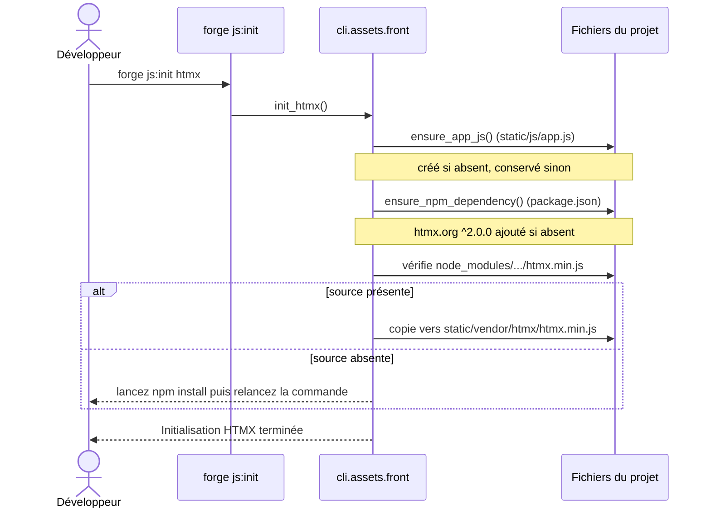

# La commande js:init dans Forge

Ce document décrit la commande `forge js:init`, qui installe les bibliothèques front optionnelles htmx et Alpine.

Le module de code correspondant est `cli.assets.front` (`cli/assets/front.py`).

## 1. Rôle

`forge js:init` prépare l'usage d'une bibliothèque front légère dans un projet Forge.

La commande déclare la dépendance npm dans `package.json`, puis copie le script minifié depuis `node_modules/` vers `static/vendor/`.
Elle prépare aussi le point d'entrée JavaScript du projet, `static/js/app.js`, s'il est absent.

Trois variantes existent : `htmx`, `alpine` et `htmx-alpine` (les deux à la fois).

Les écritures suivent le mode write-if-new : un fichier déjà présent n'est jamais écrasé.
Forge affiche pour chaque cible si elle a été créée ou conservée.

## 2. Vue d'ensemble rapide

| Élément | Valeur |
|---|---|
| Commande | `forge js:init <htmx \| alpine \| htmx-alpine>` |
| Module Python | `cli.assets.front` |
| Catégorie | CLI, outillage front |
| Rôle | installer htmx, Alpine ou les deux dans le projet |
| Entrées | la variante demandée, le projet courant (`package.json`, `node_modules/`) |
| Sorties | dépendance déclarée dans `package.json`, script copié dans `static/vendor/`, `static/js/app.js` préparé |
| Fichiers touchés | `package.json`, `static/js/app.js`, `static/vendor/htmx/htmx.min.js`, `static/vendor/alpine/alpine.min.js` |
| Mode Forge | génère (write-if-new) et lit |
| Versions cibles | `htmx.org ^2.0.0`, `alpinejs ^3.14.0` (figées dans le module) |

La commande ne lance pas `npm install` elle-même.
Si le script source n'existe pas encore dans `node_modules/`, Forge déclare seulement la dépendance et invite à lancer `npm install` puis à relancer la commande.

## 3. Schémas UML

### 3.1 Diagramme de séquence

Le diagramme de séquence montre le déroulé de `forge js:init htmx`.
Il permet de voir l'ordre des opérations : préparation de `app.js`, déclaration de la dépendance, puis copie du script vendor.



À retenir :

- `app.js` est préparé en premier, en write-if-new ;
- la dépendance npm est déclarée avant la copie du script ;
- la copie n'a lieu que si le script existe dans `node_modules/` ;
- aucun fichier existant n'est écrasé.

## 4. API publique

La commande s'invoque ainsi :

| Invocation | Effet |
|---|---|
| `forge js:init htmx` | installe htmx |
| `forge js:init alpine` | installe Alpine |
| `forge js:init htmx-alpine` | installe htmx puis Alpine |

Le module expose aussi des fonctions publiques, utilisables depuis du code Python.

| Fonction | Signature | Rôle |
|---|---|---|
| `init_htmx` | `init_htmx(root: Path \| None = None) -> bool` | installe htmx, renvoie `True` si le script est en place |
| `init_alpine` | `init_alpine(root: Path \| None = None) -> bool` | installe Alpine, renvoie `True` si le script est en place |
| `init_htmx_alpine` | `init_htmx_alpine(root: Path \| None = None) -> dict[str, bool]` | installe les deux, renvoie l'état de chaque script |
| `ensure_npm_dependency` | `ensure_npm_dependency(root: Path, package_name: str, default_version: str) -> bool` | déclare une dépendance dans `package.json`, renvoie `True` si ajoutée |
| `ensure_app_js` | `ensure_app_js(project_root: Path) -> None` | crée `static/js/app.js` s'il est absent |
| `init_vendor_script` | `init_vendor_script(*, root, label, package_name, package_version, source_path, target_path, command) -> bool` | copie un script vendor minifié vers `static/vendor/` |
| `main` | `main(args: list[str]) -> None` | point d'entrée de la commande `forge js:init` |

## 5. Contextes d'utilisation

| Besoin | Commande |
|---|---|
| Échanges HTML partiels (interactivité légère) | `forge js:init htmx` |
| Petits comportements déclaratifs côté client | `forge js:init alpine` |
| Les deux bibliothèques d'un coup | `forge js:init htmx-alpine` |
| Préparer le point d'entrée `app.js` d'un projet vierge | l'une des trois variantes |

## 6. Exemples d'utilisation

Installer htmx dans le projet courant :

```bash
forge js:init htmx
```

Installer Alpine :

```bash
forge js:init alpine
```

Installer htmx et Alpine en une seule commande :

```bash
forge js:init htmx-alpine
```

Flux complet recommandé pour un script encore absent de `node_modules/` :

```bash
forge js:init htmx     # déclare la dépendance dans package.json
npm install            # télécharge le script dans node_modules/
forge js:init htmx     # copie le script vers static/vendor/
```

## 7. Détails techniques

!!! note "Write-if-new"
    `app.js`, le script vendor et la dépendance `package.json` ne sont posés que s'ils sont absents.
    Relancer la commande affiche l'état conservé sans rien écraser.

!!! tip "npm install séparé"
    La commande ne télécharge pas les bibliothèques.
    Elle déclare la dépendance, puis copie le script depuis `node_modules/`.
    Si le script source manque, lancez `npm install` puis relancez `forge js:init`.

## Voir aussi

- [Les commandes i18n:init et i18n:check](i18n.md) : catalogues de traduction du projet.
- [Les commandes upload:init et media:init](uploads.md) : arborescence de stockage des fichiers téléversés.
