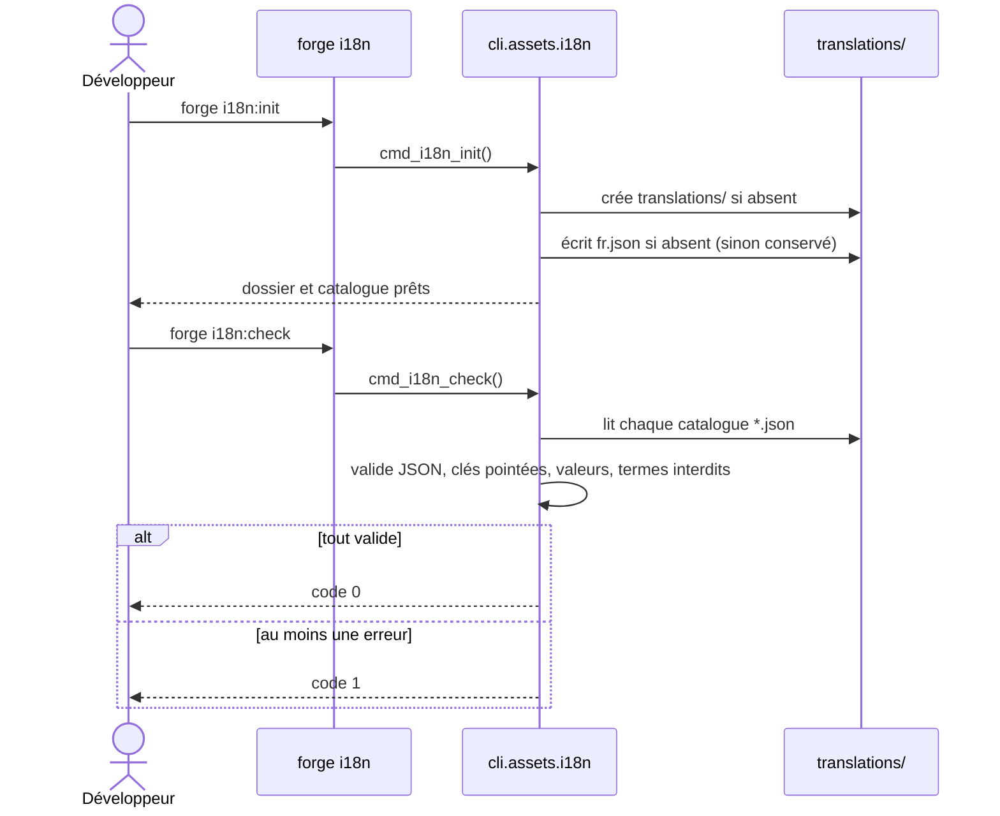

# Les commandes i18n:init et i18n:check dans Forge

Ce document décrit les commandes `forge i18n:init` et `forge i18n:check`, qui préparent et contrôlent les catalogues de traduction d'un projet.

Le module de code correspondant est `cli.assets.i18n` (`cli/assets/i18n.py`).
Ces commandes outillent l'opt-in `forge-mvc-i18n` (ADR-027).

## 1. Rôle

`forge i18n:init` crée le dossier `translations/` et un catalogue français de base `translations/fr.json`.
Ce catalogue contient des libellés communs et CRUD prêts à l'emploi (par exemple `common.save`, `crud.list`, `validation.required`).

`forge i18n:check` valide les catalogues présents dans `translations/`.
Elle vérifie la présence du dossier et du catalogue français, le format JSON, la notation pointée des clés, des valeurs non vides, et l'absence de termes métier interdits dans les clés.

L'écriture de `i18n:init` suit le mode write-if-new : un catalogue existant n'est jamais écrasé.
`i18n:check` ne fait que lire : elle n'écrit aucun fichier.

## 2. Vue d'ensemble rapide

| Élément | Valeur |
|---|---|
| Commandes | `forge i18n:init`, `forge i18n:check` |
| Module Python | `cli.assets.i18n` |
| Catégorie | CLI, internationalisation |
| Rôle | initialiser et valider les catalogues de traduction |
| Entrées | le projet courant, le dossier `translations/` et ses fichiers `*.json` |
| Sorties (`i18n:init`) | dossier `translations/`, catalogue `translations/fr.json` |
| Sorties (`i18n:check`) | rapport de validation, code de sortie `0` ou `1` |
| Fichiers touchés | `translations/`, `translations/fr.json` (création uniquement) |
| Mode Forge | génère (`i18n:init`, write-if-new), lit (`i18n:check`) |
| ADR | ADR-027 (extraction de l'i18n, `forge-mvc-i18n`) |

`i18n:check` renvoie le code `0` si tous les catalogues sont valides, et `1` sinon.

## 3. Schémas UML

### 3.1 Diagramme de séquence

Le diagramme de séquence montre les deux commandes : l'initialisation, puis la vérification.



À retenir :

- `i18n:init` crée le dossier et le catalogue français en write-if-new ;
- `fr.json` est obligatoire : `i18n:check` échoue s'il est absent ;
- chaque clé doit utiliser la notation pointée (par exemple `crud.list`) ;
- une clé contenant un terme métier interdit fait échouer la vérification.

## 4. Commande et API publique

Invocations :

| Invocation | Effet | Code de sortie |
|---|---|---|
| `forge i18n:init` | crée `translations/` et `fr.json` (write-if-new) | `0` |
| `forge i18n:check` | valide les catalogues présents | `0` si valides, `1` sinon |

Le module expose aussi des fonctions publiques.

| Fonction | Signature | Rôle |
|---|---|---|
| `cmd_i18n_init` | `cmd_i18n_init(args: list[str], root: Path \| None = None) -> None` | crée le dossier et le catalogue français initial |
| `cmd_i18n_check` | `cmd_i18n_check(args: list[str], root: Path \| None = None) -> int` | valide les catalogues, renvoie le code de sortie |
| `main` | `main(args: list[str]) -> None` | point d'entrée dispatchant `i18n:init` et `i18n:check` |

## 5. Contextes d'utilisation

| Besoin | Commande |
|---|---|
| Démarrer l'i18n avec un catalogue français de référence | `forge i18n:init` |
| Repérer une clé manquante ou mal formée avant livraison | `forge i18n:check` |
| Vérifier qu'un catalogue est un JSON valide | `forge i18n:check` |
| Contrôler la notation pointée des clés | `forge i18n:check` |

## 6. Exemples d'utilisation

Initialiser les traductions du projet :

```bash
forge i18n:init
```

Vérifier les catalogues, par exemple avant un commit ou en intégration continue :

```bash
forge i18n:check
```

Extrait du catalogue français généré par `i18n:init` :

```json
{
  "common.save": "Enregistrer",
  "common.cancel": "Annuler",
  "crud.list": "Liste",
  "crud.empty": "Aucun élément à afficher.",
  "validation.required": "Ce champ est obligatoire."
}
```

## 7. Règles de validation

!!! note "Règles vérifiées par i18n:check"
    Pour chaque catalogue `*.json`, la commande contrôle :

    - le dossier `translations/` et le fichier `fr.json` existent ;
    - le contenu est un objet JSON valide ;
    - chaque clé est une chaîne non vide en notation pointée ;
    - chaque valeur est une chaîne non vide ;
    - aucune clé ne contient un terme métier interdit.

!!! warning "Catalogue générique, pas métier"
    Les catalogues fournis et vérifiés restent génériques (libellés communs, CRUD, validation).
    Les clés portant un vocabulaire métier spécifique sont refusées par `i18n:check`.

## Voir aussi

- [La commande js:init](front.md) : bibliothèques front htmx et Alpine.
- [Les commandes upload:init et media:init](uploads.md) : arborescence de stockage des fichiers téléversés.
