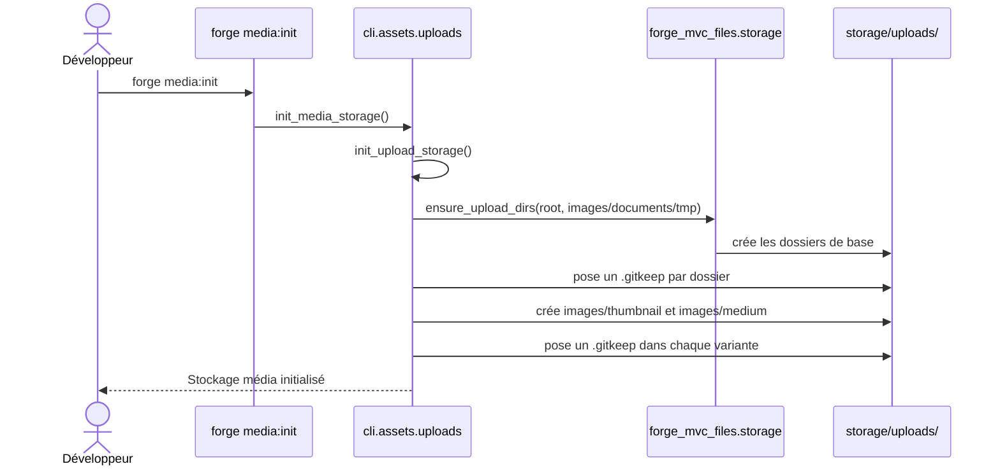

# Les commandes upload:init et media:init dans Forge

Ce document décrit les commandes `forge upload:init` et `forge media:init`, qui préparent l'arborescence de stockage des fichiers téléversés.

Le module de code correspondant est `cli.assets.uploads` (`cli/assets/uploads.py`).
La création des dossiers est déléguée à l'opt-in `forge-mvc-files` (ADR-019).

## 1. Rôle

`forge upload:init` crée l'arborescence de base du stockage d'uploads, sous `storage/uploads/`, avec les catégories `images`, `documents` et `tmp`.

`forge media:init` reprend cette arborescence de base, puis ajoute les sous-dossiers de variantes d'images `images/thumbnail` et `images/medium`.

Un fichier `.gitkeep` est posé dans chaque dossier, afin de versionner les dossiers vides.
La création est idempotente : relancer une commande ne détruit aucun fichier existant.

Ces commandes dépendent de l'opt-in `forge-mvc-files`.
Si le module n'est pas installé, Forge échoue proprement et invite à l'installer.

## 2. Vue d'ensemble rapide

| Élément | Valeur |
|---|---|
| Commandes | `forge upload:init`, `forge media:init` |
| Module Python | `cli.assets.uploads` |
| Catégorie | CLI, fichiers et médias |
| Rôle | initialiser l'arborescence de stockage des téléversements |
| Entrées | le projet courant, racine `storage/uploads/` |
| Sorties | dossiers de stockage créés, avec un `.gitkeep` par dossier |
| Fichiers touchés | `storage/uploads/{images,documents,tmp}/` et, pour `media:init`, `storage/uploads/images/{thumbnail,medium}/` |
| Mode Forge | génère (création de dossiers, idempotente) |
| Dépendance | opt-in `forge-mvc-files` (`ensure_upload_dirs`) |
| ADR | ADR-019 (extraction de l'upload générique) |

## 3. Schémas UML

### 3.1 Diagramme de séquence

Le diagramme de séquence montre le déroulé de `forge media:init`, qui englobe le travail de `upload:init` puis ajoute les variantes d'images.



À retenir :

- `media:init` réutilise tout le travail de `upload:init`, puis ajoute les variantes ;
- la création des dossiers de base est déléguée à `forge-mvc-files` ;
- chaque dossier reçoit un `.gitkeep` pour être versionné vide ;
- l'opération est idempotente et ne supprime rien.

## 4. Commande et API publique

Invocations :

| Invocation | Effet |
|---|---|
| `forge upload:init` | crée `storage/uploads/{images,documents,tmp}/` avec `.gitkeep` |
| `forge media:init` | comme ci-dessus, plus `images/thumbnail` et `images/medium` |

Le module expose aussi des fonctions publiques.

| Fonction | Signature | Rôle |
|---|---|---|
| `init_upload_storage` | `init_upload_storage(root: Path = UPLOAD_ROOT) -> list[Path]` | crée l'arborescence d'upload et les `.gitkeep`, renvoie les dossiers créés |
| `init_media_storage` | `init_media_storage(root: Path = UPLOAD_ROOT) -> list[Path]` | variante médias : base plus sous-dossiers de variantes d'images |
| `main` | `main(args: list[str]) -> None` | point d'entrée dispatchant `upload:init` et `media:init` |

Constantes du module : `UPLOAD_ROOT = storage/uploads`, `UPLOAD_CATEGORIES = (images, documents, tmp)`, `IMAGE_VARIANT_SUBDIRS = (images/thumbnail, images/medium)`.

## 5. Contextes d'utilisation

| Besoin | Commande |
|---|---|
| Préparer le stockage avant le premier téléversement de fichiers | `forge upload:init` |
| Préparer le stockage avec les variantes d'images (vignette, format moyen) | `forge media:init` |
| Réinitialiser l'arborescence sans risque pour les fichiers existants | l'une ou l'autre (idempotentes) |

## 6. Exemples d'utilisation

Initialiser le stockage d'uploads simple :

```bash
forge upload:init
```

Initialiser le stockage orienté médias (avec variantes d'images) :

```bash
forge media:init
```

Arborescence produite par `forge media:init` :

```text
storage/uploads/
├── images/
│   ├── thumbnail/
│   └── medium/
├── documents/
└── tmp/
```

## 7. Détails techniques

!!! note "Idempotence"
    Relancer `upload:init` ou `media:init` ne détruit aucun fichier.
    Les dossiers déjà présents sont conservés et les `.gitkeep` posés avec `exist_ok`.

!!! warning "Opt-in requis"
    Ces commandes nécessitent l'opt-in `forge-mvc-files`.
    S'il est absent, Forge échoue avec un message clair : `pip install forge-mvc-files`.

## Voir aussi

- [La commande js:init](front.md) : bibliothèques front htmx et Alpine.
- [Les commandes i18n:init et i18n:check](i18n.md) : catalogues de traduction du projet.
