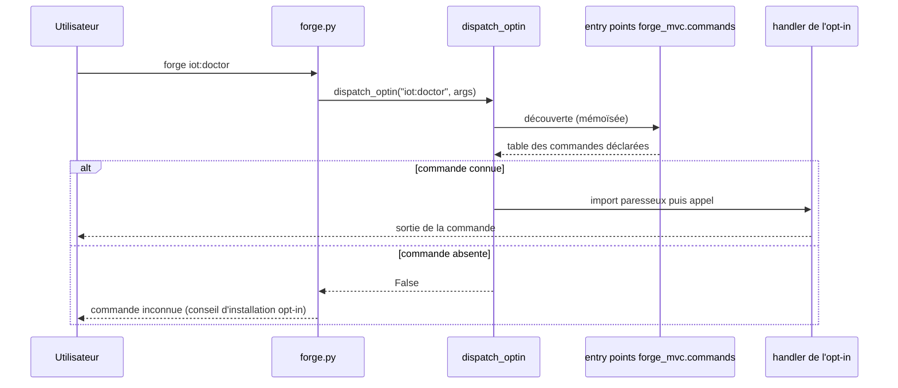

# Le dispatch des commandes opt-in dans Forge

Ce document décrit comment le CLI Forge résout les commandes livrées par les modules opt-in.
Il explique la découverte par entry points, qui permet à un opt-in d'ajouter ses commandes sans modifier le cœur.
Le fichier de code correspondant est `cli/commands/optin_dispatch.py`.

## 1. Rôle

Le lanceur `forge.py` résout une commande en trois temps.
D'abord les commandes natives du cœur (`new`, `run`, `doctor`, `db:*`).
Ensuite les commandes du cœur déléguées, via la table `CORE_COMMANDS`.
Enfin les commandes des opt-ins, via `dispatch_optin`.

Les commandes des opt-ins ne sont pas listées dans le cœur.
Elles sont découvertes à l'exécution par les entry points du groupe `forge_mvc.commands`, à l'image des backends de base de données.
Le cœur ne connaît donc jamais la liste des commandes opt-in, et ajouter une commande dans un opt-in ne touche pas le cœur.

## 2. Vue d'ensemble rapide

| Élément | Valeur |
|---|---|
| Commande Forge | `forge <namespace>:<verbe>` (par exemple `forge iot:doctor`) |
| Module Python | `cli.commands.optin_dispatch` |
| Groupe d'entry points | `forge_mvc.commands` |
| Catégorie | outillage CLI (dispatch) |
| Ticket | ADR-059 (registre de dispatch des commandes CLI) |

## 3. Schéma UML

### 3.1 Diagramme de séquence



## 4. API publique

| Symbole | Rôle |
|---|---|
| `OptinCommand` | descripteur d'une commande (`module`, `package`, `attr`, `pass_full_args`, `exit_on_rc`) |
| `dispatch_optin(command, args)` | exécute la commande si elle est découverte ; renvoie `True` si prise en charge |
| `all_optin_commands()` | dictionnaire de toutes les commandes opt-in découvertes (source unique des garde-fous) |

```python
from cli.commands.optin_dispatch import all_optin_commands, dispatch_optin

# Toutes les commandes opt-in installées, par nom.
commandes = all_optin_commands()
```

## 5. Déclarer les commandes d'un opt-in

Un opt-in déclare ses commandes en deux morceaux, sans aucune entrée dans le cœur.

### 5.1 Une table déclarative légère

Créez `forge_mvc_<nom>/commands.py` avec un dictionnaire `COMMANDS`.
Ce fichier ne contient que des chaînes, il n'importe aucun handler.

```python
# pyright: strict
"""Commandes CLI de forge-mvc-exemple, découvertes par le cœur (ADR-059)."""
from __future__ import annotations

COMMANDS: dict[str, dict[str, str | bool]] = {
    "exemple:doctor": {"module": "forge_mvc_exemple.cli.doctor"},
    "exemple:init": {"module": "forge_mvc_exemple.cli.init"},
}
```

### 5.2 L'entry point dans le `pyproject.toml`

```toml
[project.entry-points."forge_mvc.commands"]
forge_mvc_exemple = "forge_mvc_exemple.commands:COMMANDS"
```

### 5.3 Format d'une commande

| Clé | Rôle | Défaut |
|---|---|---|
| `module` | module à importer paresseusement | obligatoire |
| `attr` | attribut appelable dans le module | `main` |
| `full` | le handler reçoit les arguments complets, commande incluse | `False` |
| `exit_rc` | `sys.exit(rc)` si le handler renvoie un code non nul | `True` |

## 6. Exemples d'utilisation

Deux conventions d'appel selon le handler.

La plupart des handlers reçoivent les arguments après la commande et renvoient un code de retour.
C'est la convention par défaut (`full` à `False`, `exit_rc` à `True`).

Certains handlers gèrent eux-mêmes plusieurs sous-commandes d'un même namespace.
Ils ont alors besoin des arguments complets, on pose donc `full` à `True`.

```python
_MAIL = {"module": "forge_mvc_mail.cli", "full": True, "exit_rc": False}

COMMANDS = {
    "mail:init": _MAIL,
    "mail:test": _MAIL,
}
```

## 7. Détails techniques

L'entry point pointe vers la table de chaînes, pas vers les handlers.
Le handler d'une commande n'est importé qu'au moment de l'invocation (import paresseux), donc installer l'opt-in ne ralentit pas le démarrage du cœur.

La découverte est mémoïsée : les métadonnées ne sont lues qu'une fois par exécution.
Les entry points sont lus depuis les métadonnées d'installation (`.dist-info`).
Après avoir édité un `pyproject.toml` ou un `commands.py`, réinstallez le paquet pour que la découverte voie les changements.

```bash
pip install -e packages/forge-mvc-exemple --no-deps
```

Si l'opt-in n'est pas installé, son entry point n'existe pas, la commande n'est pas découverte.
`forge` répond alors « commande inconnue » avec un conseil qui oriente vers l'installation du module opt-in.

## Voir aussi

- Le fichier de code : `cli/commands/optin_dispatch.py`.
- ADR-059 : registre de dispatch des commandes CLI (décision et incréments).
- ADR-054 : cœur agnostique BDD et backends opt-in, même mécanisme d'entry points.
