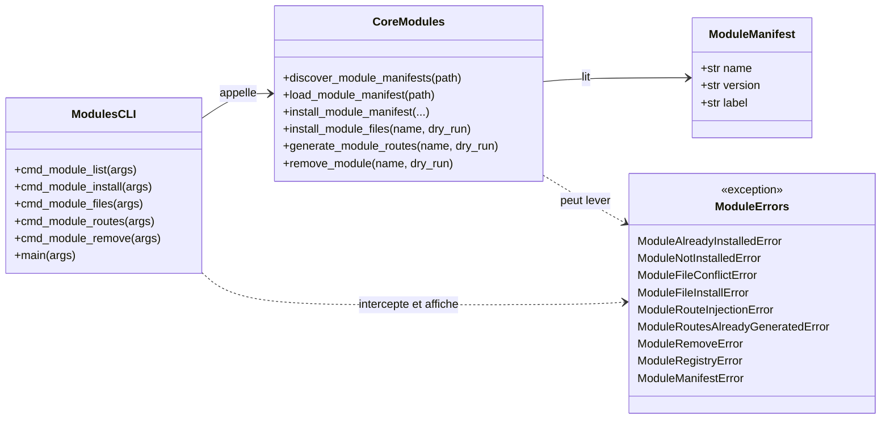
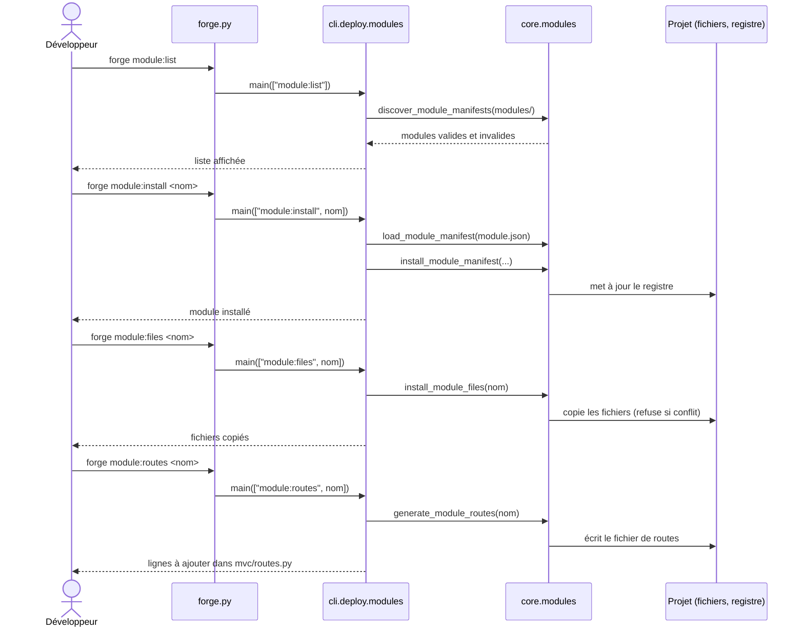

# Les commandes module:* dans Forge

Cette page documente la famille de commandes `forge module:*`, qui gère le cycle de vie des modules Forge locaux d'un projet.
Un module Forge regroupe des fichiers et des routes décrits par un manifeste `module.json`.
Le code de la couche CLI se trouve dans `cli/deploy/modules.py` ; la logique métier est portée par le cœur (`core.modules`).

## 1. Rôle

`forge module:*` installe, inspecte et retire les modules Forge présents dans un projet.

Un module Forge est un dossier qui contient un manifeste `module.json`, des fichiers à copier dans le projet et une description de routes.
Le dossier de modules par défaut est `modules/` ; l'option `--path` permet d'en viser un autre pour la découverte et l'installation.

La famille couvre cinq sous-commandes :

* `module:list` recense les modules disponibles ;
* `module:install` enregistre le manifeste d'un module dans le registre du projet ;
* `module:files` copie les fichiers d'un module installé ;
* `module:routes` génère le fichier de routes d'un module installé ;
* `module:remove` désinstalle un module.

Le déploiement applicatif (`deploy:init`, `deploy:check`) ne fait plus partie de ce module : il est fourni par l'opt-in `forge-mvc-deploy` (ADR-053).
Ce sous-paquet `cli/deploy` ne porte aujourd'hui que les commandes `module:*`.

## 2. Vue d'ensemble rapide

| Élément | Valeur |
|---|---|
| Commandes forge | `module:list`, `module:install`, `module:files`, `module:routes`, `module:remove` |
| Module Python | `cli.deploy.modules` |
| Couche | CLI Forge (sous-paquet `cli/deploy`, ADR-043) |
| Dispatch | `forge.py` route les commandes `module:*` vers `cli.deploy.modules.main` |
| Logique métier | `core.modules` (le module CLI n'est qu'une couche de présentation) |
| Rôle | gérer le cycle de vie des modules Forge locaux |
| Entrées | nom du module, options `--path`, `--dry-run` |
| Sorties | sortie console, registre de modules, fichiers copiés, fichier de routes généré |
| Dossier par défaut | `modules/` (override via `--path`) |
| Registre | `MODULE_REGISTRY_FILE` (défini par `core.modules`) |
| Mode Forge | génère (write-if-new pour `module:files` et `module:routes`), lit (`module:list`), affiche (lignes à coller dans `mvc/routes.py`) |
| ADR | ADR-043 (regroupement CLI), ADR-053 (extraction du déploiement vers `forge-mvc-deploy`) |

Le module CLI ne réécrit jamais silencieusement un fichier applicatif : `module:files` refuse de remplacer un fichier existant, et `module:routes` affiche les lignes à ajouter dans `mvc/routes.py` au lieu de les insérer lui-même.

## 3. Schémas UML

Les deux schémas suivants montrent la structure des résultats renvoyés par le cœur, puis le déroulé d'une intégration de module.

### 3.1 Diagramme de classe

Ce diagramme montre les fonctions du cœur appelées par la couche CLI et les exceptions qu'elles peuvent lever.
La couche CLI traduit ces résultats et ces exceptions en messages console.



À retenir :

- la couche CLI (`cli.deploy.modules`) ne contient pas de logique métier ;
- toutes les opérations passent par des fonctions de `core.modules` ;
- les exceptions du cœur sont interceptées et traduites en messages console ;
- le manifeste porte `name`, `version` et `label`, affichés à l'utilisateur.

### 3.2 Diagramme de séquence

Ce diagramme montre le parcours classique d'intégration d'un module : découverte, installation du manifeste, copie des fichiers, génération des routes.



À retenir :

- `forge.py` route toute commande `module:*` vers `cli.deploy.modules.main` ;
- la découverte et la copie de fichiers s'appuient sur le dossier `modules/` (ou `--path`) ;
- `module:files` refuse d'écraser un fichier existant et n'écrit rien en cas de conflit ;
- `module:routes` génère un fichier de routes puis affiche les lignes à coller à la main dans `mvc/routes.py`.

## 4. API publique et commandes

La couche CLI expose une fonction par sous-commande, plus un point d'entrée `main`.

| Commande | Invocation | Fonction | Rôle |
|---|---|---|---|
| `module:list` | `forge module:list [--path <dossier>]` | `cmd_module_list(args)` | liste les modules valides et invalides du dossier |
| `module:install` | `forge module:install <nom> [--path <dossier>] [--dry-run]` | `cmd_module_install(args)` | enregistre le manifeste du module dans le registre |
| `module:files` | `forge module:files <nom> [--dry-run]` | `cmd_module_files(args)` | copie les fichiers du module dans le projet |
| `module:routes` | `forge module:routes <nom> [--dry-run]` | `cmd_module_routes(args)` | génère le fichier de routes du module |
| `module:remove` | `forge module:remove <nom> [--dry-run]` | `cmd_module_remove(args)` | désinstalle le module |
| (dispatch) | | `main(args)` | aiguille la sous-commande `module:*` reçue |

Signatures exactes (toutes prennent `args: list[str]` et ne renvoient rien) :

```python
def cmd_module_list(args: list[str]) -> None: ...
def cmd_module_install(args: list[str]) -> None: ...
def cmd_module_files(args: list[str]) -> None: ...
def cmd_module_routes(args: list[str]) -> None: ...
def cmd_module_remove(args: list[str]) -> None: ...
def main(args: list[str]) -> None: ...
```

Chaque sous-commande gère son propre `--help`.
Les options communes sont `--path <dossier>` (seulement pour `module:list` et `module:install`) et `--dry-run` (pour `install`, `files`, `routes` et `remove`).

## 5. Contextes d'utilisation

| Besoin | Commande |
|---|---|
| Voir les modules présents dans le projet | `forge module:list` |
| Voir les modules d'un autre dossier | `forge module:list --path <dossier>` |
| Enregistrer un module dans le registre | `forge module:install <nom>` |
| Simuler une installation sans rien modifier | `forge module:install <nom> --dry-run` |
| Copier les fichiers d'un module installé | `forge module:files <nom>` |
| Générer les routes d'un module installé | `forge module:routes <nom>` |
| Retirer un module installé | `forge module:remove <nom>` |
| Vérifier l'effet d'une commande avant exécution | ajouter `--dry-run` |

La règle pratique : on installe d'abord le manifeste (`module:install`), puis on copie les fichiers (`module:files`) et on génère les routes (`module:routes`).

## 6. Exemples d'utilisation

Les exemples suivants montrent les invocations réelles de la famille `module:*`.

Lister les modules disponibles :

```bash
forge module:list
```

Lister les modules d'un dossier précis :

```bash
forge module:list --path ./extensions
```

Installer un module (puis simuler avant d'installer pour de bon) :

```bash
forge module:install blog --dry-run
forge module:install blog
```

Copier les fichiers du module dans le projet :

```bash
forge module:files blog
```

Générer le fichier de routes du module :

```bash
forge module:routes blog
```

À l'issue de `module:routes`, Forge affiche les lignes à recopier dans `mvc/routes.py`.
Forge ne modifie pas ce fichier lui-même : il vous laisse coller les lignes.

Retirer un module installé :

```bash
forge module:remove blog --dry-run
forge module:remove blog
```

## 7. Sécurité et préservation du code utilisateur

!!! note "Trois modes Forge"
    Ces commandes respectent les modes officiels.
    `module:list` lit le dossier de modules, `module:files` et `module:routes` génèrent des fichiers nouveaux, et `module:routes` affiche les lignes de routage à coller.

!!! warning "Pas d'écrasement silencieux"
    `module:files` refuse l'installation si un fichier cible existe déjà : il liste les conflits et n'écrit aucun fichier.
    `module:routes` n'insère jamais les routes dans `mvc/routes.py` : il génère un fichier de routes dédié et affiche les lignes à ajouter à la main.

!!! tip "Mode simulation"
    L'option `--dry-run` est disponible sur `module:install`, `module:files`, `module:routes` et `module:remove`.
    Elle décrit ce qui serait fait sans modifier aucun fichier ni le registre.

## Voir aussi

Cette page est aujourd'hui la seule du dossier `cli/deploy/docs/`.

Pour le déploiement applicatif (`deploy:init`, `deploy:check`), voir l'opt-in `forge-mvc-deploy` (ADR-053), désormais hors de ce module.
