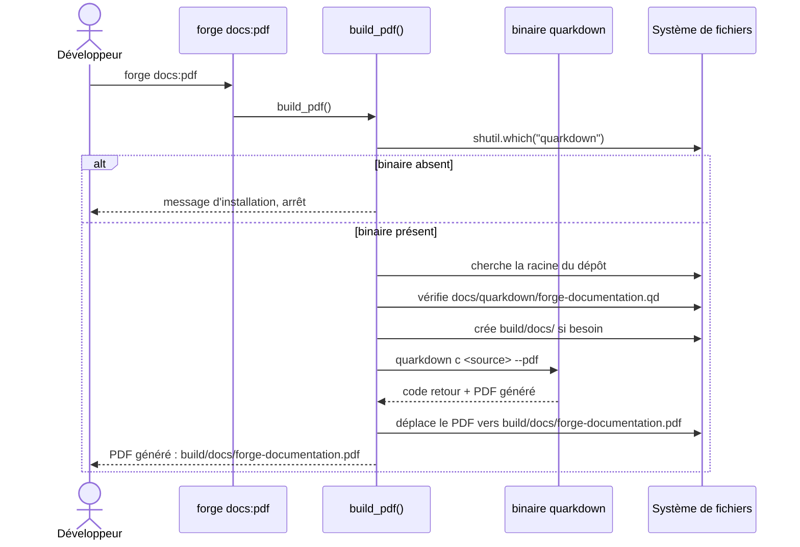

# La commande docs:pdf dans Forge

Cette page décrit la commande `forge docs:pdf`, qui génère un PDF de la documentation Forge à partir d'une source Quarkdown.
Le code correspondant est `cli/docs/quarkdown.py` ; la fonction publique est `build_pdf()`.

## 1. Rôle

`forge docs:pdf` produit un fichier PDF de la documentation Forge à partir d'une source Quarkdown.

La source lue est `docs/quarkdown/forge-documentation.qd`.
La cible écrite est `build/docs/forge-documentation.pdf`.

Quarkdown est une dépendance externe optionnelle.
Le module ne l'importe jamais : il appelle le binaire `quarkdown` via `subprocess` s'il est présent sur le `PATH`.
Si le binaire est absent, la commande affiche un message d'installation et s'arrête proprement, sans erreur Python.
Le cœur de Forge ne dépend pas de cette génération.

## 2. Vue d'ensemble rapide

| Élément | Valeur |
|---|---|
| Commande forge | `forge docs:pdf` |
| Module Python | `cli.docs.quarkdown` |
| Fonction publique | `build_pdf()` |
| Catégorie | outillage documentaire (CLI) |
| Rôle | générer un PDF de la documentation via Quarkdown |
| Entrées | `docs/quarkdown/forge-documentation.qd` |
| Sorties | `build/docs/forge-documentation.pdf` |
| Dépendance externe | binaire `quarkdown` (Java 17+), optionnel |
| Fichiers touchés | le PDF cible, plus le dossier `build/docs/` créé si besoin |
| Mode Forge | Forge génère (un PDF de sortie), Forge lit (la source `.qd`) |
| Arguments | aucun |

La commande ne modifie aucun fichier de code utilisateur.
Elle lit une source documentaire et écrit un PDF dans `build/docs/`.

## 3. Schémas UML

Le déroulé de la commande est un flux à étapes (détection du binaire, recherche de la racine, génération, déplacement du PDF).
Un diagramme de séquence le décrit clairement.

### 3.1 Diagramme de séquence

Le diagramme montre l'ordre des opérations exécutées par `build_pdf()`.

Il fait apparaître les points d'arrêt anticipés : absence du binaire, racine introuvable, source absente, échec de Quarkdown, PDF introuvable après génération.



À retenir :

- la commande vérifie d'abord la présence du binaire `quarkdown` ;
- elle remonte l'arborescence pour trouver la racine du dépôt Forge ;
- elle s'arrête proprement si la source `.qd` est absente ;
- elle déplace le PDF généré vers `build/docs/forge-documentation.pdf` ;
- chaque étape qui échoue interrompt la commande avec un message clair.

## 4. API publique et commande

La commande s'invoque sans argument.

| Invocation | Effet |
|---|---|
| `forge docs:pdf` | génère le PDF si Quarkdown est disponible, sinon explique comment l'installer |

La fonction publique appelée par le dispatch est :

| Signature | Rôle |
|---|---|
| `build_pdf() -> None` | génère le PDF de la documentation Forge via Quarkdown |

Les autres fonctions du module (`_find_quarkdown`, `_find_repo_root`, `_find_generated_pdf`, `_log`) sont internes et préfixées par un tiret bas.
Elles ne font pas partie de l'API publique.

## 5. Contextes d'utilisation

| Besoin | Commande / Élément |
|---|---|
| Produire une version PDF imprimable de la documentation | `forge docs:pdf` |
| Travailler sur un poste sans Quarkdown installé | `forge docs:pdf` affiche les instructions d'installation |
| Construire le site documentaire HTML complet | `mkdocs build` (hors de cette commande) |

## 6. Exemples d'utilisation

Génération du PDF depuis la racine du dépôt Forge :

```bash
forge docs:pdf
```

Sortie attendue lorsque Quarkdown est installé et la source présente :

```text
[Forge] Génération PDF en cours...
[Forge] → quarkdown c docs/quarkdown/forge-documentation.qd --pdf
[Forge] PDF généré : build/docs/forge-documentation.pdf
```

Sortie lorsque le binaire `quarkdown` est absent du `PATH` :

```text
[ERREUR] Quarkdown n'est pas installé ou n'est pas dans le PATH.

  Installation (Linux / macOS) :
    curl -fsSL https://raw.githubusercontent.com/quarkdown-labs/get-quarkdown/refs/heads/main/install.sh \
      | sudo env "PATH=$PATH" bash

  Homebrew :
    brew install quarkdown

  Quarkdown requiert Java 17+.
```

## 7. Détails techniques

!!! note "Dépendance optionnelle, jamais importée"
    Le module n'importe jamais Quarkdown comme bibliothèque Python.

    Il appelle le binaire `quarkdown` via `subprocess`, uniquement s'il est trouvé sur le `PATH` avec `shutil.which`.

    Le cœur de Forge reste donc indépendant de Quarkdown et de Java.

!!! tip "Recherche de la racine du dépôt"
    La commande remonte l'arborescence depuis le dossier courant jusqu'à trouver un dossier contenant `forge.py` ou `pyproject.toml`.

    Les chemins de source et de cible sont résolus à partir de cette racine, ce qui permet de lancer la commande depuis un sous-dossier du dépôt.

!!! warning "Arrêts anticipés"
    La commande s'interrompt avec un message dédié dans plusieurs cas :

    - le binaire `quarkdown` est absent du `PATH` ;
    - la racine du dépôt Forge est introuvable ;
    - la source `docs/quarkdown/forge-documentation.qd` n'existe pas ;
    - Quarkdown retourne un code non nul ;
    - aucun PDF n'est trouvé après la génération.

!!! note "Emplacement du PDF généré"
    Quarkdown peut écrire le PDF à côté de la source, dans un sous-dossier au nom du fichier, ou dans un dossier `out/`.

    La commande recherche ces emplacements, puis déplace le PDF trouvé vers `build/docs/forge-documentation.pdf`.

## Voir aussi

Cette page est la seule de ce dossier de documentation.

Pour le site documentaire HTML complet, la construction passe par `mkdocs build`, en dehors de cette commande.
