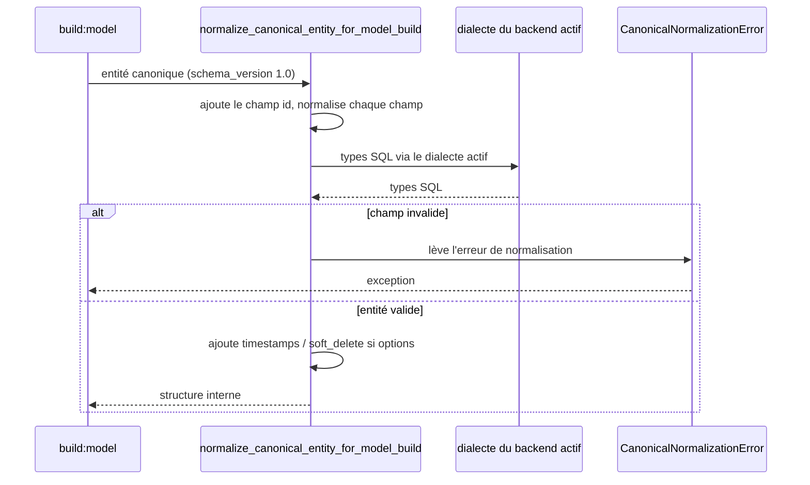

# Le normaliseur canonique du modèle dans Forge

Ce document décrit le normaliseur qui traduit une entité du format canonique vers la structure interne attendue par `build:model`.

Le module correspondant est `forge_mvc_entities.canonical_model_normalizer`.

## 1. Rôle

Ce module traduit une entité au format canonique (`schema_version: "1.0"`) en un dict compatible avec les générateurs internes.
C'est une couche de transition interne, pas un format public.

La structure produite alimente la validation et les générateurs de SQL et de modèles.
Elle suit le format interne attendu par `normalize_entity_definition()`, sans exposer ce format aux utilisateurs.

Le normaliseur s'appuie sur le dialecte du backend BDD actif (ADR-054) pour produire les types SQL.
Il ne modifie aucun fichier source.

## 2. Vue d'ensemble rapide

| Élément | Valeur |
|---|---|
| Commande forge | aucune (brique interne de `build:model`) |
| Module Python | `forge_mvc_entities.canonical_model_normalizer` |
| Catégorie | génération du modèle de données |
| Rôle | traduire une entité canonique en structure interne |
| Entrées | une entité canonique (dict) |
| Sorties | un dict interne, ou `CanonicalNormalizationError` |
| Fichiers touchés | aucun (transformation en mémoire) |
| Mode Forge | lit |
| ADR liés | ADR-013, ADR-017, ADR-054 |

## 3. Schémas UML

### 3.1 Diagramme de séquence



À retenir :

- le normaliseur ajoute un champ `id`, puis normalise chaque champ déclaré ;
- les types SQL proviennent du dialecte du backend actif (ADR-054) ;
- un champ invalide (par exemple `decimal` sans `precision`) lève une erreur explicite ;
- les options `timestamps` et `soft_delete` ajoutent les champs datés correspondants.

## 4. API publique

| Symbole | Signature | Rôle |
|---|---|---|
| `normalize_canonical_entity_for_model_build` | `normalize_canonical_entity_for_model_build(entity: dict[str, Any]) -> dict[str, Any]` | traduit une entité canonique vers la structure interne |
| `CanonicalNormalizationError` | exception (`ValueError`) | erreur lors de la normalisation d'une entité canonique |

## 5. Contextes d'utilisation

| Besoin | Commande / Élément |
|---|---|
| Préparer une entité canonique pour `build:model` | `normalize_canonical_entity_for_model_build(entity)` |
| Faire le pont entre format public et structure interne | même fonction |
| Détecter un champ canonique invalide | `CanonicalNormalizationError` |

## 6. Exemples d'utilisation

Normaliser une entité canonique avant génération :

```python
from forge_mvc_entities.canonical_model_normalizer import (
    normalize_canonical_entity_for_model_build,
    CanonicalNormalizationError,
)

try:
    internal = normalize_canonical_entity_for_model_build(entity)
except CanonicalNormalizationError as exc:
    print(f"Entité canonique invalide : {exc}")
```

## 7. Limites documentées

!!! note "Périmètre de la traduction"
    Le normaliseur a des limites assumées, alignées sur ce que `build:model` sait traiter :

    - les index (`indexes[]`) sont ignorés ;
    - les relations restent hors périmètre, dans `relations.json` ;
    - un `string` sans `max_length` reçoit une longueur conservatrice par défaut ;
    - un `decimal` sans `precision`/`scale` lève une erreur explicite.

## Voir aussi

- [Les commandes build:model, check:model et sync:entity](model.md) : consommateur de ce normaliseur.
- [La validation canonique des entités](validation.md) : validation du format canonique.
