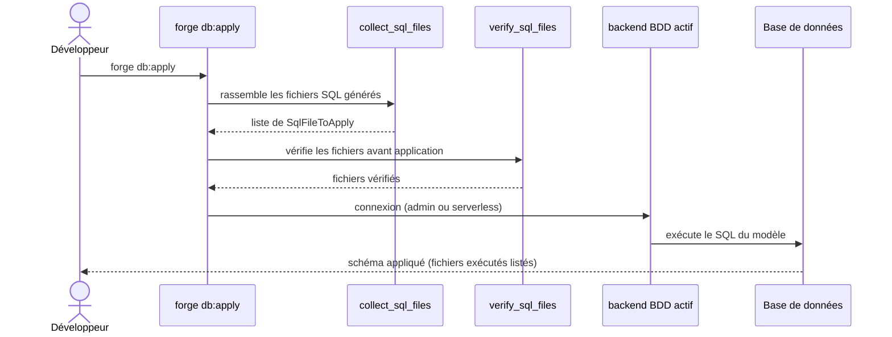

# La commande db:apply dans Forge

Ce document décrit la commande `forge db:apply`.
Elle applique à la base le schéma SQL généré à partir du modèle d'entités.

Le module correspondant est `cli.entities.db_apply`.

## 1. Rôle

`db:apply` applique le schéma SQL du modèle d'entités à la base du projet.
Elle collecte les fichiers SQL générés à partir des entités, les vérifie, puis les applique.

Sur un backend avec serveur, l'application utilise une connexion d'administration (`DB_ADMIN_*`).
Sur un backend sans serveur (SQLite, ADR-054), le SQL est appliqué directement sur le fichier via le backend actif.
Le SQL reste visible et inspectable (principe 5).

## 2. Vue d'ensemble rapide

| Élément | Valeur |
|---|---|
| Commande forge | `forge db:apply` |
| Module Python | `cli.entities.db_apply` |
| Catégorie | base de données |
| Rôle | appliquer le schéma SQL du modèle à la base |
| Entrées | fichiers SQL générés sous `mvc/entities/`, config du projet |
| Sorties | tables et structures créées, liste des fichiers exécutés |
| Fichiers touchés | aucun fichier source (écriture en base) |
| Mode Forge | lit le SQL généré, l'exécute sur la base |
| ADR liés | ADR-033 (identifiants admin), ADR-054 (backends BDD) |

## 3. Schémas UML

### 3.1 Diagramme de séquence



À retenir :

- les fichiers SQL sont d'abord collectés puis vérifiés ;
- la connexion dépend du backend : admin avec serveur, directe sans serveur ;
- le SQL appliqué reste lisible ;
- si la connexion admin échoue, Forge suggère de lancer `forge db:init`.

## 4. API publique / Commande

| Symbole | Signature | Rôle |
|---|---|---|
| `apply_model_sql` | `apply_model_sql(entities_root: Path) -> list[Path]` | applique le SQL du modèle, retourne les fichiers exécutés |
| `collect_sql_files` | `collect_sql_files(entities_root: Path) -> list[SqlFileToApply]` | rassemble les fichiers SQL à appliquer |
| `verify_sql_files` | `verify_sql_files(files: list[SqlFileToApply]) -> dict[Path, str]` | contrôle les fichiers avant application |
| `load_db_apply_config` | `load_db_apply_config() -> DbApplyConfig` | résout la configuration d'application |
| `DbApplyConfig` / `SqlFileToApply` | dataclasses | configuration et descripteur de fichier SQL |
| `DbApplyError` | exception | erreur d'application du SQL |
| `main` | `main(argv: list[str] \| None = None) -> None` | point d'entrée de `forge db:apply` |

Invocation :

| Invocation | Effet |
|---|---|
| `forge db:apply` | applique le schéma SQL du modèle à la base |

## 5. Contextes d'utilisation

| Besoin | Commande / Élément |
|---|---|
| Matérialiser les entités en tables | `forge db:apply` |
| Appliquer le SQL après évolution du modèle | `forge db:apply` |
| Préparer d'abord la base et le compte | `forge db:init` |

## 6. Exemples d'utilisation

Appliquer le schéma SQL du modèle :

```bash
forge db:apply
```

Enchaînement courant : générer, puis appliquer :

```bash
forge build:model
forge db:apply
```

## 7. Préparation et identifiants

!!! warning "Base non préparée"
    Si la connexion d'administration échoue, la base du projet n'est peut-être pas préparée.
    Lancez d'abord `forge db:init`, ou vérifiez `DB_ADMIN_*` et `DB_NAME` dans votre fichier d'environnement.

!!! note "SQL visible"
    Le SQL appliqué provient de fichiers générés, lisibles avant exécution (principe 5).

## Voir aussi

- [La commande db:init](db_init.md) : provisioning de la base et du compte.
- [Les commandes migration:*](migrations.md) : suivi et évolution du schéma.
- [Les commandes build:model, check:model et sync:entity](model.md) : génération du SQL appliqué.
