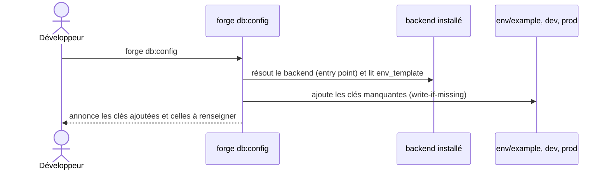

# La commande db:config dans Forge

Ce document décrit la commande `forge db:config`.
Elle amorce les variables d'environnement du backend BDD installé dans les fichiers d'environnement du projet.

Le module correspondant est `forge_mvc_entities.db_config`.

## 1. Rôle

`db:config` prépare la configuration de connexion du backend choisi (ADR-064).
Elle écrit les clés d'environnement du backend dans `env/example`, `env/dev` et `env/prod`, sans jamais toucher à une valeur déjà renseignée ni écrire de secret.

Le backend est découvert par son entry point (ADR-054) : il suffit qu'il soit installé.
La commande ne provisionne pas la base : ce rôle revient à `forge db:init`.

## 2. Vue d'ensemble rapide

| Élément | Valeur |
|---|---|
| Commande forge | `forge db:config` |
| Module Python | `forge_mvc_entities.db_config` |
| Catégorie | base de données |
| Rôle | amorcer les variables d'environnement du backend |
| Entrées | backend installé (son `env_template`), fichiers `env/*` |
| Sorties | clés ajoutées à `env/example`, `env/dev`, `env/prod` |
| Fichiers touchés | `env/example`, `env/dev`, `env/prod` (write-if-missing) |
| Mode Forge | écrit des fichiers utilisateur de façon annoncée (charte n°9) |
| ADR liés | ADR-064 (amorçage), ADR-054 (backends), ADR-060 (config du backend) |

## 3. Schémas UML

### 3.1 Diagramme de séquence



À retenir :

- le backend est résolu avant toute écriture ;
- seules les clés absentes sont ajoutées, jamais de valeur écrasée ;
- aucun secret n'est écrit : uniquement des exemples ou du vide ;
- la commande annonce ce qu'elle a fait et ce qu'il reste à renseigner.

## 4. API publique / Commande

| Symbole | Signature | Rôle |
|---|---|---|
| `configure_backend_env` | `configure_backend_env(project_root: Path) -> int` | amorce les fichiers d'environnement pour le backend installé |
| `main` | `main(argv: list[str] \| None = None) -> int` | point d'entrée de `forge db:config` |

Invocation :

| Invocation | Effet |
|---|---|
| `forge db:config` | écrit les clés du backend dans `env/example`, `env/dev`, `env/prod` |

## 5. Contextes d'utilisation

| Besoin | Commande / Élément |
|---|---|
| Configurer un backend fraîchement installé | `forge db:config` |
| Retrouver les clés à renseigner | `forge db:config` (les liste) |
| Provisionner ensuite la base | `forge db:init` |

## 6. Exemples d'utilisation

Après l'installation d'un backend :

```bash
pip install --pre forge-mvc-mariadb
forge db:config
```

Enchaînement complet sur un environnement neuf :

```bash
forge db:config     # amorce env/example, env/dev, env/prod
# … renseigner les valeurs dans env/dev et env/prod …
forge db:init       # provisionne la base et le compte applicatif
forge db:apply      # crée les tables
```

## 7. Écriture annoncée et sans secret

!!! note "Charte n°9 : pas d'écriture invisible"
    `db:config` écrit dans des fichiers utilisateur, mais de façon **explicite** (vous lancez la commande) et **annoncée** (elle liste chaque clé ajoutée).
    Elle procède en write-if-missing : une valeur déjà renseignée n'est jamais écrasée.

!!! warning "Aucun secret écrit"
    La commande ne pose que des placeholders : valeurs d'exemple pour l'hôte et le port, vide pour les noms, comptes et mots de passe.
    C'est ce qui rend sûr l'écriture dans `env/example`, versionné.

## Voir aussi

- [La commande db:init](db_init.md) : provisionnement de la base.
- [La commande db:apply](db_apply.md) : application du schéma SQL.
