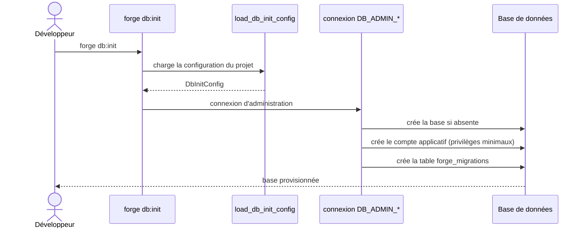

# La commande db:init dans Forge

Ce document décrit la commande `forge db:init`.
Elle provisionne la base de données du projet : création de la base et du compte applicatif.

Le module correspondant est `cli.entities.db_init`.

## 1. Rôle

`db:init` prépare la base de données du projet.
Sur un backend avec serveur (MariaDB par défaut), elle crée la base et le compte applicatif, puis lui accorde des privilèges minimaux.

Elle lit la configuration du projet et utilise les identifiants d'administration (`DB_ADMIN_*`).
Le compte applicatif (`forge_app`) reste un compte runtime à privilèges DML minimaux : `SELECT`, `INSERT`, `UPDATE`, `DELETE` par défaut (ADR-033).

Quand la table `mysql.user` n'est pas lisible, la commande bascule en mode dégradé (`CREATE USER IF NOT EXISTS`).
Sur un backend sans serveur (SQLite, ADR-054), il n'y a pas de provisioning de comptes.

## 2. Vue d'ensemble rapide

| Élément | Valeur |
|---|---|
| Commande forge | `forge db:init` |
| Module Python | `cli.entities.db_init` |
| Catégorie | base de données |
| Rôle | créer la base et le compte applicatif du projet |
| Entrées | configuration du projet, identifiants `DB_ADMIN_*` |
| Sorties | base créée, compte applicatif, table `forge_migrations` |
| Fichiers touchés | aucun fichier source (provisioning en base) |
| Mode Forge | lit la config, provisionne la base |
| ADR liés | ADR-033 (privilèges DML), ADR-054 (backends BDD) |

## 3. Schémas UML

### 3.1 Diagramme de séquence



À retenir :

- la configuration est résolue avant toute connexion ;
- la connexion utilise les identifiants d'administration ;
- le compte applicatif reçoit des privilèges DML minimaux ;
- la table `forge_migrations` est créée pour le suivi des migrations.

## 4. API publique / Commande

| Symbole | Signature | Rôle |
|---|---|---|
| `load_db_init_config` | `load_db_init_config() -> DbInitConfig` | charge la configuration d'initialisation depuis le projet |
| `init_project_database` | `init_project_database() -> list[str]` | crée la base et le compte applicatif |
| `DbInitConfig` | dataclass | configuration résolue d'initialisation |
| `DbInitError` | exception | configuration ou connexion invalide |
| `main` | `main(argv: list[str] \| None = None) -> None` | point d'entrée de `forge db:init` |

Invocation :

| Invocation | Effet |
|---|---|
| `forge db:init` | provisionne la base et le compte applicatif |

## 5. Contextes d'utilisation

| Besoin | Commande / Élément |
|---|---|
| Créer la base et le compte de l'application | `forge db:init` |
| Provisionner un environnement neuf | `forge db:init` |
| Appliquer ensuite le schéma | `forge db:apply` |

## 6. Exemples d'utilisation

Provisionner la base au premier déploiement :

```bash
forge db:init
```

Enchaînement complet sur un environnement neuf :

```bash
forge db:init
forge build:model
forge db:apply
```

## 7. Privilèges et mode dégradé

!!! note "Privilèges minimaux"
    Le compte applicatif reçoit par défaut les seuls privilèges DML : `SELECT`, `INSERT`, `UPDATE`, `DELETE` (ADR-033).
    Les opérations DDL passent par les identifiants d'administration lors des migrations.

!!! warning "Table mysql.user illisible"
    Si la table `mysql.user` n'est pas lisible, `db:init` bascule en mode dégradé et crée le compte avec `CREATE USER IF NOT EXISTS`.

## Voir aussi

- [La commande db:apply](db_apply.md) : application du schéma SQL.
- [Les commandes migration:*](migrations.md) : suivi des migrations.
