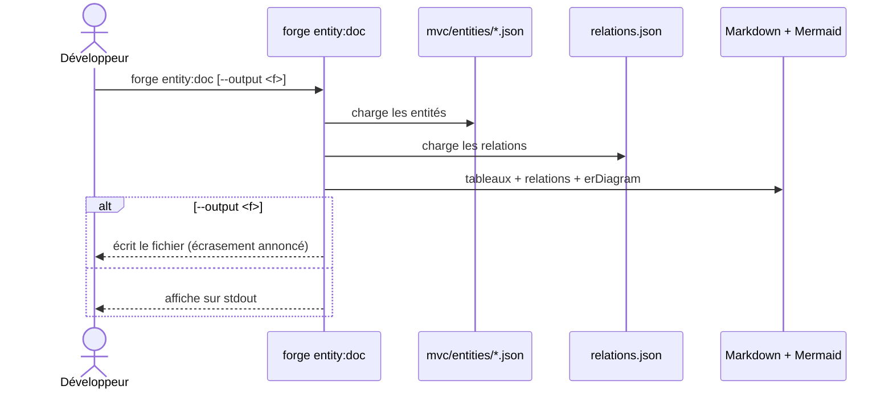

# La commande entity:doc dans Forge

Ce document décrit la commande `forge entity:doc`.
Elle produit une vue globale des entités et de leurs relations à partir des contrats du projet.

Le module correspondant est `cli.entities.entity_doc`.

## 1. Rôle

`entity:doc` lit les contrats du projet (`mvc/entities/*.json` et `relations.json`) et en produit une documentation Markdown.
La sortie comprend un tableau par entité (champs, colonnes, types, nullable, clé primaire, unicité), la liste des relations avec leur cardinalité, et un diagramme Mermaid `erDiagram`.

Elle documente le modèle **déclaré**, pas la base réelle : aucun backend ni connexion n'est requis.
Par défaut, la commande affiche le Markdown sur la sortie standard ; `--output` écrit le résultat dans un fichier.

## 2. Vue d'ensemble rapide

| Élément | Valeur |
|---|---|
| Commande forge | `forge entity:doc [--output <fichier>]` |
| Module Python | `cli.entities.entity_doc` |
| Catégorie | inspection du modèle de données |
| Rôle | documenter entités et relations (tableaux + diagramme) |
| Entrées | fichiers d'entités et `relations.json` du projet |
| Sorties | Markdown sur stdout, ou fichier avec `--output` |
| Fichiers touchés | aucun par défaut ; seul le fichier de `--output` |
| Mode Forge | affiche (lit les contrats) |
| Backend requis | non |

## 3. Schémas UML

### 3.1 Diagramme de séquence

Le diagramme suivant montre la construction de la documentation.



À retenir :

- la vue provient des contrats, pas de la base ;
- sans `--output`, rien n'est écrit ;
- le diagramme Mermaid `erDiagram` se rend dans GitHub et MkDocs ;
- la cardinalité est déduite du type de relation (N:1 pour `many_to_one`, N:N pour `many_to_many`).

## 4. API publique / Commande

| Symbole | Signature | Rôle |
|---|---|---|
| `main` | `main(argv: list[str] \| None = None) -> None` | point d'entrée de `forge entity:doc` |
| `build_entity_doc` | `build_entity_doc(entities_root: Path) -> str` | construit le Markdown des entités et relations |

Invocation :

| Invocation | Effet |
|---|---|
| `forge entity:doc` | affiche la documentation Markdown sur stdout |
| `forge entity:doc --output ENTITES.md` | écrit la documentation dans `ENTITES.md` |

## 5. Contextes d'utilisation

| Besoin | Commande / Élément |
|---|---|
| Avoir une vue globale des entités et relations | `forge entity:doc` |
| Générer un fichier de schéma versionnable | `forge entity:doc --output ENTITES.md` |
| Réutiliser la génération dans un script | `build_entity_doc(...)` |

## 6. Exemples d'utilisation

Afficher la vue globale dans le terminal :

```bash
forge entity:doc
```

Écrire la documentation dans un fichier :

```bash
forge entity:doc --output ENTITES.md
```

## 7. Diagramme des relations

!!! tip "Rendu du diagramme"
    Le bloc `erDiagram` produit se rend directement dans GitHub, MkDocs (extension Mermaid) et la plupart des éditeurs Markdown.
    C'est la vue d'ensemble des entités et de leur cardinalité.

!!! note "Contrats, pas base réelle"
    `entity:doc` documente ce que vous avez déclaré dans `mvc/entities/`.
    Pour vérifier la base réellement provisionnée, voir les commandes `db:*`.

## Voir aussi

- [La commande entity:validate](entity_validate.md) : valide les contrats avant de les documenter.
- [La commande make:relation](make_relation.md) : déclare les relations documentées ici.
