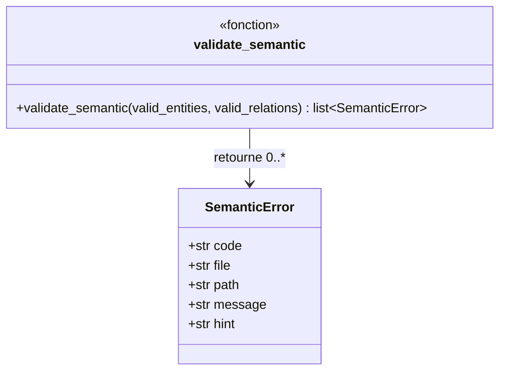
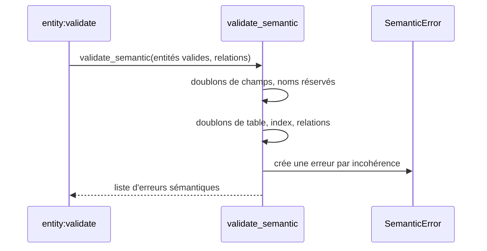

# La validation sémantique des entités dans Forge

Ce document décrit la validation sémantique des entités et des relations.
C'est la seconde passe de `forge entity:validate`, après la validation structurelle JSON Schema.

Le module correspondant est `forge_mvc_entities.entity_semantic_validate`.

## 1. Rôle

La validation sémantique s'exécute sur les fichiers déjà jugés structurellement valides.
Elle vérifie la cohérence qu'un schéma JSON seul ne peut pas garantir :

- doublons de champs dans une même entité ;
- noms de champs réservés en Python ;
- doublons de table entre entités ;
- index pointant vers des champs inexistants ;
- cohérence des relations `many_to_one` et `many_to_many`.

Chaque problème détecté est rapporté avec un code stable `FORGE_*`, le fichier, un chemin JSON et un message.

## 2. Vue d'ensemble rapide

| Élément | Valeur |
|---|---|
| Commande forge | aucune directe (passe de `forge entity:validate`) |
| Module Python | `forge_mvc_entities.entity_semantic_validate` |
| Catégorie | validation du modèle de données |
| Rôle | contrôler la cohérence sémantique des entités et relations |
| Entrées | entités structurellement valides, `relations.json` éventuel |
| Sorties | liste de `SemanticError` (vide si tout est cohérent) |
| Fichiers touchés | aucun (lecture seule) |
| Mode Forge | lit |
| Codes d'erreur | constantes `FORGE_*` stables |

## 3. Schémas UML

### 3.1 Diagramme de classe

Le diagramme suivant montre la structure d'erreur produite par cette passe.



À retenir :

- `validate_semantic` retourne une liste d'erreurs ;
- chaque `SemanticError` porte un code, un fichier, un chemin, un message et une aide ;
- une liste vide signifie que tout est cohérent.

### 3.2 Diagramme de séquence



À retenir :

- seuls les fichiers structurellement valides sont passés en entrée ;
- la fonction parcourt entités puis relations ;
- elle agrège toutes les incohérences trouvées.

## 4. API publique

| Symbole | Signature | Rôle |
|---|---|---|
| `validate_semantic` | `validate_semantic(valid_entities: list[tuple[str, dict[str, Any]]], valid_relations: dict[str, Any] \| None) -> list[SemanticError]` | exécute les contrôles sémantiques et retourne les erreurs |
| `SemanticError` | dataclass `(code, file, path, message, hint)` | erreur sémantique unitaire |

## 5. Contextes d'utilisation

| Besoin | Commande / Élément |
|---|---|
| Détecter une incohérence invisible au schéma | `validate_semantic(...)` |
| Valider la pertinence des relations déclarées | `validate_semantic(...)` |
| Identifier une erreur par un code stable | `SemanticError.code` |

## 6. Exemples d'utilisation

Appel direct de la passe sémantique sur des entités déjà valides :

```python
from forge_mvc_entities.entity_semantic_validate import validate_semantic

errors = validate_semantic(
    valid_entities=[("Contact.json", contact_data)],
    valid_relations=relations_data,
)
for error in errors:
    print(error.code, error.file, error.message)
```

Une liste vide indique que les entités et relations sont cohérentes.

## 7. Codes stables et chemins

!!! note "Erreurs agrégées"
    La fonction ne s'arrête pas à la première erreur : elle retourne toutes les incohérences trouvées.

!!! tip "Localiser l'erreur"
    Le champ `path` de chaque `SemanticError` est un chemin JSON, par exemple `$.fields[2].name`, qui pointe vers l'élément fautif.

## Voir aussi

- [La commande entity:validate](entity_validate.md) : orchestration des deux passes.
- [Les codes d'erreur de validation d'entité](entity_validation_errors.md) : codes stables `FORGE_*`.
- [Les relations globales](relations.md) : validation détaillée des relations.
