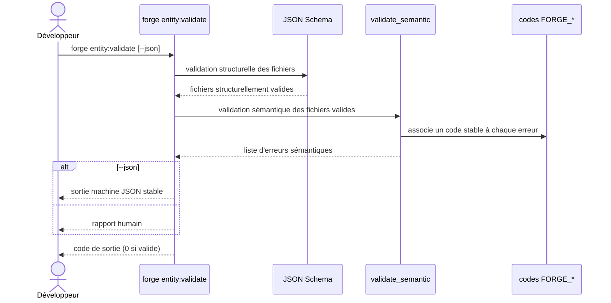

# La commande entity:validate dans Forge

Ce document décrit la commande `forge entity:validate`.
Elle valide les fichiers d'entités et de relations d'un projet en deux passes complémentaires.

Le module correspondant est `forge_mvc_entities.entity_validate`.

## 1. Rôle

`entity:validate` contrôle les définitions d'entités et de relations avant toute génération ou application SQL.
Elle enchaîne deux passes :

1. validation structurelle par JSON Schema (`entity.schema.json`, `relations.schema.json`) ;
2. validation sémantique Forge : doublons de champs, noms réservés Python, doublons de table, cohérence relationnelle.

La passe sémantique est portée par le module `entity_semantic_validate`.
Les codes d'erreur sont des constantes stables préfixées `FORGE_`, définies dans `entity_validation_errors`.

La commande produit une sortie lisible par défaut, ou une sortie machine stable avec `--json`.

## 2. Vue d'ensemble rapide

| Élément | Valeur |
|---|---|
| Commande forge | `forge entity:validate [--json]` |
| Module Python | `forge_mvc_entities.entity_validate` |
| Catégorie | validation du modèle de données |
| Rôle | valider entités et relations (structure puis sémantique) |
| Entrées | fichiers d'entités et `relations.json` du projet |
| Sorties | rapport humain, ou JSON stable avec `--json` ; code de sortie |
| Fichiers touchés | aucun (lecture seule) |
| Mode Forge | lit |
| Codes d'erreur | constantes `FORGE_*` stables |

## 3. Schémas UML

### 3.1 Diagramme de séquence

Le diagramme suivant montre l'enchaînement des deux passes.



À retenir :

- la passe structurelle s'exécute en premier ;
- seuls les fichiers structurellement valides passent en validation sémantique ;
- chaque erreur porte un code stable `FORGE_*` ;
- `--json` produit une sortie machine, sans ligne humaine.

## 4. API publique / Commande

| Symbole | Signature | Rôle |
|---|---|---|
| `main` | `main(args: list[str] \| None = None) -> None` | point d'entrée de `forge entity:validate` |
| `collect_entity_validation_results` | `collect_entity_validation_results(entities_root: Path) -> dict[str, Any] \| None` | collecte les résultats de validation |

Invocation :

| Invocation | Effet |
|---|---|
| `forge entity:validate` | valide entités et relations, sortie humaine |
| `forge entity:validate --json` | valide et émet une sortie machine JSON stable |

## 5. Contextes d'utilisation

| Besoin | Commande / Élément |
|---|---|
| Vérifier les entités avant génération ou SQL | `forge entity:validate` |
| Intégrer la validation dans une CI | `forge entity:validate --json` |
| Collecter les résultats par code | `collect_entity_validation_results(...)` |

## 6. Exemples d'utilisation

Validation lisible des entités et relations :

```bash
forge entity:validate
```

Validation en CI avec sortie machine :

```bash
forge entity:validate --json
```

## 7. Sortie machine et codes stables

!!! note "Sortie --json"
    Avec `--json`, la commande écrit uniquement une sortie machine sur la sortie standard, sans ligne humaine.
    C'est le format adapté aux pipelines et à l'outillage.

!!! tip "Asserter sur les codes"
    Les codes `FORGE_*` sont stables.
    Préférez asserter sur un code plutôt que sur un message dans vos tests.

## Voir aussi

- [La validation sémantique des entités](entity_semantic_validate.md) : seconde passe.
- [Les codes d'erreur de validation d'entité](entity_validation_errors.md) : codes stables `FORGE_*`.
- [La validation canonique des entités](validation.md) : règles de la définition d'entité.
