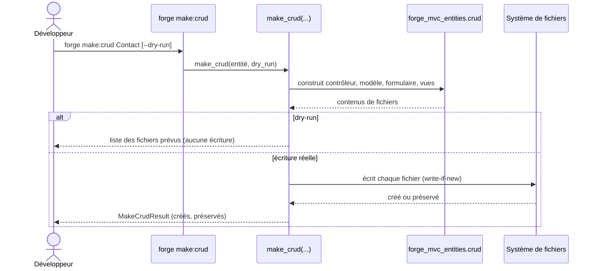

# La commande make:crud dans Forge

Ce document décrit la commande `forge make:crud`.
Elle génère un CRUD complet à partir d'une entité déjà définie.

Le module correspondant est `forge_mvc_entities.make_crud`.

## 1. Rôle

`make:crud` produit, pour une entité, l'ensemble des fichiers d'un CRUD : contrôleur, modèle, formulaire, vues (liste, fiche, formulaires) et mise en page.
Elle génère du SQL visible et du code lisible, sans magie cachée (principes 3 et 5).

Toutes les écritures suivent le mode write-if-new : un fichier existant n'est jamais écrasé (principe 9).
Le mode `--dry-run` permet de prévisualiser les fichiers qui seraient créés, sans rien écrire.

La logique de construction est déléguée aux constructeurs du sous-paquet `packages/forge-mvc-entities/forge_mvc_entities/crud/`.

## 2. Vue d'ensemble rapide

| Élément | Valeur |
|---|---|
| Commande forge | `forge make:crud <NomEntite> [--dry-run]` |
| Module Python | `forge_mvc_entities.make_crud` |
| Catégorie | génération du modèle de données |
| Rôle | générer un CRUD complet pour une entité existante |
| Entrées | nom d'entité, option `--dry-run` |
| Sorties | contrôleur, modèle, formulaire, vues, mise en page |
| Fichiers touchés | arborescence `mvc/` du projet |
| Mode Forge | génère (write-if-new), affiche (dry-run) |
| Résultat | `MakeCrudResult` (fichiers créés, fichiers préservés) |

## 3. Schémas UML

### 3.1 Diagramme de séquence

Le diagramme suivant montre le déroulé de `forge make:crud`.



À retenir :

- la génération est déléguée aux constructeurs de `forge_mvc_entities.crud` ;
- `--dry-run` affiche les fichiers prévus sans écrire ;
- chaque fichier déjà présent est préservé, jamais écrasé ;
- le résultat distingue les fichiers créés des fichiers préservés.

## 4. API publique / Commande

| Symbole | Signature | Rôle |
|---|---|---|
| `make_crud` | `make_crud(...) -> MakeCrudResult` | génère l'ensemble des fichiers CRUD d'une entité |
| `cmd_make_crud_main` | `cmd_make_crud_main(args: list[str]) -> None` | point d'entrée de `forge make:crud` |
| `MakeCrudResult` | dataclass | résultat de génération (fichiers créés, fichiers préservés) |

Invocation :

| Invocation | Effet |
|---|---|
| `forge make:crud Contact` | génère le CRUD de l'entité `Contact` |
| `forge make:crud Contact --dry-run` | affiche les fichiers prévus sans écrire |

## 5. Contextes d'utilisation

| Besoin | Commande / Élément |
|---|---|
| Obtenir un CRUD fonctionnel pour une entité | `forge make:crud NomEntite` |
| Prévisualiser sans écrire | `forge make:crud NomEntite --dry-run` |
| Inspecter le résultat par code | `MakeCrudResult` |

## 6. Exemples d'utilisation

Génération complète du CRUD d'une entité :

```bash
forge make:crud Contact
```

Prévisualisation des fichiers prévus, sans écriture :

```bash
forge make:crud Contact --dry-run
```

## 7. Génération write-if-new

!!! note "Aucune réécriture silencieuse"
    `make:crud` ne réécrit jamais un fichier existant.
    Si un contrôleur ou une vue existe déjà, Forge le préserve et l'indique dans le résultat (principe 9).

!!! tip "Prévisualiser avant d'écrire"
    Utilisez `--dry-run` pour voir la liste des fichiers qui seraient créés avant de lancer la génération réelle.

## Voir aussi

- [La commande make:entity](make_entity.md) : création de l'entité source.
- [La commande make:relation](make_relation.md) : déclaration de relations entre entités.
- [Les commandes build:model, check:model et sync:entity](model.md) : régénération des modèles.
