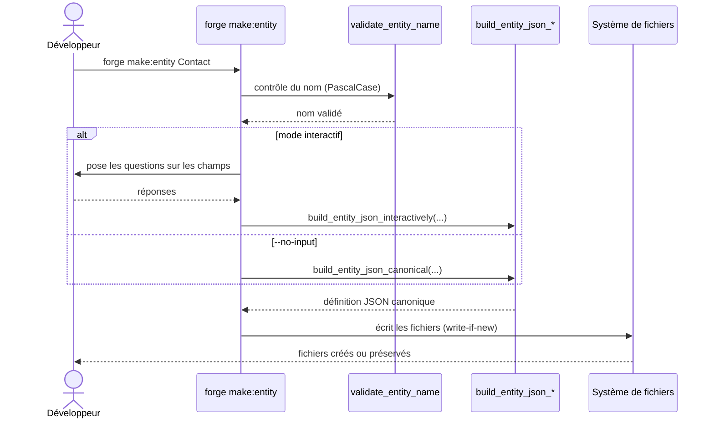

# La commande make:entity dans Forge

Ce document décrit la commande `forge make:entity`.
Elle génère la définition JSON canonique d'une entité Forge, ainsi que les fichiers Python de cette entité.

Le module correspondant est `cli.entities.make_entity`.

## 1. Rôle

`make:entity` crée une nouvelle entité du modèle de données.
Elle produit la définition au format canonique (`schema_version: "1.0"`), puis les fichiers Python associés.

La commande fonctionne en deux modes :

- interactif : Forge pose des questions pour construire les champs un à un ;
- non interactif : avec `--no-input`, Forge génère une entité minimale à partir du nom fourni.

Le nom d'entité doit être en PascalCase, par exemple `Contact` ou `BlogPost`.
Toutes les écritures suivent le mode write-if-new : Forge ne réécrit jamais un fichier existant (principe 9).

## 2. Vue d'ensemble rapide

| Élément | Valeur |
|---|---|
| Commande forge | `forge make:entity <NomEntite> [--no-input]` |
| Module Python | `cli.entities.make_entity` |
| Catégorie | génération du modèle de données |
| Rôle | créer la définition d'une entité et ses fichiers Python |
| Entrées | nom d'entité (PascalCase), réponses interactives ou `--no-input` |
| Sorties | fichier JSON d'entité, fichiers Python de l'entité |
| Fichiers touchés | dossier d'entités du projet (`mvc/entities/`) |
| Mode Forge | génère (write-if-new) |

## 3. Schémas UML

### 3.1 Diagramme de séquence

Le diagramme suivant montre le déroulé de `forge make:entity`.



À retenir :

- le nom est validé avant toute écriture ;
- le mode interactif construit les champs un à un ;
- `--no-input` produit une entité minimale ;
- aucun fichier existant n'est écrasé.

## 4. API publique / Commande

| Symbole | Signature | Rôle |
|---|---|---|
| `main` | `main(argv: list[str] \| None = None) -> None` | point d'entrée de `forge make:entity` |
| `validate_entity_name` | `validate_entity_name(name: str) -> str` | valide le nom d'entité (PascalCase) |
| `build_entity_json_canonical` | `build_entity_json_canonical(entity_name: str, table: str \| None = None) -> dict[str, Any]` | construit la définition JSON canonique minimale |
| `build_entity_json_interactively` | `build_entity_json_interactively(...) -> dict[str, Any]` | construit la définition en mode interactif |
| `to_snake` | `to_snake(name: str) -> str` | convertit un nom en `snake_case` |
| `entities_dir` | `entities_dir(root: Path \| None = None) -> Path` | localise le dossier d'entités |
| `project_root` | `project_root() -> Path` | localise la racine du projet |

Invocation :

| Invocation | Effet |
|---|---|
| `forge make:entity Contact` | génère l'entité `Contact` en mode interactif |
| `forge make:entity Contact --no-input` | génère une entité minimale sans interaction |

## 5. Contextes d'utilisation

| Besoin | Commande / Élément |
|---|---|
| Démarrer une nouvelle entité | `forge make:entity NomEntite` |
| Générer sans interaction (CI, script) | `forge make:entity NomEntite --no-input` |
| Valider un nom d'entité par code | `validate_entity_name(name)` |

## 6. Exemples d'utilisation

Création interactive d'une entité :

```bash
forge make:entity Contact
```

Création non interactive, utile en script ou en CI :

```bash
forge make:entity Contact --no-input
```

Construction de la définition canonique par code :

```python
from cli.entities.make_entity import build_entity_json_canonical

definition = build_entity_json_canonical("Contact")
print(definition["name"])   # Contact
```

## 7. Génération write-if-new

!!! note "Forge génère, Forge ne réécrit pas"
    `make:entity` crée des fichiers nouveaux uniquement.
    Si un fichier d'entité existe déjà, Forge le préserve au lieu de l'écraser (principe 9).

!!! tip "Nom d'entité"
    Le nom doit être en PascalCase.
    Forge en dérive le nom de table en `snake_case` via `to_snake(...)`.

## Voir aussi

- [La commande make:crud](make_crud.md) : génération du CRUD à partir de l'entité.
- [La commande entity:validate](entity_validate.md) : validation des entités générées.
- [La validation canonique des entités](validation.md) : règles de validation du format.
