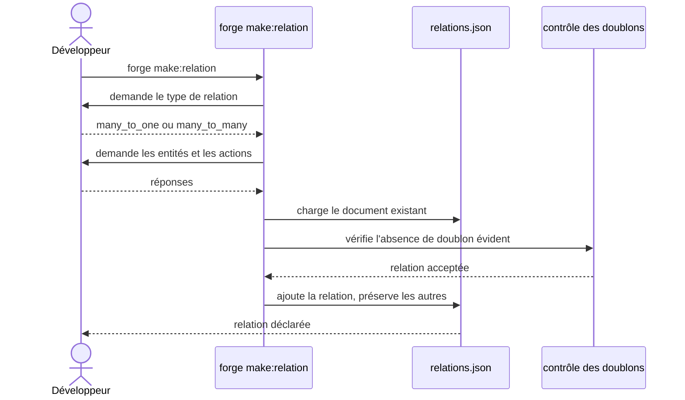

# La commande make:relation dans Forge

Ce document décrit la commande `forge make:relation`.
Elle déclare une relation entre deux entités dans le document de relations du projet.

Le module correspondant est `cli.entities.make_relation`.

## 1. Rôle

`make:relation` ajoute une relation entre entités au document `mvc/entities/relations.json`.
Elle fonctionne en mode interactif : elle guide le choix du type de relation, des entités et des actions.

Elle prend en charge les relations `many_to_one` et `many_to_many` (pivot canonique).
Elle ajoute la relation au document existant sans détruire les relations déjà déclarées (principe 9).

## 2. Vue d'ensemble rapide

| Élément | Valeur |
|---|---|
| Commande forge | `forge make:relation` |
| Module Python | `cli.entities.make_relation` |
| Catégorie | génération du modèle de données |
| Rôle | déclarer une relation entre entités |
| Entrées | réponses interactives (type, entités, actions) |
| Sorties | une entrée ajoutée dans `relations.json` |
| Fichiers touchés | `mvc/entities/relations.json` |
| Mode Forge | génère (ajout sans destruction des relations existantes) |
| Types pris en charge | `many_to_one`, `many_to_many` |

## 3. Schémas UML

### 3.1 Diagramme de séquence

Le diagramme suivant montre le déroulé interactif de `forge make:relation`.



À retenir :

- la commande est entièrement interactive ;
- elle charge le document existant avant d'y ajouter une relation ;
- un contrôle empêche un doublon évident ;
- les relations déjà déclarées sont préservées.

## 4. API publique / Commande

| Symbole | Signature | Rôle |
|---|---|---|
| `main` | `main(argv: list[str] \| None = None) -> None` | point d'entrée de `forge make:relation` |

Le module est principalement interactif.
Son point d'entrée assemble la relation à partir des réponses de l'utilisateur, puis l'écrit dans `relations.json`.

Invocation :

| Invocation | Effet |
|---|---|
| `forge make:relation` | lance l'assistant interactif de déclaration de relation |

## 5. Contextes d'utilisation

| Besoin | Commande / Élément |
|---|---|
| Relier deux entités existantes | `forge make:relation` |
| Déclarer une relation `many_to_many` enrichie | `forge make:relation` |

## 6. Exemples d'utilisation

Lancer l'assistant de déclaration de relation :

```bash
forge make:relation
```

L'assistant pose successivement le type de relation, les entités concernées et les actions, puis ajoute l'entrée dans `relations.json`.

## 7. Ajout sans destruction

!!! note "Préservation des relations existantes"
    `make:relation` ajoute une relation au document sans réécrire ni supprimer les relations déjà présentes (principe 9).

!!! tip "Valider après déclaration"
    Après l'ajout, lancez `forge entity:validate` pour vérifier la cohérence des relations déclarées.

## Voir aussi

- [La commande entity:validate](entity_validate.md) : validation des relations déclarées.
- [Les relations globales](relations.md) : validation et génération du SQL de relations.
- [La commande make:entity](make_entity.md) : création des entités à relier.
