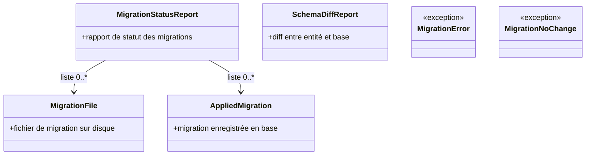
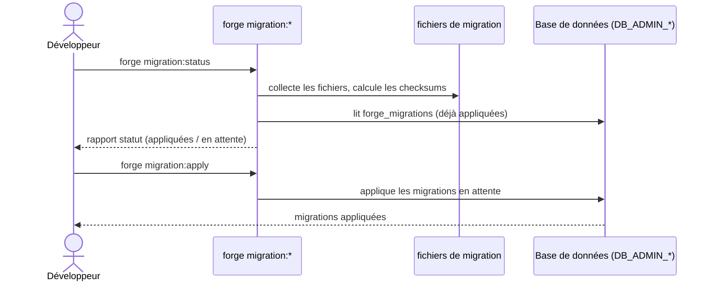

# Les commandes migration:* dans Forge

Ce document décrit la famille de commandes `forge migration:*`.
Elle gère les migrations SQL du projet : statut, application, création et diff.

Le module correspondant est `cli.entities.migrations`.

## 1. Rôle

Ces commandes gèrent le cycle de vie des migrations SQL d'un projet.
Une migration est un fichier SQL versionné, identifié par un checksum qui permet de détecter toute altération.

Quatre commandes sont disponibles :

- `migration:status` : état des migrations appliquées et en attente ;
- `migration:apply` : application des migrations en attente ;
- `migration:make` : création d'un fichier de migration ;
- `migration:diff` : diff SQL entre une entité et l'état de la base.

Les opérations base de données utilisent les identifiants d'administration (`DB_ADMIN_*`).
Le SQL des migrations reste visible, écrit à la main ou généré explicitement (principes 3 et 5).

## 2. Vue d'ensemble rapide

| Élément | Valeur |
|---|---|
| Commandes forge | `forge migration:status`, `forge migration:apply [--dry-run]`, `forge migration:make <nom>`, `forge migration:diff --entity <Entite>` |
| Module Python | `cli.entities.migrations` |
| Catégorie | base de données |
| Rôle | suivre, créer et appliquer les migrations SQL |
| Entrées | fichiers de migration, entités, état de la base |
| Sorties | rapport de statut, fichier de migration, diff SQL, migrations appliquées |
| Fichiers touchés | génère des fichiers de migration (write-if-new) |
| Mode Forge | génère (`migration:make`), lit (`status`, `diff`), applique (`apply`) |
| ADR liés | ADR-033 (identifiants admin) |

## 3. Schémas UML

### 3.1 Diagramme de classe



À retenir :

- une migration existe sous deux formes : fichier sur disque et enregistrement appliqué en base ;
- le rapport de statut croise les deux ;
- le diff de schéma compare une entité à l'état réel de la base ;
- `MigrationNoChange` signale l'absence de différence à migrer.

### 3.2 Diagramme de séquence



À retenir :

- `migration:status` croise fichiers et table `forge_migrations` ;
- les checksums détectent une altération d'un fichier déjà appliqué ;
- `migration:apply` exécute uniquement les migrations en attente ;
- `--dry-run` permet de prévisualiser `migration:apply`.

## 4. API publique / Commande

| Symbole | Signature | Rôle |
|---|---|---|
| `build_migration_status` | `build_migration_status(...)` | construit le rapport de statut |
| `build_schema_diff_report` | `build_schema_diff_report(...)` | génère un diff SQL entre entité et base |
| `migration_checksum` | `migration_checksum(path: Path) -> str` | calcule le checksum d'un fichier de migration |
| `make_migration_file` | `make_migration_file(...)` | crée un fichier de migration |
| `apply_pending_migrations` | `apply_pending_migrations(...)` | applique les migrations en attente |
| `MigrationStatusReport` / `MigrationFile` / `AppliedMigration` | dataclasses | structures du suivi des migrations |
| `MigrationError` / `MigrationNoChange` | exceptions | erreurs et absence de changement |
| `main` | `main(argv: list[str] \| None = None) -> None` | point d'entrée dispatchant `migration:status` / `migration:apply` / `migration:make` / `migration:diff` |

Invocation :

| Invocation | Effet |
|---|---|
| `forge migration:status` | affiche l'état des migrations |
| `forge migration:apply` | applique les migrations en attente |
| `forge migration:apply --dry-run` | prévisualise l'application |
| `forge migration:make <nom>` | crée un fichier de migration |
| `forge migration:make <nom> --from-entity <Entite> [--with-relations]` | migration depuis le SQL d'une entité, avec option les relations (FK) |
| `forge migration:make <nom> --from-entities [--with-relations]` | migration depuis toutes les entités, avec option les relations |
| `forge migration:make <nom> --from-diff <Entite>` | crée une migration depuis un diff d'entité |
| `forge migration:diff --entity <Entite>` | affiche le diff SQL entre l'entité et la base |

## 5. Contextes d'utilisation

| Besoin | Commande / Élément |
|---|---|
| Connaître les migrations appliquées et en attente | `forge migration:status` |
| Créer une migration | `forge migration:make <nom>` |
| Appliquer les migrations en attente | `forge migration:apply` |
| Comparer le modèle et l'état de la base | `forge migration:diff --entity <Entite>` |

## 6. Exemples d'utilisation

Consulter le statut puis appliquer les migrations en attente :

```bash
forge migration:status
forge migration:apply
```

Créer une migration à partir du diff d'une entité :

```bash
forge migration:diff --entity Contact
forge migration:make ajout_champ_contact --from-diff Contact
```

## 7. Checksums et write-if-new

!!! note "Détection d'altération"
    Chaque migration appliquée est enregistrée avec un checksum.
    Si un fichier déjà appliqué est modifié, le statut le signale.

!!! tip "Prévisualiser une application"
    Utilisez `forge migration:apply --dry-run` pour voir ce qui serait appliqué avant l'exécution réelle.

## Voir aussi

- [La commande db:apply](db_apply.md) : application du schéma SQL du modèle.
- [La commande db:init](db_init.md) : provisioning de la base et de la table `forge_migrations`.
- [Les commandes build:model, check:model et sync:entity](model.md) : génération des modèles et du SQL.
