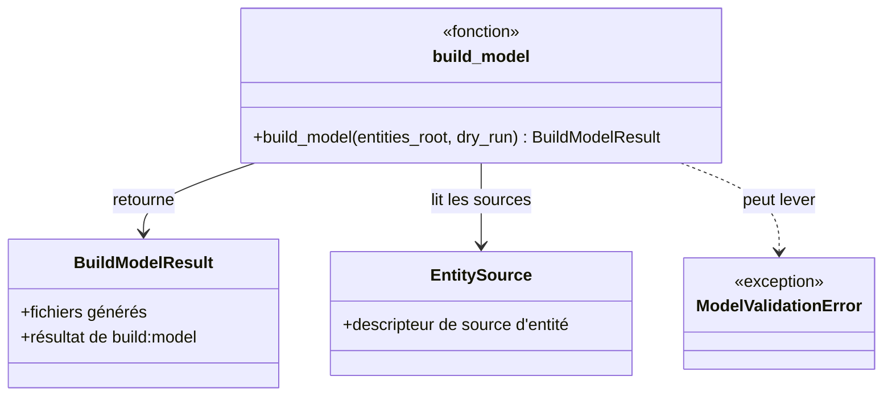
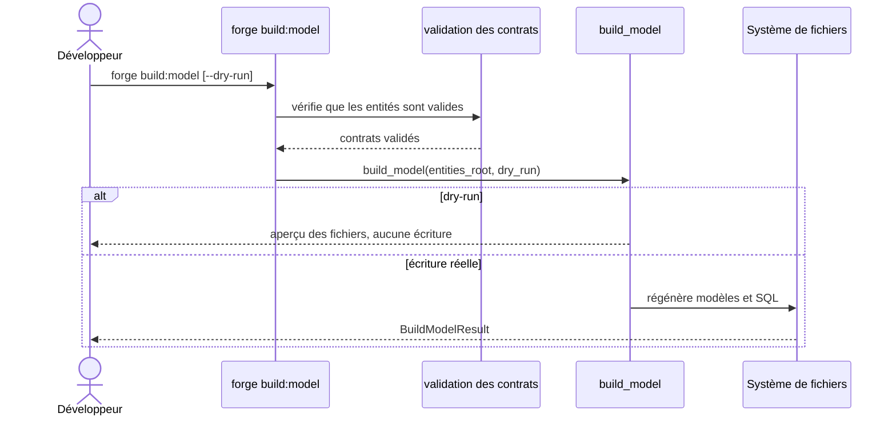

# Les commandes build:model, check:model et sync:entity dans Forge

Ce document décrit l'orchestration du modèle d'entités.
Le module porte les commandes `build:model`, `check:model`, `sync:entity` et `sync:relations`.

Le module correspondant est `cli.entities.model`.

## 1. Rôle

Ce module orchestre la génération des modèles Python et du SQL à partir des entités JSON.
Il porte plusieurs commandes :

- `build:model` : régénère l'ensemble des modèles et du SQL ;
- `check:model` : vérifie la cohérence des modèles sans écrire ;
- `sync:entity` : régénère les fichiers d'une entité ciblée ;
- `sync:relations` : régénère le SQL des relations (`relations.sql`).

La génération s'appuie sur des contrats validés au préalable.
Un mode `--dry-run` permet de prévisualiser `build:model` sans écrire.

## 2. Vue d'ensemble rapide

| Élément | Valeur |
|---|---|
| Commandes forge | `forge build:model [--dry-run]`, `forge check:model`, `forge sync:entity <NomEntite>`, `forge sync:relations` |
| Module Python | `cli.entities.model` |
| Catégorie | génération du modèle de données |
| Rôle | régénérer modèles et SQL, vérifier leur cohérence |
| Entrées | entités JSON du projet, `relations.json` |
| Sorties | fichiers de modèle Python, fichiers SQL |
| Fichiers touchés | fichiers `_base.py` et SQL générés sous `mvc/entities/` |
| Mode Forge | génère (fichiers régénérables), lit (`check:model`, dry-run) |

## 3. Schémas UML

### 3.1 Diagramme de classe



À retenir :

- `build_model` retourne un `BuildModelResult` ;
- il lit les entités via des `EntitySource` ;
- un contrat invalide lève `ModelValidationError`.

### 3.2 Diagramme de séquence



À retenir :

- les contrats sont validés avant toute génération ;
- `--dry-run` montre l'aperçu sans écrire ;
- `build:model` régénère modèles et SQL ;
- les fichiers générés sont régénérables (suffixe `_base.py`).

## 4. API publique / Commande

| Symbole | Signature | Rôle |
|---|---|---|
| `build_model` | `build_model(entities_root: Path, *, dry_run: bool = False) -> BuildModelResult` | régénère l'ensemble des modèles |
| `check_model` | `check_model(...)` | vérifie la cohérence des modèles |
| `sync_entity` | `sync_entity(entities_root: Path, entity_name: str) -> tuple[Path, Path]` | régénère les fichiers d'une entité |
| `sync_relations` | `sync_relations(entities_root: Path) -> Path` | régénère `relations.sql` |
| `BuildModelResult` / `EntitySource` | dataclasses | résultat de build et descripteur de source |
| `ModelValidationError` | exception | contrat invalide |
| `main` | `main(argv: list[str] \| None = None) -> None` | point d'entrée dispatchant les commandes du modèle |

Invocation :

| Invocation | Effet |
|---|---|
| `forge build:model` | régénère tous les modèles et le SQL |
| `forge build:model --dry-run` | affiche l'aperçu sans écrire |
| `forge check:model` | vérifie la cohérence des modèles |
| `forge sync:entity Contact` | régénère les fichiers de l'entité `Contact` |
| `forge sync:relations` | régénère `relations.sql` |

## 5. Contextes d'utilisation

| Besoin | Commande / Élément |
|---|---|
| Reconstruire les modèles après modification | `forge build:model` |
| Vérifier sans écrire | `forge check:model` ou `forge build:model --dry-run` |
| Régénérer une seule entité | `forge sync:entity NomEntite` |
| Régénérer le SQL de relations | `forge sync:relations` |

## 6. Exemples d'utilisation

Régénérer tous les modèles après une modification d'entité :

```bash
forge build:model
```

Prévisualiser sans écrire :

```bash
forge build:model --dry-run
```

Régénérer une entité ciblée puis vérifier la cohérence :

```bash
forge sync:entity Contact
forge check:model
```

## 7. Régénération et contrats

!!! note "Fichiers régénérables"
    `build:model` régénère les fichiers `_base.py`, conçus pour être reconstruits à partir des entités.
    Le code que vous écrivez à la main, hors `_base.py`, n'est pas écrasé.

!!! warning "Validation préalable"
    La génération s'appuie sur des contrats validés.
    Un contrat invalide lève `ModelValidationError` et interrompt la génération.

## Voir aussi

- [Les relations globales](relations.md) : validation et génération du SQL de relations.
- [Le normaliseur canonique du modèle](canonical_model_normalizer.md) : traduction vers la structure interne.
- [La commande db:apply](db_apply.md) : application du SQL généré à la base.
