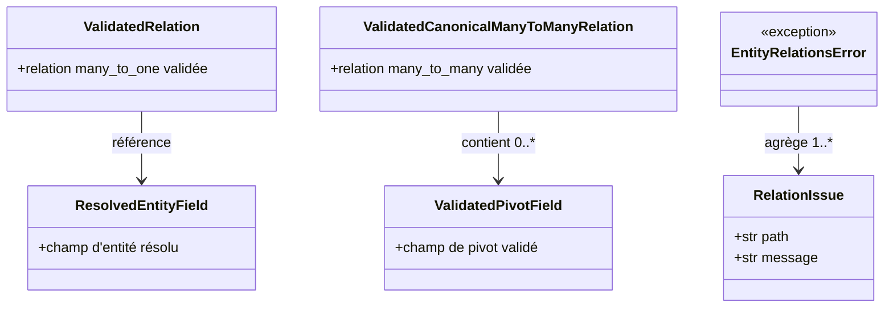
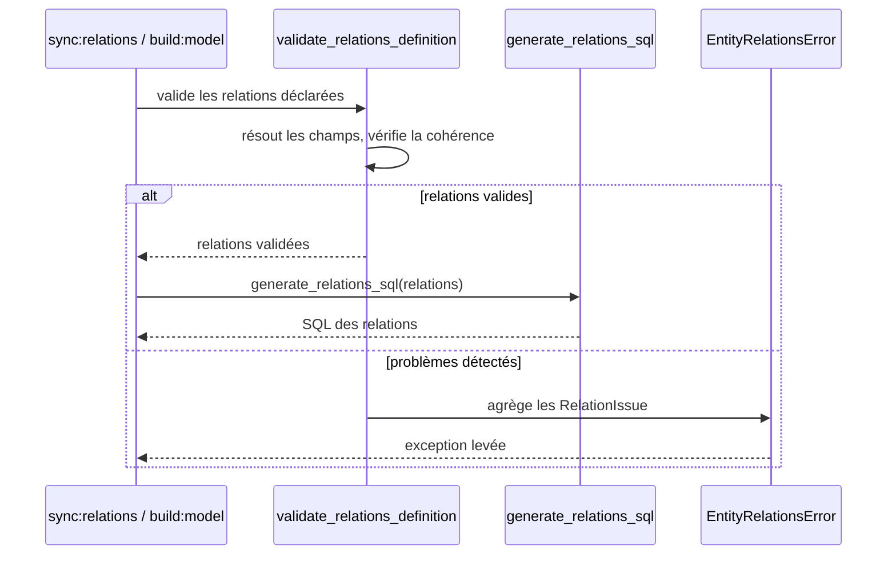

# Les relations globales dans Forge

Ce document décrit la validation et la génération des relations globales entre entités.

Le module correspondant est `forge_mvc_entities.relations`.

## 1. Rôle

Ce module valide les relations déclarées entre entités et en génère le SQL global. Il résout les champs concernés, vérifie la cohérence des liens et signale les problèmes rencontrés.

Il prend en charge les relations `many_to_one` et les relations `many_to_many` canoniques (pivot enrichi).
Le SQL produit reste visible et inspectable (principe 5).

## 2. Vue d'ensemble rapide

| Élément | Valeur |
|---|---|
| Commande forge | aucune directe (brique de `sync:relations` et `build:model`) |
| Module Python | `forge_mvc_entities.relations` |
| Catégorie | génération du modèle de données |
| Rôle | valider les relations et générer leur SQL |
| Entrées | définitions d'entités et `relations.json` |
| Sorties | relations validées, SQL des relations, ou `EntityRelationsError` |
| Fichiers touchés | aucun directement (le SQL est consommé par `sync:relations`) |
| Mode Forge | lit |
| Types pris en charge | `many_to_one`, `many_to_many` canonique |

## 3. Schémas UML

### 3.1 Diagramme de classe



À retenir :

- les relations validées existent en deux formes : `many_to_one` et `many_to_many` canonique ;
- les champs sont résolus en `ResolvedEntityField` et `ValidatedPivotField` ;
- chaque problème est un `RelationIssue` (chemin, message) ;
- les problèmes sont agrégés dans `EntityRelationsError`.

### 3.2 Diagramme de séquence



À retenir :

- la validation résout les champs et contrôle la cohérence des liens ;
- les relations valides alimentent la génération du SQL ;
- les problèmes sont remontés ensemble dans une exception.

## 4. API publique

| Symbole | Type | Rôle |
|---|---|---|
| `ValidatedRelation` | dataclass | relation `many_to_one` validée |
| `ValidatedCanonicalManyToManyRelation` | dataclass | relation `many_to_many` canonique validée |
| `ResolvedEntityField` | dataclass | champ d'entité résolu |
| `ValidatedPivotField` | dataclass | champ de pivot validé |
| `RelationIssue` | dataclass `(path, message)` | problème détecté sur une relation |
| `EntityRelationsError` | exception | relations invalides (problèmes agrégés) |

## 5. Contextes d'utilisation

| Besoin | Commande / Élément |
|---|---|
| Vérifier la cohérence globale des relations | validation des relations du projet |
| Produire le SQL des relations entre entités | génération du SQL des relations |
| Déclarer une relation de façon interactive | `forge make:relation` |
| Régénérer le SQL de relations | `forge sync:relations` |

## 6. Exemples d'utilisation

La validation et la génération sont déclenchées par les commandes du modèle.

Régénérer le SQL des relations du projet :

```bash
forge sync:relations
```

Déclarer une relation puis valider l'ensemble :

```bash
forge make:relation
forge entity:validate
```

## 7. Pivot canonique et SQL visible

!!! note "Relations many_to_many enrichies"
    Une relation `many_to_many` canonique s'appuie sur un pivot dont les champs sont validés (`ValidatedPivotField`).
    Le SQL produit reste lisible et inspectable (principe 5).

## Voir aussi

- [Les commandes build:model, check:model et sync:entity](model.md) : `sync:relations` et build du modèle.
- [La commande make:relation](make_relation.md) : déclaration interactive d'une relation.
- [La commande entity:validate](entity_validate.md) : validation des relations déclarées.
