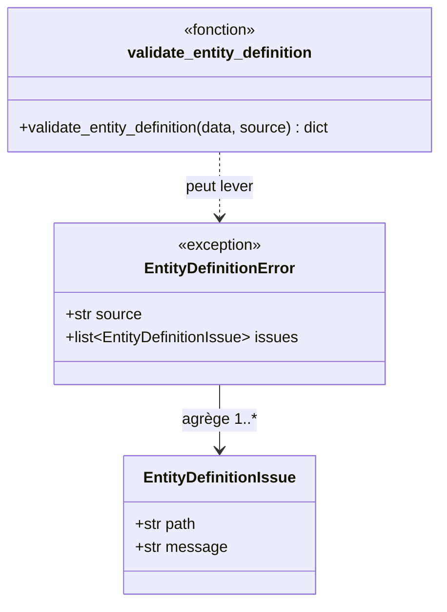
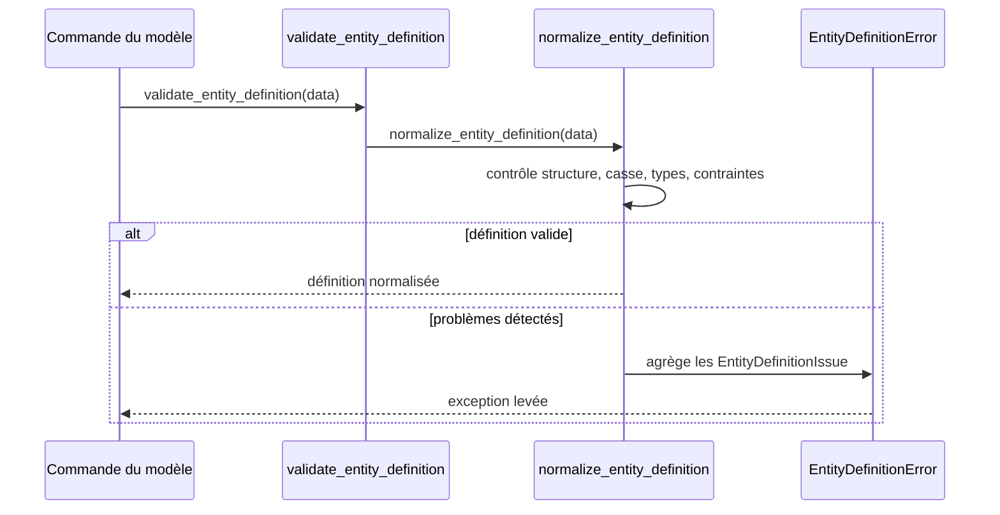

# La validation canonique des entités dans Forge

Ce document décrit la validation canonique d'une définition d'entité.
C'est une brique de validation interne réutilisée par les commandes de génération et de modèle.

Le module correspondant est `forge_mvc_entities.validation`.

## 1. Rôle

Ce module valide la structure et les valeurs d'une définition d'entité au format canonique.
Il contrôle, entre autres :

- la casse des noms : PascalCase pour l'entité, `snake_case` pour les champs ;
- la cohérence des types SQL et Python ;
- les contraintes, valeurs par défaut et options de formulaire ;
- les structures RBAC et médias éventuelles.

Il propose des suggestions, calculées avec `difflib`, lorsqu'une valeur est proche d'une valeur attendue.
Quand des problèmes sont détectés, il les agrège dans une seule exception `EntityDefinitionError`.

## 2. Vue d'ensemble rapide

| Élément | Valeur |
|---|---|
| Commande forge | aucune directe (brique utilisée par les commandes du modèle) |
| Module Python | `forge_mvc_entities.validation` |
| Catégorie | validation du modèle de données |
| Rôle | valider et normaliser une définition d'entité canonique |
| Entrées | une définition d'entité (dict JSON) |
| Sorties | définition normalisée, ou `EntityDefinitionError` |
| Fichiers touchés | aucun (lecture seule) |
| Mode Forge | lit |
| ADR liés | ADR-013 (nullable/required), ADR-017 (slug), ADR-054 (types par dialecte) |

## 3. Schémas UML

### 3.1 Diagramme de classe



À retenir :

- `validate_entity_definition` retourne une définition normalisée ;
- en cas de problème, elle lève `EntityDefinitionError` ;
- l'exception agrège tous les problèmes via des `EntityDefinitionIssue` ;
- chaque problème porte un chemin et un message.

### 3.2 Diagramme de séquence



À retenir :

- `validate_entity_definition` délègue à `normalize_entity_definition` ;
- la normalisation contrôle structure, casse, types et contraintes ;
- une définition valide ressort normalisée ;
- les problèmes sont remontés ensemble dans une exception.

## 4. API publique

| Symbole | Signature | Rôle |
|---|---|---|
| `validate_entity_definition` | `validate_entity_definition(data: Any, *, source: str = "<entity.json>") -> dict[str, Any]` | valide et retourne la définition normalisée |
| `normalize_entity_definition` | `normalize_entity_definition(data: Any, *, source: str = "<entity.json>") -> dict[str, Any]` | normalise la définition, contrôle inclus |
| `EntityDefinitionIssue` | dataclass `(path, message)` | problème unitaire détecté |
| `EntityDefinitionError` | exception | agrège les problèmes de validation |

## 5. Contextes d'utilisation

| Besoin | Commande / Élément |
|---|---|
| Valider une entité avant génération | `validate_entity_definition(data)` |
| Normaliser une définition d'entité | `normalize_entity_definition(data)` |
| Signaler précisément un champ invalide | `EntityDefinitionIssue` |

## 6. Exemples d'utilisation

Valider une définition d'entité chargée depuis un fichier JSON :

```python
import json
from forge_mvc_entities.validation import (
    validate_entity_definition,
    EntityDefinitionError,
)

data = json.loads(path.read_text(encoding="utf-8"))
try:
    normalized = validate_entity_definition(data, source=path.name)
except EntityDefinitionError as exc:
    for issue in exc.issues:
        print(issue.path, issue.message)
```

## 7. Suggestions et agrégation

!!! note "Problèmes agrégés"
    La validation ne s'arrête pas au premier problème : elle les agrège tous dans une seule `EntityDefinitionError`.

!!! tip "Suggestions de correction"
    Sur une valeur proche d'une valeur attendue, le module propose une suggestion calculée avec `difflib`, pour aider à corriger une faute de frappe.

## Voir aussi

- [La commande entity:validate](entity_validate.md) : validation complète des entités d'un projet.
- [Le normaliseur canonique du modèle](canonical_model_normalizer.md) : traduction vers la structure interne.
- [Les commandes build:model, check:model et sync:entity](model.md) : consommateurs de cette validation.
