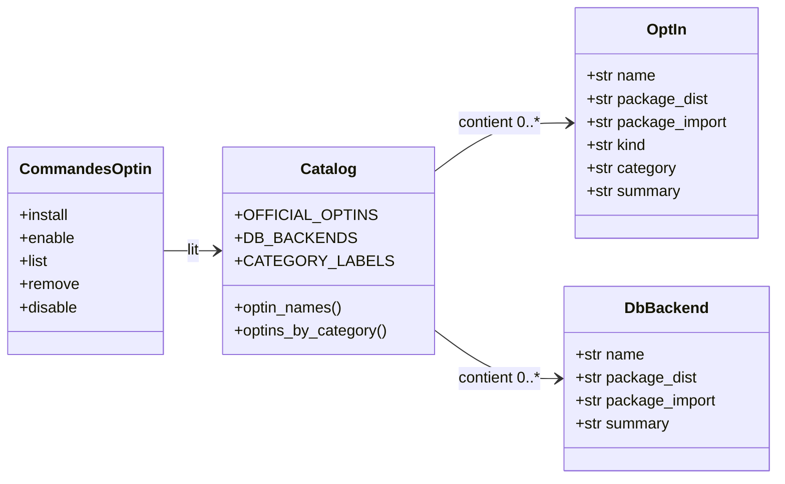

# Le catalogue des opt-ins dans Forge

Ce document décrit le catalogue canonique des opt-ins officiels de Forge.
Il sert de source de vérité unique à toute la famille de commandes `opt-in:*` (ADR-016).

## 1. Rôle

`cli/optins/catalog.py` est la source de vérité unique de la famille de commandes `opt-in:*`.
Il décrit les opt-ins officiels, chacun distribué comme package PyPI `forge-mvc-*`.

Le catalogue décrit seulement ce qui existe, c'est-à-dire le plan de distribution.
L'état d'activation dans un projet donné se lit ailleurs, dans la couche `optins/` du projet (commande `opt-in:list`).

Chaque opt-in porte un *kind* qui dit comment il s'intègre techniquement, et une *catégorie* qui dit à quoi il sert (ADR-055).
Le catalogue distingue aussi les backends de base de données, une famille exclusive (ADR-054) gérée à part par la famille `db:*`.

## 2. Vue d'ensemble rapide

| Élément | Valeur |
|---|---|
| Module Python | `cli.optins.catalog` |
| Catégorie | module de référence partagé par la CLI et la documentation |
| Rôle | décrire les opt-ins officiels et les backends BDD |
| Entrées | aucune (données statiques en code) |
| Sorties | structures de données (`OptIn`, `DbBackend`, dictionnaires) |
| Fichiers touchés | aucun (lecture seule, pas d'effet de bord) |
| Mode Forge | aucun (module interne, pas une commande directe) |
| ADR liés | ADR-016, ADR-052, ADR-053, ADR-054, ADR-055 |

Ce module ne s'invoque pas directement en ligne de commande.
Il est importé par les commandes `opt-in:install`, `opt-in:enable`, `opt-in:list`, `opt-in:remove` et `opt-in:disable`.

## 3. Schémas UML

### 3.1 Diagramme de classe

Le diagramme montre les deux structures du catalogue et leur consommation par les commandes `opt-in:*`.



À retenir :

- `OptIn` décrit une brique optionnelle officielle ;
- `DbBackend` décrit un backend de base de données, famille exclusive à part ;
- toutes les commandes `opt-in:*` lisent ce catalogue, sans jamais importer les paquets `forge_mvc_*` ;
- `optins_by_category()` fournit le groupement par destination, partagé par la CLI et la documentation.

## 4. API publique

| Symbole | Signature | Rôle |
|---|---|---|
| `OptIn` | `OptIn(name, package_dist, package_import, kind, category, summary)` | description d'un opt-in officiel |
| `DbBackend` | `DbBackend(name, package_dist, package_import, summary)` | description d'un backend BDD |
| `OFFICIAL_OPTINS` | `dict[str, OptIn]` | catalogue complet des opt-ins officiels |
| `DB_BACKENDS` | `tuple[DbBackend, ...]` | backends BDD (famille exclusive) |
| `CATEGORY_LABELS` | `dict[str, str]` | libellés français des catégories |
| `CATEGORY_ORDER` | `tuple[str, ...]` | ordre d'affichage des catégories |
| `optin_names()` | `optin_names() -> list[str]` | identifiants courts triés des opt-ins |
| `optins_by_category()` | `optins_by_category() -> dict[str, list[OptIn]]` | opt-ins groupés par catégorie non vide |

Constantes de *kind* (forme d'intégration) : `KIND_ROUTE`, `KIND_LIBRARY`, `KIND_CROSSCUTTING`, `KIND_CLI`.

Constantes de catégorie (destination) : `CATEGORY_DATABASE`, `CATEGORY_MEDIA`, `CATEGORY_SECURITY`, `CATEGORY_COMMUNICATION`, `CATEGORY_DATA`, `CATEGORY_I18N`, `CATEGORY_CONTENT`, `CATEGORY_CONFIGURATION`, `CATEGORY_OPERATIONS`.

## 5. Contextes d'utilisation

| Besoin | Élément |
|---|---|
| Décrire un opt-in officiel | `OptIn` |
| Lister tous les opt-ins | `OFFICIAL_OPTINS` |
| Lister les noms triés | `optin_names()` |
| Grouper par destination | `optins_by_category()` |
| Lire les backends BDD | `DB_BACKENDS` |
| Afficher un libellé de catégorie | `CATEGORY_LABELS` |

## 6. Exemples d'utilisation

Lecture programmatique du catalogue depuis du code Python interne au CLI :

```python
from cli.optins.catalog import OFFICIAL_OPTINS, optin_names, optins_by_category

# Identifiants courts triés.
print(optin_names())            # ['admin', 'audio', 'audit', ...]

# Détails d'un opt-in donné.
opt = OFFICIAL_OPTINS["mfa"]
print(opt.package_dist)         # forge-mvc-mfa
print(opt.kind)                 # crosscutting

# Groupement par destination (catégories non vides, dans l'ordre).
for category, opts in optins_by_category().items():
    print(category, [o.name for o in opts])
```

!!! note "Source de vérité unique"
    Aucun opt-in n'est connu en dehors de ce catalogue.
    Ajouter un opt-in officiel passe par l'édition de `OFFICIAL_OPTINS`, jamais par une découverte automatique.

## 7. Distinction kind et catégorie

!!! tip "Deux axes complémentaires"
    Le *kind* dit comment la brique se branche techniquement.

    - `route` : la brique possède ses routes, câblage via la couche `optins/` du projet ;
    - `library` : bibliothèque pure, on importe et on appelle, rien à brancher ;
    - `crosscutting` : se greffe dans un flux existant (décorateurs, starter) ;
    - `cli` : opt-in piloté par ses propres commandes, sans câblage ni import bibliothèque (ADR-053).

    La *catégorie* dit à quoi la brique sert (ADR-055).
    Elle classe l'opt-in par destination fonctionnelle, indépendamment du kind technique.

!!! warning "Backends de base de données à part"
    Les backends BDD (`DB_BACKENDS`) forment une famille exclusive (ADR-054) : un seul par projet.
    Ils ne s'activent pas comme les opt-ins ordinaires et sont pilotés par la famille `db:*`.
    Ils sont volontairement hors de `OFFICIAL_OPTINS`.

## Voir aussi

- [Les conseils d'activation des opt-ins](guidance.md) : messages affichés selon le *kind*.
- [La commande opt-in:list](list.md) : état local des opt-ins dans un projet.
- [La commande opt-in:enable](enable.md) : branchement local d'un opt-in routier.
- [La commande opt-in:install](install.md) : affichage de la commande d'installation.
