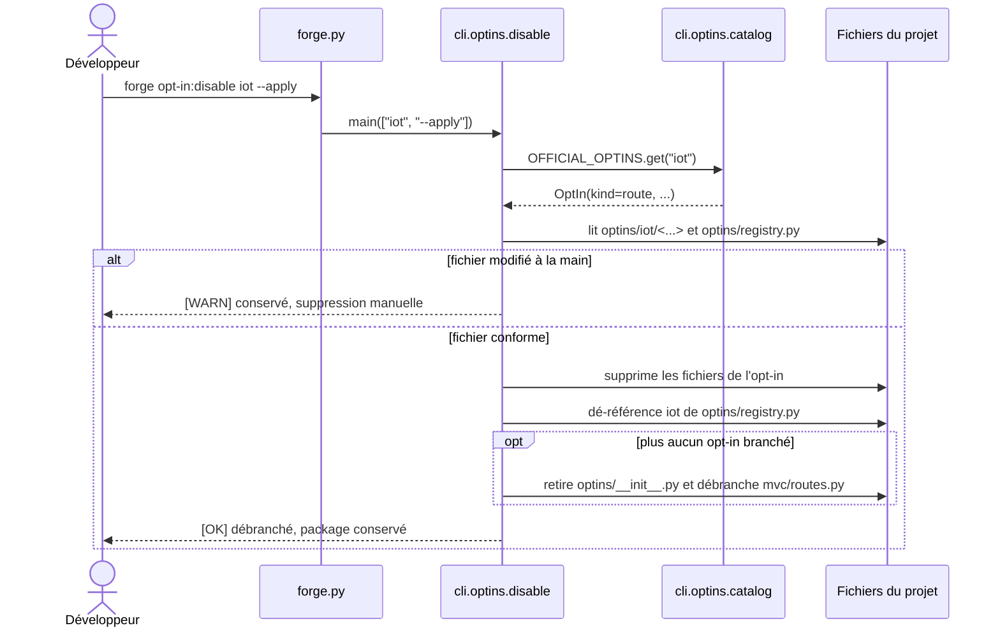

# La commande opt-in:disable dans Forge

Ce document décrit la commande `forge opt-in:disable <name> [--apply]`.
Elle débranche localement un opt-in routier du projet, en mode dry-run par défaut.

## 1. Rôle

`opt-in:disable` est l'inverse exact d'`opt-in:enable` sur l'axe activation (ADR-016).
Pour un opt-in de *kind* `route`, elle retire la couche de câblage `optins/<name>/`, dé-référence l'opt-in de `optins/registry.py`, et débranche `register_optins(router)` de `mvc/routes.py` lorsque plus aucun opt-in n'est branché.

Elle laisse le package installé : pour désinstaller, voir `opt-in:remove`.
Pour un opt-in non routier (`library` ou `crosscutting`), la commande n'écrit rien et affiche un conseil de retrait.

Le contrat reste strict :

- dry-run par défaut : sans `--apply`, rien n'est écrit ;
- un fichier modifié à la main par l'utilisateur est conservé, jamais supprimé en silence (principe 9) ;
- le câblage partagé (`optins/__init__.py`, `mvc/routes.py`) n'est retiré qu'en démontage complet, quand plus aucun opt-in ne reste branché ;
- les répertoires devenus vides sont retirés.

## 2. Vue d'ensemble rapide

| Élément | Valeur |
|---|---|
| Commande Forge | `forge opt-in:disable <name> [--apply]` |
| Module Python | `cli.optins.disable` |
| Catégorie | commande CLI de débranchement local |
| Rôle | retirer le câblage local d'un opt-in routier (sans désinstaller) |
| Entrées | nom court de l'opt-in, option `--apply` |
| Sorties | suppression de fichiers de `optins/<name>/` (avec `--apply`), messages d'état |
| Fichiers touchés | `optins/<name>/...`, `optins/registry.py`, `optins/__init__.py`, `mvc/routes.py` |
| Mode Forge | Forge génère (suppression contrôlée) et affiche (conseils) |
| ADR lié | ADR-016 |

## 3. Schémas UML

### 3.1 Diagramme de séquence

Le diagramme montre le déroulé pour un opt-in routier (kind `route`).



À retenir :

- la commande ne supprime que les fichiers qu'elle reconnaît (conformes au contenu généré) ;
- un fichier modifié à la main est conservé et signalé `[WARN]` ;
- le câblage partagé n'est retiré qu'en démontage complet, quand aucun opt-in ne reste ;
- le package reste installé : `opt-in:disable` agit sur l'activation, pas sur la présence.

## 4. API publique

| Symbole | Signature | Rôle |
|---|---|---|
| `disable_optin(name, *, apply, project_root)` | `disable_optin(name: str, *, apply: bool, project_root: Path) -> int` | débranche un opt-in routier du projet |
| `main(args=None)` | `main(args: list[str] | None = None) -> int` | point d'entrée de `forge opt-in:disable` |

Codes de sortie de `disable_optin` : `0` (succès, idempotent ou dry-run), `2` (opt-in non débranchable).

## 5. Contextes d'utilisation

| Besoin | Commande |
|---|---|
| Débrancher un opt-in routier du projet | `forge opt-in:disable <name> --apply` |
| Prévisualiser sans écrire | `forge opt-in:disable <name>` |
| Désinstaller ensuite le package | `forge opt-in:remove <name>` |
| Inverse exact (branchement) | `forge opt-in:enable <name>` |

## 6. Exemples d'utilisation

Prévisualiser le débranchement de l'opt-in IoT (dry-run, rien n'est écrit) :

```bash
forge opt-in:disable iot
```

Appliquer réellement le débranchement :

```bash
forge opt-in:disable iot --apply
```

!!! note "Activation et présence"
    `opt-in:disable` débranche l'opt-in du projet, mais laisse le package installé.
    Pour retirer le package, utilisez `forge opt-in:remove`.

!!! warning "Fichiers modifiés conservés"
    Un fichier de la couche `optins/<name>/` modifié à la main n'est jamais supprimé en silence.
    La commande le conserve et vous invite à le retirer manuellement.

## Voir aussi

- [La commande opt-in:enable](enable.md) : inverse exact, branchement local.
- [La commande opt-in:remove](remove.md) : désinstallation du package.
- [La commande opt-in:list](list.md) : état local des opt-ins.
