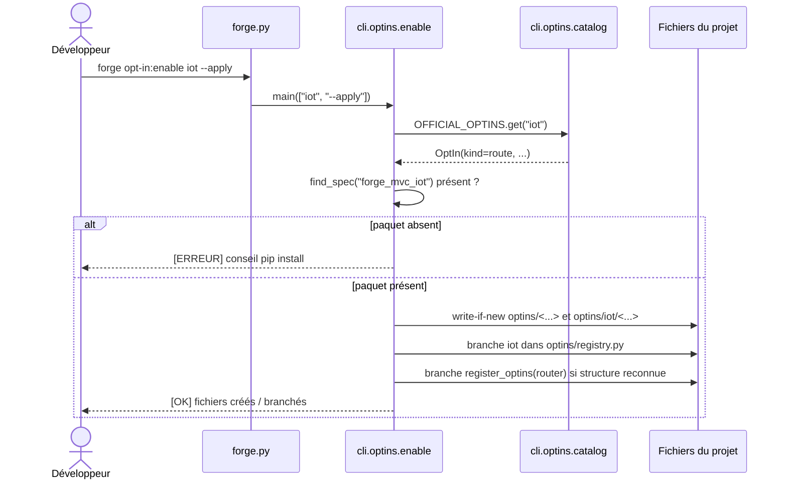

# La commande opt-in:enable dans Forge

Ce document décrit la commande `forge opt-in:enable <name> [--apply]`.
Elle branche localement un opt-in dans le projet courant, en mode dry-run par défaut.

## 1. Rôle

`opt-in:enable` agit sur l'axe activation (ADR-016).
Pour un opt-in de *kind* `route` (`iot`, `video`, `audio`), elle crée la couche `optins/<name>/` du projet, branche l'opt-in dans `optins/registry.py`, puis propose de brancher `register_optins(router)` dans `mvc/routes/__init__.py`.

Pour un opt-in non routier (`library` ou `crosscutting`), la commande n'écrit rien.
Elle affiche un conseil d'utilisation produit par le module `guidance` (voir la page dédiée).

Le contrat est strict :

- dry-run par défaut : sans `--apply`, rien n'est écrit ;
- idempotence : fichier absent créé, présent identique signalé `[OK] déjà présent`, présent différent signalé `[WARN]` sans écriture ;
- jamais d'écrasement silencieux (principe 9) ;
- pas de discovery magique : le branchement reste explicite via `optins/registry.py` ;
- `mvc/routes/__init__.py` n'est modifié que si sa structure est reconnue (`router = Router()`), sinon la commande affiche l'instruction manuelle ;
- la présence du paquet est vérifiée via `importlib.util.find_spec`, sans importer `forge_mvc_<name>`.

## 2. Vue d'ensemble rapide

| Élément | Valeur |
|---|---|
| Commande Forge | `forge opt-in:enable <name> [--apply]` |
| Module Python | `cli.optins.enable` |
| Catégorie | commande CLI de branchement local |
| Rôle | brancher un opt-in routier dans le projet (ou conseiller pour un non-routier) |
| Entrées | nom court de l'opt-in, option `--apply` |
| Sorties | fichiers de la couche `optins/<name>/` (avec `--apply`), messages d'état |
| Fichiers touchés | `optins/__init__.py`, `optins/registry.py`, `optins/<name>/...`, `mvc/routes/__init__.py` |
| Mode Forge | Forge génère (write-if-new) et affiche (instructions, conseils) |
| ADR lié | ADR-016 |

## 3. Schémas UML

### 3.1 Diagramme de séquence

Le diagramme montre le déroulé pour un opt-in routier (kind `route`).



À retenir :

- la commande vérifie d'abord la présence du paquet, même en dry-run ;
- elle écrit selon le mode write-if-new : un fichier existant différent n'est jamais écrasé ;
- le branchement dans `optins/registry.py` et `mvc/routes/__init__.py` est explicite et idempotent ;
- pour un opt-in non routier, aucun fichier n'est touché : seul un conseil s'affiche.

## 4. API publique

| Symbole | Signature | Rôle |
|---|---|---|
| `enable_optin(name, *, apply=False, project_root, package_check=None)` | `enable_optin(name: str, *, apply: bool = False, project_root: Path, package_check: Callable[[str], bool] | None = None) -> int` | branche un opt-in routier dans un projet |
| `main(args=None)` | `main(args: list[str] | None = None) -> int` | point d'entrée de `forge opt-in:enable` |

Statuts affichés : `STATUS_OK`, `STATUS_INFO`, `STATUS_WARN`, `STATUS_ERROR`, `STATUS_DRYRUN`.
`SUPPORTED_OPTINS` liste les opt-ins routiers câblables (`iot`, `video`, `audio`).

Codes de sortie de `enable_optin` : `0` (succès, idempotent ou dry-run), `1` (paquet absent ou conflit bloquant en `--apply`), `2` (opt-in inconnu).

## 5. Contextes d'utilisation

| Besoin | Commande |
|---|---|
| Brancher un opt-in routier dans le projet | `forge opt-in:enable <name> --apply` |
| Prévisualiser sans écrire | `forge opt-in:enable <name>` |
| Découvrir comment utiliser un opt-in bibliothèque | `forge opt-in:enable <name>` (affiche un conseil) |
| Inverse exact (débranchement) | `forge opt-in:disable <name>` |

## 6. Exemples d'utilisation

Prévisualiser le branchement de l'opt-in IoT (dry-run, rien n'est écrit) :

```bash
forge opt-in:enable iot
```

Appliquer réellement le branchement :

```bash
forge opt-in:enable iot --apply
```

Demander à un opt-in bibliothèque (rien n'est écrit, un conseil s'affiche) :

```bash
forge opt-in:enable stats
```

!!! note "Dry-run par défaut"
    Sans `--apply`, `opt-in:enable` montre ce qui serait écrit, mais n'écrit rien.
    Relancez avec `--apply` pour appliquer.

!!! warning "Pas d'écrasement silencieux"
    Si un fichier de la couche `optins/<name>/` existe déjà avec un contenu différent, la commande signale un conflit `[WARN]` et n'écrit rien.
    Vous gardez le contrôle sur vos fichiers.

## Voir aussi

- [La commande opt-in:disable](disable.md) : inverse exact, débranchement local.
- [La commande opt-in:list](list.md) : état local des opt-ins.
- [Les conseils d'activation des opt-ins](guidance.md) : messages pour les opt-ins non routiers.
- [Le catalogue des opt-ins](catalog.md) : source des opt-ins connus.
