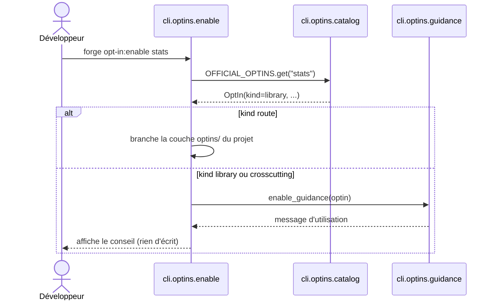

# Les conseils d'activation des opt-ins dans Forge

Ce document décrit le module qui produit les messages de conseil affichés selon le *kind* d'un opt-in.
Ces messages sont affichés par `opt-in:enable` et `opt-in:disable` pour les opt-ins non routiers.

## 1. Rôle

Seuls les opt-ins de *kind* `route` (comme `iot`) ont un câblage projet réel (couche `optins/`).
Pour les bibliothèques (`library`) et les transversaux (`crosscutting`), `opt-in:enable` et `opt-in:disable` n'écrivent rien.

Le module `guidance` produit alors des messages qui informent : ils expliquent comment utiliser ou retirer la brique.
Ce choix évite toute cérémonie vide (principe 8) : pas de câblage factice pour un opt-in qui n'en a pas besoin.

Les messages sont adaptés au cas particulier de certains opt-ins transversaux, comme `rbac` (validation du schéma `rbac.json`) et `mfa` (renvoi vers le parcours manuel `welcome-mfa`).

## 2. Vue d'ensemble rapide

| Élément | Valeur |
|---|---|
| Module Python | `cli.optins.guidance` |
| Catégorie | module de messages partagé par enable et disable |
| Rôle | produire les conseils d'activation et de retrait des opt-ins non routiers |
| Entrées | un objet `OptIn` (issu du catalogue) |
| Sorties | une chaîne de texte (message de conseil) |
| Fichiers touchés | aucun (production de texte uniquement) |
| Mode Forge | Forge affiche (texte de conseil, aucune écriture) |
| ADR lié | ADR-016 |

## 3. Schémas UML

### 3.1 Diagramme de séquence

Le diagramme montre comment `opt-in:enable` délègue à `guidance` pour un opt-in non routier.



À retenir :

- `enable` (et `disable`) appelle `guidance` seulement pour les opt-ins non routiers ;
- la fonction lit le *kind* de l'opt-in pour choisir le message adapté ;
- un opt-in `library` reçoit un conseil d'import direct ;
- un opt-in `crosscutting` reçoit un conseil de câblage (décorateurs, schéma, parcours).

## 4. API publique

| Symbole | Signature | Rôle |
|---|---|---|
| `enable_guidance(optin)` | `enable_guidance(optin: OptIn) -> str` | message d'activation pour un opt-in non routier |
| `disable_guidance(optin)` | `disable_guidance(optin: OptIn) -> str` | message de retrait pour un opt-in non routier |

Les deux fonctions reçoivent un `OptIn` (voir le catalogue) et retournent une chaîne de texte.

## 5. Contextes d'utilisation

| Besoin | Élément |
|---|---|
| Conseiller l'usage d'un opt-in bibliothèque | `enable_guidance(optin)` |
| Conseiller le retrait d'un opt-in transversal | `disable_guidance(optin)` |
| Répondre à enable sans câblage projet | `enable_guidance(optin)` |
| Répondre à disable sans câblage projet | `disable_guidance(optin)` |

## 6. Exemples d'utilisation

Message d'activation d'un opt-in bibliothèque (`stats`) :

```text
Opt-in « stats » (bibliothèque) : aucun câblage projet.
Importe-le et utilise ses fonctions directement :
    import forge_mvc_stats
Rien à activer ni à désactiver côté projet.
```

Message de retrait d'un opt-in bibliothèque :

```text
Opt-in « stats » (bibliothèque) : rien à débrancher côté projet.
Retire ses imports de ton code ; `forge opt-in:remove stats` pour le package.
```

Production programmatique d'un message depuis du code interne au CLI :

```python
from cli.optins.catalog import OFFICIAL_OPTINS
from cli.optins.guidance import enable_guidance

print(enable_guidance(OFFICIAL_OPTINS["rbac"]))
```

!!! tip "Cohérence d'expérience"
    `opt-in:enable` et `opt-in:disable` répondent toujours, même quand il n'y a aucun câblage à faire.
    Le module `guidance` garantit cette réponse utile, sans écrire dans le projet.

## Voir aussi

- [Le catalogue des opt-ins](catalog.md) : source des *kinds* des opt-ins.
- [La commande opt-in:enable](enable.md) : branchement d'un opt-in routier.
- [La commande opt-in:disable](disable.md) : débranchement d'un opt-in routier.
