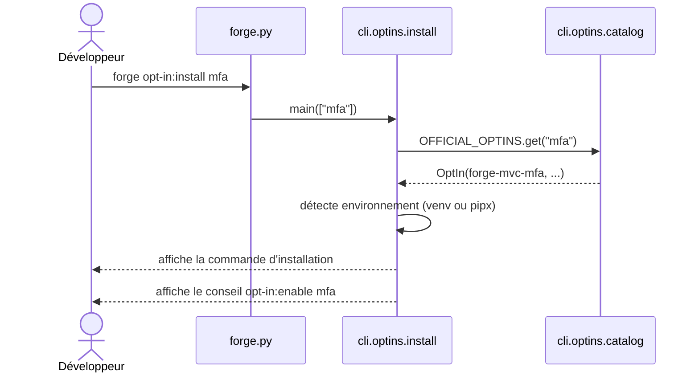

# La commande opt-in:install dans Forge

Ce document décrit la commande `forge opt-in:install <name>`.
Elle affiche la commande d'installation du package d'un opt-in officiel, sans rien exécuter.

## 1. Rôle

`opt-in:install` agit sur l'axe présence d'un opt-in (ADR-016).
Elle affiche la commande d'installation du package PyPI correspondant, puis n'exécute rien.

Selon le contexte, elle propose `pip install` (en environnement courant ou venv) ou `pipx inject` (en installation pipx).
Le choix « afficher plutôt qu'exécuter » est délibéré : installer un package est un geste explicite de l'utilisateur (principe 9).
La commande détecte l'environnement pipx en inspectant le chemin de l'exécutable Python.

## 2. Vue d'ensemble rapide

| Élément | Valeur |
|---|---|
| Commande Forge | `forge opt-in:install <name>` |
| Module Python | `cli.optins.install` |
| Catégorie | commande CLI d'aide à l'installation |
| Rôle | afficher la commande d'installation d'un opt-in |
| Entrées | le nom court d'un opt-in officiel (`mfa`, `rbac`, ...) |
| Sorties | texte affiché : commande pip ou pipx, puis conseil `opt-in:enable` |
| Fichiers touchés | aucun (la commande n'écrit rien) |
| Mode Forge | Forge affiche (aucune écriture, aucune exécution) |
| ADR lié | ADR-016 |

## 3. Schémas UML

### 3.1 Diagramme de séquence

Le diagramme montre le déroulé de la commande : lecture du catalogue, détection de l'environnement, affichage.



À retenir :

- la commande lit le catalogue statique, sans importer le paquet de l'opt-in ;
- elle n'exécute jamais l'installation : elle affiche la commande à lancer ;
- elle adapte le conseil à l'environnement (pip ou pipx) ;
- elle oriente ensuite vers `opt-in:enable` pour le branchement projet.

## 4. Commande

| Invocation | Effet |
|---|---|
| `forge opt-in:install <name>` | affiche la commande d'installation de l'opt-in `<name>` |
| `forge opt-in:install -h` | affiche l'aide et la liste des opt-ins officiels |

Point d'entrée Python : `main(args=None)`.
Codes de sortie : `0` (succès ou aide), `2` (nom manquant ou opt-in inconnu).

## 5. Contextes d'utilisation

| Besoin | Commande |
|---|---|
| Connaître la commande exacte à lancer | `forge opt-in:install <name>` |
| Voir la liste des opt-ins officiels | `forge opt-in:install -h` |
| Désinstaller ensuite (miroir) | `forge opt-in:remove <name>` |
| Brancher l'opt-in dans le projet | `forge opt-in:enable <name>` |

## 6. Exemples d'utilisation

Afficher la commande d'installation de l'opt-in MFA :

```bash
forge opt-in:install mfa
```

Sortie typique en environnement courant :

```text
Opt-in « mfa » : Authentification multi-facteurs (TOTP, codes de récupération).
Package : forge-mvc-mfa

Installation (environnement courant) :
  /chemin/vers/python -m pip install --pre forge-mvc-mfa

Puis branche l'opt-in dans le projet :
  forge opt-in:enable mfa
```

!!! note "Affiche, n'exécute pas"
    `opt-in:install` ne lance jamais `pip` ni `pipx`.
    Elle affiche la commande pour que vous la lanciez vous-même.
    L'installation reste un geste explicite.

## Voir aussi

- [La commande opt-in:remove](remove.md) : miroir, affiche la désinstallation.
- [La commande opt-in:enable](enable.md) : branchement local dans le projet.
- [Le catalogue des opt-ins](catalog.md) : source des opt-ins connus.
