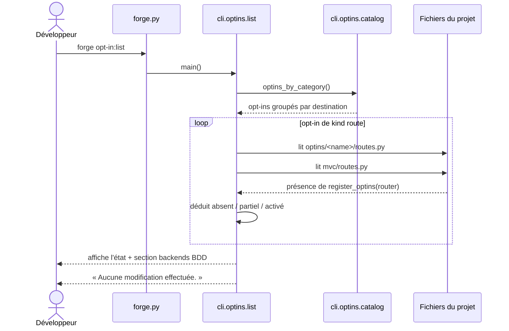

# La commande opt-in:list dans Forge

Ce document décrit la commande `forge opt-in:list`.
Elle affiche l'état local des opt-ins connus dans un projet Forge, en lecture seule.

## 1. Rôle

`opt-in:list` affiche l'état local des opt-ins connus dans le projet courant.
Elle est strictement en lecture seule : elle ne crée, ne modifie et n'installe rien.

Elle inspecte seulement le texte de quelques fichiers connus (`optins/` et `mvc/routes.py`).
Elle n'importe aucun paquet `forge_mvc_*` : elle ne lit que le catalogue statique.
Il n'y a pas de discovery magique : seuls les opt-ins de *kind* `route` (`iot`, `video`, `audio`) reçoivent une couche `optins/<name>/`, et seul leur état projet est analysé par lecture de fichiers.
Les opt-ins `library` et `crosscutting` n'ont pas de couche projet : ils sont listés avec leur kind, sans état projet.
Les backends de base de données sont présentés dans une section dédiée (famille exclusive, ADR-054).

## 2. Vue d'ensemble rapide

| Élément | Valeur |
|---|---|
| Commande Forge | `forge opt-in:list` |
| Module Python | `cli.optins.list` |
| Catégorie | commande CLI d'inspection (diagnostic) |
| Rôle | afficher l'état local des opt-ins du projet |
| Entrées | aucune (inspecte le projet courant) |
| Sorties | texte affiché : opt-ins groupés par catégorie, état des opt-ins routiers, backends BDD |
| Fichiers touchés | aucun (lecture seule stricte) |
| Mode Forge | Forge lit (inspection de fichiers texte) |
| ADR liés | ADR-016, ADR-054, ADR-055 |

## 3. Schémas UML

### 3.1 Diagramme de séquence

Le diagramme montre le déroulé de la commande : groupement par catégorie, puis analyse de l'état projet des opt-ins routiers.



À retenir :

- la commande lit le catalogue, puis inspecte le projet courant ;
- elle distingue trois états pour les opt-ins routiers : `absent`, `partiel`, `activé` ;
- l'état `partiel` signale une couche `optins/<name>/` présente mais non branchée dans `mvc/routes.py` ;
- elle n'écrit jamais rien et termine toujours avec le code de sortie `0`.

## 4. API publique

| Symbole | Signature | Rôle |
|---|---|---|
| `list_optins(*, project_root)` | `list_optins(*, project_root: Path) -> int` | affiche l'état de tous les opt-ins |
| `detect_optin_state(project_root, name)` | `detect_optin_state(project_root: Path, name: str) -> dict[str, object]` | analyse l'état d'un opt-in routier |
| `detect_iot_state(project_root)` | `detect_iot_state(project_root: Path) -> dict[str, object]` | raccourci de compatibilité pour `iot` |
| `main(argv=None)` | `main(argv: list[str] | None = None) -> int` | point d'entrée de `forge opt-in:list` |

États possibles d'un opt-in routier : `STATE_ABSENT` (`absent`), `STATE_PARTIAL` (`partiel`), `STATE_ACTIVE` (`activé`).
`KNOWN_OPTINS` liste les opt-ins de kind `route` dont l'état projet est analysable.

## 5. Contextes d'utilisation

| Besoin | Élément |
|---|---|
| Savoir quels opt-ins sont branchés | `forge opt-in:list` |
| Repérer un câblage incomplet | état `partiel` dans la sortie |
| Analyser l'état d'un opt-in routier en code | `detect_optin_state(project_root, name)` |
| Connaître les états possibles | `STATE_ABSENT`, `STATE_PARTIAL`, `STATE_ACTIVE` |

## 6. Exemples d'utilisation

Inspecter l'état des opt-ins du projet courant :

```bash
forge opt-in:list
```

Sortie typique (extrait) :

```text
Forge opt-ins

Sécurité et accès
  mfa           transversal
  rbac          transversal
  ...

Médias et fichiers
  iot       activé
            structure : optins/iot/
            routes    : register_optins(router) présent dans mvc/routes.py
  video     absent
            conseil   : forge opt-in:enable video --apply

Bases de données
            un seul backend par projet ; piloté par forge db:*
  mariadb       backend
  sqlite        backend

Aucune modification effectuée.
```

!!! tip "Lecture seule"
    `opt-in:list` n'installe ni ne branche rien.
    Elle est sûre à lancer à tout moment pour faire un état des lieux.

## Voir aussi

- [Le catalogue des opt-ins](catalog.md) : source des opt-ins connus.
- [La commande opt-in:enable](enable.md) : branchement local d'un opt-in routier.
- [La commande opt-in:disable](disable.md) : débranchement local.
