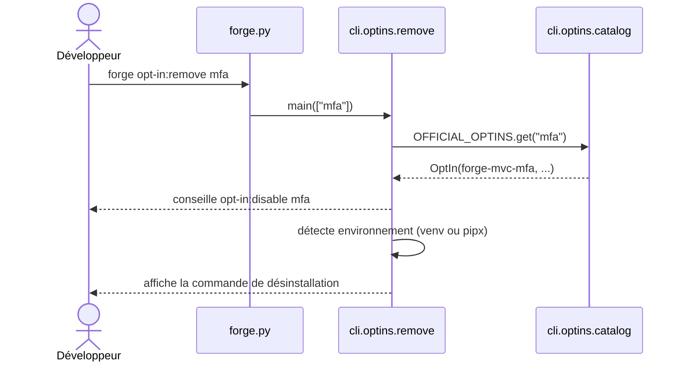

# La commande opt-in:remove dans Forge

Ce document décrit la commande `forge opt-in:remove <name>`.
Elle affiche la commande de désinstallation du package d'un opt-in officiel, sans rien exécuter.

## 1. Rôle

`opt-in:remove` est le miroir d'`opt-in:install` sur l'axe présence (ADR-016).
Elle affiche la commande de désinstallation du package PyPI, puis n'exécute rien.

La commande conseille d'abord de débrancher l'opt-in du projet si nécessaire, via `opt-in:disable`.
Elle propose ensuite `pip uninstall` (environnement courant) ou `pipx uninject` (installation pipx), selon l'environnement détecté.
La désinstallation reste un geste explicite de l'utilisateur (principe 9).

## 2. Vue d'ensemble rapide

| Élément | Valeur |
|---|---|
| Commande Forge | `forge opt-in:remove <name>` |
| Module Python | `cli.optins.remove` |
| Catégorie | commande CLI d'aide à la désinstallation |
| Rôle | afficher la commande de désinstallation d'un opt-in |
| Entrées | le nom court d'un opt-in officiel (`mfa`, `rbac`, ...) |
| Sorties | texte affiché : conseil `opt-in:disable`, puis commande pip ou pipx |
| Fichiers touchés | aucun (la commande n'écrit rien) |
| Mode Forge | Forge affiche (aucune écriture, aucune exécution) |
| ADR lié | ADR-016 |

## 3. Schémas UML

### 3.1 Diagramme de séquence

Le diagramme montre le déroulé de la commande : lecture du catalogue, détection de l'environnement, affichage.



À retenir :

- la commande lit le catalogue statique, sans importer le paquet de l'opt-in ;
- elle n'exécute jamais la désinstallation : elle affiche la commande à lancer ;
- elle rappelle de débrancher d'abord l'opt-in avec `opt-in:disable` ;
- elle adapte la commande à l'environnement (pip ou pipx).

## 4. Commande

| Invocation | Effet |
|---|---|
| `forge opt-in:remove <name>` | affiche la commande de désinstallation de l'opt-in `<name>` |
| `forge opt-in:remove -h` | affiche l'aide et la liste des opt-ins officiels |

Point d'entrée Python : `main(args=None)`.
Codes de sortie : `0` (succès ou aide), `2` (nom manquant ou opt-in inconnu).

## 5. Contextes d'utilisation

| Besoin | Commande |
|---|---|
| Connaître la commande de désinstallation | `forge opt-in:remove <name>` |
| Débrancher d'abord du projet | `forge opt-in:disable <name>` |
| Installer (miroir) | `forge opt-in:install <name>` |
| Voir la liste des opt-ins officiels | `forge opt-in:remove -h` |

## 6. Exemples d'utilisation

Afficher la commande de désinstallation de l'opt-in MFA :

```bash
forge opt-in:remove mfa
```

Sortie typique en environnement courant :

```text
Opt-in « mfa » : désinstallation du package forge-mvc-mfa

Débranche d'abord l'opt-in du projet si nécessaire :
  forge opt-in:disable mfa

Désinstallation (environnement courant) :
  /chemin/vers/python -m pip uninstall forge-mvc-mfa
```

!!! note "Présence et activation"
    Désinstaller le package (présence) diffère de débrancher l'opt-in du projet (activation).
    `opt-in:remove` agit sur la présence ; `opt-in:disable` agit sur l'activation.

## Voir aussi

- [La commande opt-in:install](install.md) : miroir, affiche l'installation.
- [La commande opt-in:disable](disable.md) : débranchement local sans désinstallation.
- [Le catalogue des opt-ins](catalog.md) : source des opt-ins connus.
