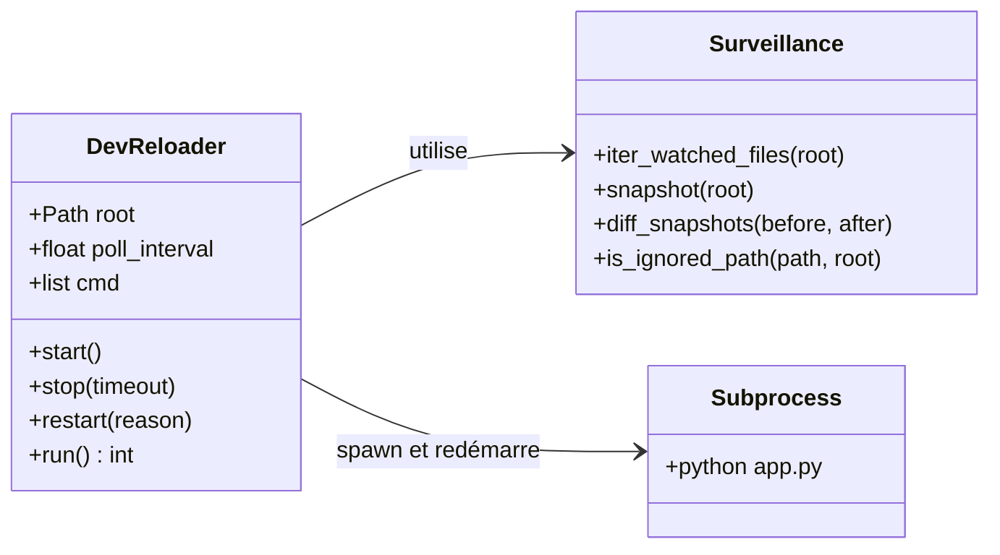
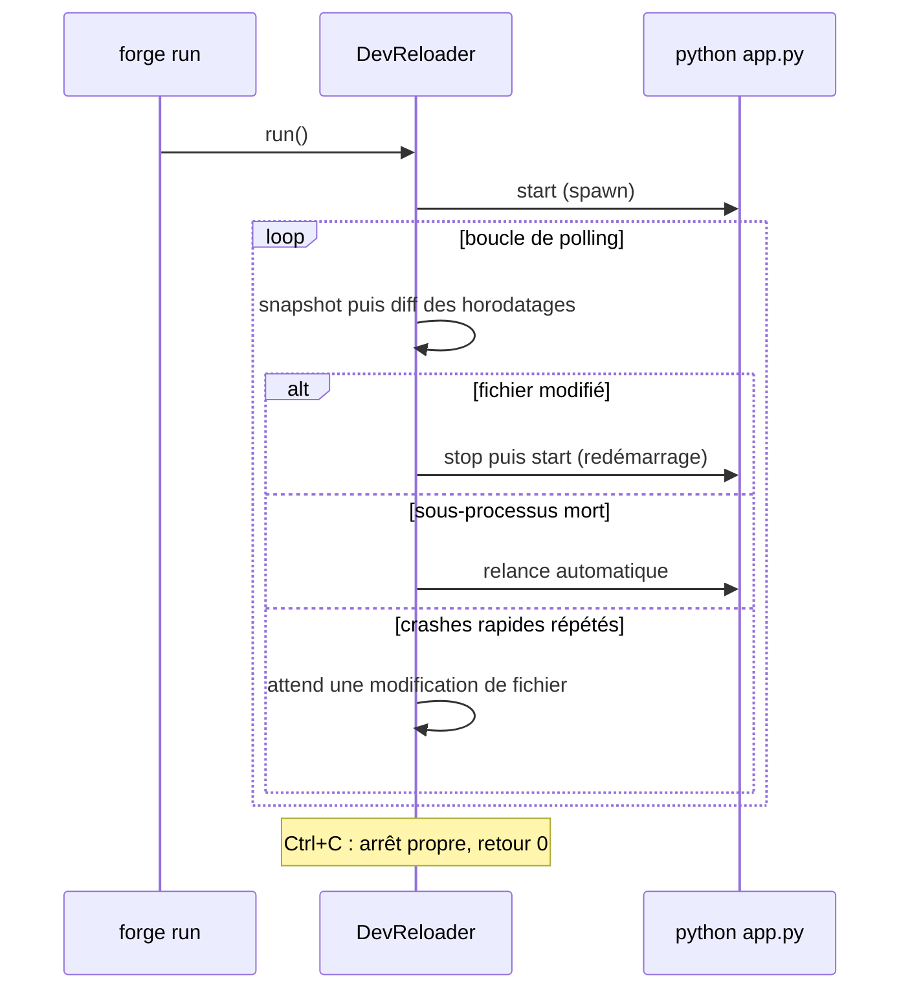

# Le superviseur de développement dans Forge

Ce document décrit le superviseur de développement avec autoreload qui propulse `forge run` en mode développement.

Le module porte la mécanique de redémarrage de processus : il lance `python app.py` et le relance dès qu'un fichier surveillé change, sans rechargement à chaud magique (principe 3).

## 1. Rôle

Le superviseur garde l'application Forge vivante pendant le développement.

Il lance `python app.py` dans un sous-processus, surveille les fichiers du projet par échantillonnage de leurs horodatages, et redémarre le sous-processus dès qu'un changement est détecté.
Il rend aussi `forge run` résilient : si l'application crashe, le superviseur la relance automatiquement et ne s'arrête que sur `Ctrl+C`.

L'autoreload se fait toujours par redémarrage de processus, jamais par rechargement de modules en mémoire.

## 2. Vue d'ensemble rapide

| Élément | Valeur |
|---|---|
| Commande forge | déclenché par `forge run` (mode dev, autoreload actif) |
| Module Python | `cli.project.dev_reloader` |
| Catégorie | infrastructure de lancement (dev) |
| Rôle | superviser, surveiller et redémarrer le sous-processus applicatif |
| Entrées | fichiers du projet (`app.py`, `config.py`, `env/dev`, `mvc/`, `core/`) |
| Sorties | sous-processus `python app.py` relancé au besoin, journal `[DEV-RELOAD]` |
| Fichiers touchés | aucun (lecture des horodatages uniquement) |
| Mode Forge | lit |
| Tickets | `DEV-SERVER-AUTORELOAD-001`, `DEV-SERVER-CRASH-RESILIENCE-001` |

Le superviseur vit dans `cli/`.
Il ne touche ni le routeur HTTP, ni `core/http`, ni le chemin WSGI.

## 3. Schémas UML

### 3.1 Diagramme de classe

Le diagramme montre la classe `DevReloader` et les fonctions de surveillance qu'elle utilise.



À retenir :

- `DevReloader` est le superviseur : il spawn, surveille et redémarre ;
- les fonctions de surveillance photographient les horodatages et calculent les changements ;
- le sous-processus surveillé est `python app.py`.

### 3.2 Diagramme de séquence

Le diagramme montre la boucle de surveillance et de redémarrage.



À retenir :

- un changement de fichier relance toujours le sous-processus et réarme le compteur de crashes ;
- une mort inattendue déclenche une relance automatique ;
- après plusieurs crashes rapides consécutifs, le superviseur cesse de relancer en boucle et attend une correction ;
- seul `Ctrl+C` arrête le superviseur.

## 4. API publique

| Symbole | Signature | Rôle |
|---|---|---|
| `DevReloader` | `DevReloader(root, *, poll_interval=0.5, cmd=None, ...)` | superviseur : spawn, surveillance, redémarrage |
| `DevReloader.run` | `run() -> int` | boucle principale, garde `forge run` vivant |
| `iter_watched_files` | `iter_watched_files(root: Path) -> Iterable[Path]` | énumère les fichiers surveillés à un instant donné |
| `snapshot` | `snapshot(root: Path) -> dict[str, float]` | photographie les horodatages des fichiers surveillés |
| `diff_snapshots` | `diff_snapshots(before, after) -> list[str]` | liste triée des fichiers modifiés, ajoutés ou supprimés |
| `is_ignored_path` | `is_ignored_path(path: Path, root: Path) -> bool` | indique si un chemin est exclu de la surveillance |

Fichiers surveillés par défaut :

| Type | Cibles |
|---|---|
| Fichiers racine | `app.py`, `config.py`, `env/dev` |
| Répertoires récursifs | `mvc/` (`.py`, `.html`, `.json`, `.sql`), `core/` (`.py`) |
| Dossiers ignorés | `.venv`, `venv`, `__pycache__`, `storage`, `logs`, `site`, `node_modules`, `.git`, `build`, `dist`, caches |

## 5. Contextes d'utilisation

| Besoin | Élément |
|---|---|
| Recharger l'application à chaque modification de code | `DevReloader.run()` via `forge run` |
| Relancer automatiquement après un crash | résilience intégrée du superviseur |
| Connaître les fichiers surveillés | `iter_watched_files(root)` |
| Détecter les changements entre deux instants | `snapshot(root)` puis `diff_snapshots(before, after)` |

## 6. Exemples d'utilisation

Le superviseur s'utilise indirectement, via `forge run` en mode développement :

```bash
forge run
```

Les fonctions de surveillance sont utilisables directement, par exemple dans un test ou un outil :

```python
from pathlib import Path

from cli.project.dev_reloader import snapshot, diff_snapshots

root = Path.cwd()
before = snapshot(root)
# ... modification d'un fichier de mvc/ ...
after = snapshot(root)
changes = diff_snapshots(before, after)
```

## 7. Détails techniques

!!! note "Volontairement simple"
    La surveillance repose sur un échantillonnage des horodatages (`stat()`), sans `inotify`, `watchfiles` ni `watchdog`.
    Le rechargement passe toujours par un redémarrage de processus, jamais par `importlib.reload`.
    Seule la bibliothèque standard est utilisée.

!!! tip "Résilience aux crashes"
    Un sous-processus qui meurt vite est compté comme crash rapide.
    Au-delà du seuil de crashes rapides consécutifs, le superviseur arrête le redémarrage en boucle et attend une modification de fichier, ce qui laisse l'erreur lisible dans le terminal.

## Voir aussi

- [La commande run](run.md) : le point d'entrée qui pilote ce superviseur.
- [La commande doctor](doctor.md) : diagnostic du projet.
