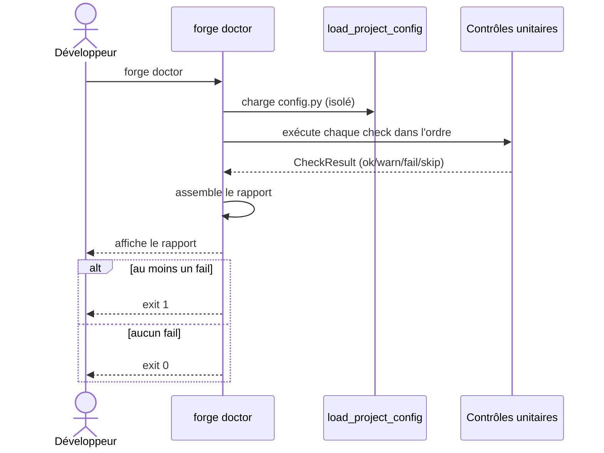

# La commande doctor dans Forge

`forge doctor` réalise un diagnostic large et tolérant d'un projet Forge, en lecture seule.

Elle informe et oriente sans jamais bloquer ni modifier le projet.
Pour un contrôle strict orienté CI, voir `forge project:check`.

## 1. Rôle

`forge doctor` parcourt un ensemble de contrôles unitaires sur le projet courant et affiche un rapport synthétique.

Elle vérifie la version de Python, la configuration d'environnement, la structure MVC, les entités, les migrations, l'i18n, les templates, le registre de modules, les dépendances de sécurité MFA et RBAC, les certificats TLS de développement, la présence de Node, une connexion base de données avec la version, l'encodage et le compte du serveur, et quelques garde-fous statiques de sécurité production.

Chaque contrôle produit un statut : `ok`, `warn`, `fail` ou `skip`.
La commande renvoie un code de sortie non nul seulement si au moins un contrôle est en `fail`.

## 2. Vue d'ensemble rapide

| Élément | Valeur |
|---|---|
| Commande forge | `forge doctor` |
| Module Python | `cli.project.doctor` |
| Catégorie | commande projet (diagnostic) |
| Rôle | diagnostiquer un projet de façon tolérante |
| Entrées | racine du projet courant, `config.py`, `env/`, `mvc/` |
| Sorties | rapport sur la sortie standard, code de sortie selon les `fail` |
| Fichiers touchés | aucun (lecture seule) |
| Mode Forge | lit |
| Posture | tolérante (informe et oriente) |

`forge doctor` ne réécrit jamais le projet.
Elle lit la configuration et la structure, puis restitue des observations.

## 3. Schémas UML

### 3.1 Diagramme de séquence

Le diagramme montre comment `forge doctor` enchaîne ses contrôles et calcule son code de sortie.



À retenir :

- la configuration est chargée en isolation, sans polluer `sys.modules` ;
- chaque contrôle est tolérant : une exception inattendue devient un `fail` lisible, pas un crash ;
- seuls les `fail` font échouer la commande ; les `warn` et `skip` restent informatifs.

## 4. API publique

| Symbole | Signature | Rôle |
|---|---|---|
| `CheckResult` | `CheckResult(status, label, detail="")` | résultat unitaire d'un contrôle |
| `load_project_config` | `load_project_config(root: Path) -> ModuleType \| None` | charge `config.py` en isolation, ou `None` |
| `run_all` | `run_all(root: Path, version: str) -> list[CheckResult]` | exécute tous les contrôles dans l'ordre |
| `print_report` | `print_report(results, version) -> None` | affiche le rapport sur la sortie standard |
| `has_failures` | `has_failures(results) -> bool` | indique si un contrôle est en `fail` |

Contrôles unitaires : `check_python`, `check_env`, `check_mvc_structure`, `check_model_entities`, `check_migrations`, `check_i18n`, `check_templates`, `check_modules`, `check_mfa_dependency`, `check_rbac_dependency`, `check_ssl`, `check_node`, `check_db`, `check_prod_security`.

## 4 bis. Ce que le contrôle de base rapporte

`check_db` ne disait que « connexion OK », et cela ne suffit pas.

Une version trop ancienne, un jeu de caractères qui n'est pas de l'UTF-8, ou une connexion établie sous un compte inattendu sont des pannes à venir qu'aucune connexion réussie ne signale (`DB-DOCTOR-001`).

Le contrôle rapporte désormais ce que le serveur répond.

Sur PostgreSQL, il rapporte la version du serveur, l'encodage `UTF8`, la base et le compte connecté.
Sur SQL Server, la version, la collation, la base et le compte.

| Backend | Ce que le contrôle ajoute |
|---|---|
| `postgres` | version, encodage, base, compte |
| `mariadb` | version, encodage, collation, base, compte |
| `mssql` | version, collation, base, compte |
| `sqlite` | version du moteur, encodage du fichier |

SQLite est un fichier, sans serveur ni compte : seules la version et l'encodage y ont un sens.

Ce que chaque backend sait dire lui appartient, par `Dialect.server_diagnostics_sql`.
Un backend qui ne déclare rien reste correct, et le diagnostic se tait plutôt que d'inventer.

!!! info "Un diagnostic ne doit jamais faire échouer `doctor`"
    Chaque requête est isolée, et celle qui échoue est simplement omise.

    Le compte applicatif est volontairement en DML strict (ADR-033) : il peut légitimement se voir refuser une lecture de métadonnées, et ce refus n'est pas une panne du projet.

!!! info "Pourquoi pas une commande `db:doctor`"
    Le diagnostic de base vit dans `forge doctor`, qui le portait déjà.

    Une commande séparée aurait donné deux façons de poser la même question, ce que le principe 11 refuse, et l'exploitant devrait deviner laquelle regarder.

## 5. Contextes d'utilisation

| Besoin | Commande |
|---|---|
| Diagnostiquer un projet qui ne démarre pas | `forge doctor` |
| Vérifier l'environnement avant de travailler | `forge doctor` |
| Contrôler strictement avant fusion (CI) | `forge project:check` |
| Obtenir un panorama détaillé par familles | `forge project:audit` |

## 6. Exemples d'utilisation

Lancer le diagnostic depuis la racine du projet :

```bash
forge doctor
```

Extrait de rapport indicatif :

```text
Forge doctor - 1.0.0bN

  [OK]    Python - 3.12.x - requis >= 3.12
  [OK]    Structure MVC - mvc/ valide
  [WARN]  Certificats SSL - Absent : cert.pem - relance openssl pour les generer
  [SKIP]  MFA (securite) - aucun indice MFA dans ce projet

0 avertissement(s), 0 erreur(s).
```

## 7. Détails et limites

!!! tip "Tolérance assumée"
    `forge doctor` privilégie l'orientation : la plupart des manques produisent un `warn` ou un `skip`, pas un `fail`.
    Un projet vierge, sans entité ni migration, est un état nominal et ne déclenche pas d'erreur.

!!! note "Connexion base de données non bloquante"
    Le contrôle base de données tente une connexion applicative avec un court délai.
    Une connexion impossible avant `forge db:init` est attendue et produit un simple avertissement.

## Voir aussi

- [La commande project:check](project_check.md) : contrôle strict prêt pour la CI.
- [La commande project:audit](project_audit.md) : rapport d'audit détaillé par familles.
- [Le chargement de configuration projet](project_config.md) : lecture explicite de la configuration.
- [La commande run](run.md) : lancement de l'application.
