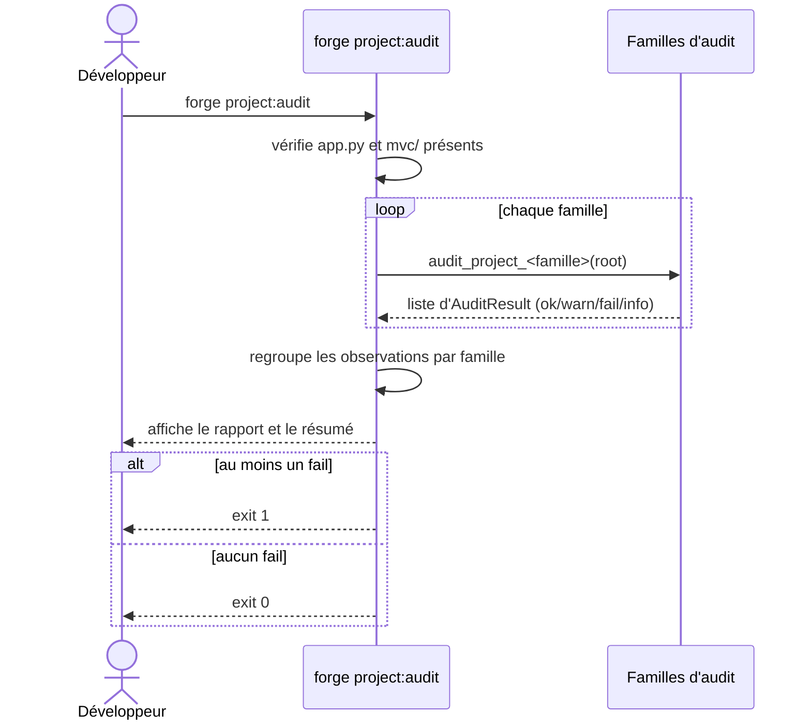

# La commande project:audit dans Forge

`forge project:audit` produit un rapport d'audit détaillé et non destructif d'un projet Forge.

Elle dresse un panorama par familles : structure, configuration, entités, routes, templates, modules, migrations, documentation et tests.
Elle ne modifie rien : c'est une lecture approfondie qui restitue des observations.

## 1. Rôle

`forge project:audit` analyse un projet sous plusieurs angles et affiche un rapport groupé par familles.

Pour chaque famille, elle émet une ou plusieurs observations avec un statut : `ok`, `warn`, `fail` ou `info`.
Le statut `info` est propre à l'audit : il signale un élément optionnel ou un constat neutre, sans le traiter comme un manque.

La commande renvoie un code de sortie non nul seulement si au moins une observation est en `fail`.

## 2. Vue d'ensemble rapide

| Élément | Valeur |
|---|---|
| Commande forge | `forge project:audit` |
| Module Python | `cli.project.project_audit` |
| Catégorie | commande projet (audit détaillé) |
| Rôle | dresser un panorama détaillé et non destructif |
| Entrées | racine du projet courant, structure `mvc/`, configuration, docs, tests |
| Sorties | rapport groupé par familles, code de sortie selon les `fail` |
| Fichiers touchés | aucun (lecture seule, non destructif) |
| Mode Forge | lit |
| Posture | informative et détaillée |

`forge project:audit` doit être lancée depuis la racine du projet.
Lancée ailleurs, elle s'arrête avec un message d'orientation.

## 3. Schémas UML

### 3.1 Diagramme de séquence

Le diagramme montre l'enchaînement des familles d'audit et la production du rapport groupé.



À retenir :

- chaque famille peut produire plusieurs observations, contrairement aux contrôles unitaires de `doctor` et `project:check` ;
- le rapport est groupé par famille et suivi d'un résumé chiffré ;
- le statut `info` distingue un constat neutre d'un avertissement.

## 4. API publique

| Symbole | Signature | Rôle |
|---|---|---|
| `AuditResult` | `AuditResult(status, family, detail="")` | observation unitaire d'audit |
| `run_project_audit` | `run_project_audit(root: Path, version: str) -> list[AuditResult]` | exécute toutes les familles d'audit |
| `print_audit_report` | `print_audit_report(results, version) -> None` | affiche le rapport groupé par familles |
| `has_failures` | `has_failures(results) -> bool` | indique si une observation est en `fail` |

Familles d'audit : `audit_project_structure`, `audit_project_config`, `audit_project_entities`, `audit_project_routes`, `audit_project_templates`, `audit_project_modules`, `audit_project_migrations`, `audit_project_docs`, `audit_project_tests`.

## 5. Contextes d'utilisation

| Besoin | Commande |
|---|---|
| Dresser un panorama détaillé d'un projet existant | `forge project:audit` |
| Reprendre un projet hérité avant d'y toucher | `forge project:audit` |
| Contrôler strictement avant fusion (CI) | `forge project:check` |
| Diagnostiquer de façon tolérante | `forge doctor` |

## 6. Exemples d'utilisation

Audit détaillé depuis la racine du projet :

```bash
forge project:audit
```

Extrait de rapport indicatif :

```text
Forge project:audit - 1.0.0bN

Structure :
  [OK]    app.py présent
  [OK]    mvc/ présent
  [INFO]  static/ absent (optionnel)

Entités :
  [INFO]  aucune entité déclarée

Résumé :
  OK     2
  INFO   2

Audit terminé - aucun problème détecté.
```

## 7. Détails et limites

!!! note "Statut info propre à l'audit"
    Le statut `info` signale un élément optionnel ou un constat neutre.
    Par exemple, l'absence de `static/`, l'absence de `README` ou l'absence de tests sont des `info`, pas des avertissements.

!!! tip "Audit non destructif"
    `forge project:audit` ne lance jamais les tests détectés et ne se connecte à aucun service externe.
    Elle se contente d'observer les fichiers présents.

## Voir aussi

- [La commande project:check](project_check.md) : contrôle strict prêt pour la CI.
- [La commande doctor](doctor.md) : diagnostic tolérant.
- [La commande run](run.md) : lancement de l'application.
