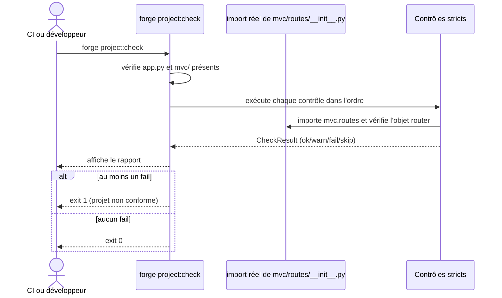

# La commande project:check dans Forge

`forge project:check` effectue un contrôle strict des conventions d'un projet Forge.

Elle est pensée pour la CI : un manquement conventionnel se traduit par un échec.
Contrairement à `forge doctor`, qui est tolérant, `project:check` est exigeant.

## 1. Rôle

`forge project:check` vérifie qu'un projet respecte les conventions structurelles attendues par Forge.

Elle couvre la structure (présence de `app.py`, `config.py`, `mvc/` et ses sous-dossiers), la configuration (`env/example`, `env/dev`), les entités et `relations.json`, le module `mvc/routes/__init__.py` (import réel et présence d'un objet `router`), les templates, le registre de modules et les migrations.

Chaque contrôle produit un statut `ok`, `warn`, `fail` ou `skip`.
La commande renvoie un code de sortie non nul si au moins un contrôle est en `fail`.

## 2. Vue d'ensemble rapide

| Élément | Valeur |
|---|---|
| Commande forge | `forge project:check` |
| Module Python | `cli.project.project_check` |
| Catégorie | commande projet (contrôle strict, CI) |
| Rôle | valider strictement les conventions d'un projet |
| Entrées | racine du projet courant, structure `mvc/`, configuration |
| Sorties | rapport sur la sortie standard, code de sortie selon les `fail` |
| Fichiers touchés | aucun (lecture seule) |
| Mode Forge | lit |
| Posture | stricte (échec en cas de manquement) |

`forge project:check` doit être lancée depuis la racine du projet.
Lancée ailleurs, elle s'arrête avec un message d'orientation.

## 3. Schémas UML

### 3.1 Diagramme de séquence

Le diagramme montre l'enchaînement des contrôles stricts et le calcul du code de sortie.



À retenir :

- la vérification des routes va au-delà de la syntaxe : le module est réellement importé, ce qui révèle un import manquant ou un objet `router` absent ;
- un projet vierge sans entité reste conforme (`relations.json` n'est exigé que s'il existe au moins une entité) ;
- seuls les `fail` rendent le projet non conforme.

## 4. API publique

| Symbole | Signature | Rôle |
|---|---|---|
| `run_project_check` | `run_project_check(root: Path, version: str) -> list[CheckResult]` | exécute tous les contrôles stricts |
| `print_check_report` | `print_check_report(results, version) -> None` | affiche le rapport sur la sortie standard |
| `has_failures` | `has_failures(results) -> bool` | indique si un contrôle est en `fail` |

Contrôles stricts unitaires : `check_project_structure`, `check_project_config`, `check_project_entities`, `check_project_routes`, `check_project_templates`, `check_project_modules`, `check_project_migrations`.

Les résultats réutilisent le type `CheckResult` de la commande `doctor`.

## 5. Contextes d'utilisation

| Besoin | Commande |
|---|---|
| Valider un projet avant fusion (CI) | `forge project:check` |
| Vérifier strictement la conformité d'un projet | `forge project:check` |
| Diagnostiquer de façon tolérante | `forge doctor` |
| Obtenir un panorama détaillé par familles | `forge project:audit` |

## 6. Exemples d'utilisation

Contrôle strict depuis la racine du projet :

```bash
forge project:check
```

Utilisation typique en CI, où un code de sortie non nul fait échouer l'étape :

```bash
forge project:check || exit 1
```

Extrait de rapport indicatif :

```text
Forge project:check - 1.0.0bN

  [OK]    Structure - structure projet conforme
  [OK]    Routes - mvc/routes/__init__.py valide
  [WARN]  Configuration - env/dev absent - seules les valeurs de env/example sont actives

0 erreur, 1 avertissement(s). Projet conforme avec avertissements.
```

## 7. Détails et limites

!!! warning "Import réel des routes"
    Le contrôle des routes importe réellement `mvc/routes/__init__.py`.
    Un import qui échoue, par exemple parce qu'un opt-in n'est pas installé, devient un `fail` explicite indiquant la dépendance manquante.

!!! note "Projet vierge"
    Un projet nu issu de `forge new` reste conforme.
    `relations.json` et les fichiers d'entités ne sont exigés que dès qu'au moins une entité existe.

## Voir aussi

- [La commande doctor](doctor.md) : diagnostic tolérant.
- [La commande project:audit](project_audit.md) : rapport d'audit détaillé.
- [La commande run](run.md) : lancement de l'application.
