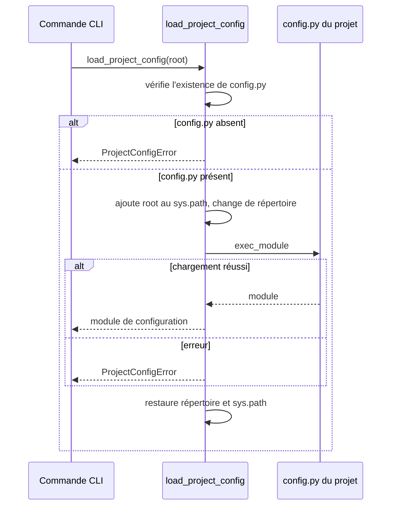

# Le chargement de configuration projet dans Forge

Ce module charge la configuration du projet Forge courant de façon explicite, sans magie cachée (principe 3).

Plusieurs commandes du CLI s'appuient sur lui pour lire la configuration applicative.
En cas de configuration absente ou invalide, il lève une exception dédiée plutôt que d'échouer silencieusement.

## 1. Rôle

`load_project_config` charge le fichier `config.py` du projet courant et retourne le module Python correspondant.

Il ajoute temporairement la racine du projet au chemin d'import et bascule le répertoire courant le temps du chargement, puis restaure l'état initial.
Le module chargé n'est pas conservé dans `sys.modules` après le retour, ce qui évite de polluer l'environnement.

Si `config.py` est absent ou si son chargement échoue, le module lève `ProjectConfigError` avec un message explicite.

## 2. Vue d'ensemble rapide

| Élément | Valeur |
|---|---|
| Commande forge | aucune directement ; support de commandes projet (`routes:list`, diagnostics) |
| Module Python | `cli.project.project_config` |
| Catégorie | infrastructure CLI (chargement de configuration) |
| Rôle | charger explicitement `config.py` du projet courant |
| Entrées | racine du projet (`root`, défaut : répertoire courant) |
| Sorties | module Python de configuration, ou `ProjectConfigError` |
| Fichiers touchés | aucun (lecture seule) |
| Mode Forge | lit |

Le module est volontairement explicite : il ne dépend pas du paquet installé par pipx et lit directement le `config.py` du projet.

## 3. Schémas UML

### 3.1 Diagramme de séquence

Le diagramme montre le chargement isolé et la restauration de l'état initial.



À retenir :

- l'absence de `config.py` lève une erreur claire, jamais un échec silencieux ;
- le chargement est isolé : le répertoire courant et le chemin d'import sont restaurés à la fin ;
- le module n'est pas laissé dans `sys.modules` après le retour.

## 4. API publique

| Symbole | Signature | Rôle |
|---|---|---|
| `load_project_config` | `load_project_config(root: Path \| None = None) -> ModuleType` | charge et retourne le module `config.py` du projet |
| `ProjectConfigError` | `ProjectConfigError(ValueError)` | levée si la configuration est introuvable ou invalide |

## 5. Contextes d'utilisation

| Besoin | Élément |
|---|---|
| Lire la configuration applicative depuis une commande | `load_project_config(root)` |
| Charger la configuration du répertoire courant | `load_project_config()` |
| Signaler clairement une configuration manquante | capture de `ProjectConfigError` |

## 6. Exemples d'utilisation

Charger la configuration du projet courant et lire une valeur :

```python
from pathlib import Path

from cli.project.project_config import load_project_config, ProjectConfigError

try:
    config = load_project_config(Path.cwd())
    app_name = getattr(config, "APP_NAME", "")
except ProjectConfigError as exc:
    print(f"Configuration projet indisponible : {exc}")
```

## 7. Détails techniques

!!! note "Chargement isolé"
    Le module utilise une clé dédiée dans `sys.modules` et la retire systématiquement après le chargement.
    Le répertoire courant et le chemin d'import sont restaurés dans le bloc `finally`, même en cas d'erreur.

## Voir aussi

- [La commande doctor](doctor.md) : diagnostic qui vérifie la configuration.
- [Les profils de projet](project_profiles.md) : contrat des profils officiels.
