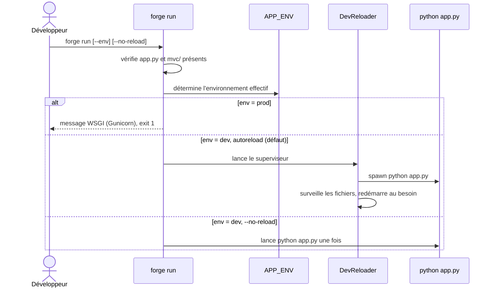

# La commande run dans Forge

`forge run` est le point d'entrée officiel pour lancer une application Forge.
Son comportement dépend de l'environnement applicatif : développement ou production.

## 1. Rôle

`forge run` démarre l'application Forge depuis la racine du projet.

En développement (`APP_ENV=dev`, valeur par défaut), elle lance un superviseur avec autoreload : il exécute `python app.py` dans un sous-processus et le redémarre à chaque changement de fichier surveillé.
L'option `--no-reload` désactive ce rechargement automatique et lance l'application une seule fois.

En production (`APP_ENV=prod`), elle refuse de servir avec le serveur intégré.
Elle affiche à la place la stratégie WSGI à employer (Gunicorn derrière un reverse proxy) et renvoie un code de sortie non nul.

## 2. Vue d'ensemble rapide

| Élément | Valeur |
|---|---|
| Commande forge | `forge run [--env dev\|prod] [--no-reload]` |
| Module Python | `cli.project.run` |
| Catégorie | commande projet (lancement) |
| Rôle | lancer l'application selon l'environnement |
| Entrées | options de ligne de commande, variable `APP_ENV`, racine du projet |
| Sorties | superviseur de dev, ou message WSGI en prod ; code de sortie |
| Fichiers touchés | aucun (Forge lit le projet, ne le réécrit pas) |
| Mode Forge | lit |
| Tickets | `FORGE-RUN-COMMAND-001`, `DEV-SERVER-AUTORELOAD-001` |

`forge run` ne modifie aucun fichier du projet.
Elle observe `app.py`, `mvc/` et la configuration, puis lance un processus.

## 3. Schémas UML

### 3.1 Diagramme de séquence

Le diagramme suivant montre le déroulé de la commande selon l'environnement détecté.



À retenir :

- la commande s'exécute toujours depuis la racine du projet ;
- la priorité de l'environnement est : `--env` puis `APP_ENV` puis `dev` par défaut ;
- en production, aucun serveur n'est lancé : seul un message d'orientation est affiché ;
- en développement, l'autoreload est actif par défaut.

## 4. Commande

Invocation : `forge run [--env dev|prod] [--no-reload]`.

| Option | Effet |
|---|---|
| `--env dev` | force l'environnement de développement |
| `--env prod` | force le mode production (refus du serveur intégré) |
| `--no-reload` | désactive l'autoreload, lance `python app.py` une seule fois |

| Fonction publique | Rôle |
|---|---|
| `cmd_run(args: list[str]) -> None` | implémente `forge run` selon l'environnement |
| `main(args: list[str]) -> None` | point d'entrée appelé par le dispatcher CLI |

## 5. Contextes d'utilisation

| Besoin | Commande |
|---|---|
| Développer avec rechargement automatique | `forge run` |
| Lancer une seule fois sans autoreload | `forge run --no-reload` |
| Forcer l'environnement de développement | `forge run --env dev` |
| Obtenir la stratégie de lancement en production | `forge run --env prod` |

## 6. Exemples d'utilisation

Lancer l'application en développement avec autoreload (cas le plus fréquent) :

```bash
forge run
```

Lancer sans rechargement automatique :

```bash
forge run --no-reload
```

Forcer le mode production pour afficher la stratégie WSGI :

```bash
forge run --env prod
```

## 7. Détails et limites

!!! note "Détection de la racine du projet"
    `forge run` exige un dossier contenant `app.py` et `mvc/`.
    Lancée ailleurs, elle s'arrête avec un message d'orientation vers `forge new`.

!!! warning "Pas de serveur intégré en production"
    En `APP_ENV=prod`, `forge run` ne démarre jamais `python app.py`.
    La voie supportée est WSGI : Gunicorn derrière un reverse proxy.
    La commande affiche la commande Gunicorn à utiliser et oriente vers la documentation de déploiement.

## Voir aussi

- [Le superviseur de développement](dev_reloader.md) : la mécanique de l'autoreload.
- [La commande doctor](doctor.md) : diagnostic du projet avant lancement.
- [La commande project:check](project_check.md) : contrôle strict des conventions.
