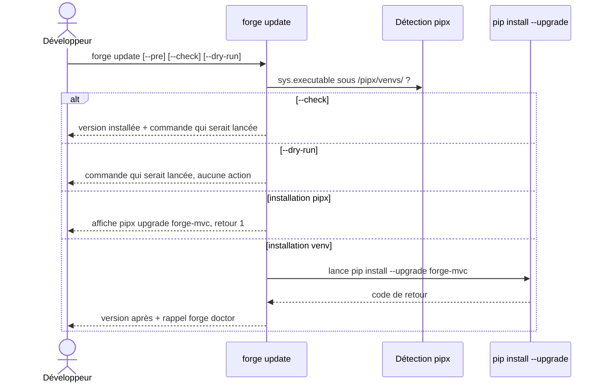

# La commande update dans Forge

`forge update` aide à mettre à jour Forge dans l'environnement Python courant, qu'il s'agisse d'un `.venv` de projet ou d'une installation pipx.

Elle vise l'utilisateur qui a créé un projet avec une ancienne version et veut passer à la dernière.

## 1. Rôle

`forge update` détecte le mode d'installation (venv ou pipx) et adapte la commande de mise à jour de `forge-mvc`.

En venv, elle lance `pip install --upgrade forge-mvc` avec l'interpréteur courant.
En pipx, elle ne lance pas pip : elle affiche le bon `pipx upgrade forge-mvc` à exécuter, car pipx isole chaque application et un `pip install` ne mettrait pas à jour l'installation pipx globale.

Elle propose plusieurs modes avant toute mise à jour effective : un mode vérification, un dry-run, et une option de pré-release.
Aucun fichier de projet, aucune migration et aucun fichier `env/*` n'est touché.

## 2. Vue d'ensemble rapide

| Élément | Valeur |
|---|---|
| Commande forge | `forge update [--pre] [--check] [--dry-run]` |
| Module Python | `cli.project.update` |
| Catégorie | commande projet (maintenance) |
| Rôle | mettre à jour `forge-mvc` dans l'environnement courant |
| Entrées | options de ligne de commande, interpréteur `sys.executable` |
| Sorties | exécution pip, ou affichage de la commande, ou rapport ; code de retour |
| Fichiers touchés | aucun fichier de projet (`env/*`, migrations inclus) |
| Mode Forge | lit (et délègue à pip, sans toucher le projet) |
| Ticket | `FORGE-UPDATE-COMMAND-001` |

`forge update` ne modifie jamais le code applicatif.
Elle agit uniquement sur le paquet `forge-mvc` installé dans l'environnement Python.

## 3. Schémas UML

### 3.1 Diagramme de séquence

Le diagramme montre la décision selon le mode d'installation et l'option choisie.



À retenir :

- `--check` et `--dry-run` ne modifient jamais rien ;
- en mode pipx, la commande refuse de lancer pip et affiche la commande pipx correcte ;
- en mode venv, elle lance pip avec l'interpréteur courant puis rappelle `forge doctor`.

## 4. Commande

Invocation : `forge update [--pre] [--check] [--dry-run]`.

| Option | Effet |
|---|---|
| `--check` | affiche la version installée et la commande qui serait lancée, sans rien modifier |
| `--dry-run` | affiche la commande qui serait exécutée, sans la lancer |
| `--pre` | autorise les versions de pré-release (utile tant que Forge est en beta) |
| `-h`, `--help` | affiche l'aide de la commande |

| Fonction publique | Signature | Rôle |
|---|---|---|
| `main` | `main(args: Sequence[str] \| None = None) -> int` | point d'entrée, renvoie un code de retour |

## 5. Contextes d'utilisation

| Besoin | Commande |
|---|---|
| Passer un projet à la dernière version de Forge | `forge update --pre` |
| Savoir si une version plus récente est disponible | `forge update --check` |
| Prévisualiser la commande pip sans l'exécuter | `forge update --dry-run` |
| Mettre à jour une installation pipx | `forge update` puis suivre la commande pipx affichée |

## 6. Exemples d'utilisation

Vérifier sans rien modifier :

```bash
forge update --check
```

Mettre à jour vers la dernière pré-release (recommandé en phase beta) :

```bash
forge update --pre
```

Prévisualiser la commande pip :

```bash
forge update --dry-run
```

## 7. Détails et limites

!!! warning "Installation pipx"
    Si Forge tourne depuis un venv pipx, `forge update` ne lance pas pip.
    Elle affiche la commande `pipx upgrade forge-mvc` à exécuter et renvoie un code de retour non nul, car pip depuis ce venv isolé ne mettrait pas à jour l'installation pipx globale.

!!! note "Aucune action sur le projet"
    La commande ne modifie aucun fichier du projet, ne lance aucune migration et ne touche pas les fichiers `env/*`.
    Après une mise à jour, elle invite à lancer `forge doctor` pour vérifier la cohérence.

## Voir aussi

- [La commande doctor](doctor.md) : diagnostic à lancer après mise à jour.
- [La commande project:check](project_check.md) : contrôle strict des conventions.
