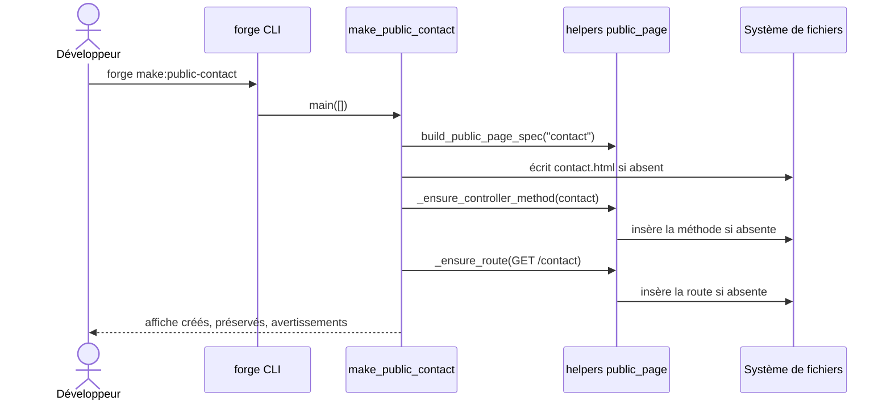

# La commande make:public-contact dans Forge

`forge make:public-contact` génère une page de contact publique : un gabarit de vue et une méthode de contrôleur.
C'est une variante spécialisée de la page publique, dédiée aux coordonnées de contact.

Le code correspondant est dans `cli/public/public_contact.py`.

## 1. Rôle

La commande crée une page de contact publique fixe, sous le slug `contact`.

Elle réutilise entièrement la mécanique de `make:public-page` :

- elle écrit un gabarit Jinja sous `mvc/views/public/contact.html` ;
- elle ajoute une méthode `contact` au contrôleur `mvc/controllers/public_pages_controller.py` ;
- elle déclare une route publique `GET /contact` dans `mvc/routes.py`.

Le gabarit affiche des coordonnées (email, téléphone, adresse) à travers le helper `trans()`, prêtes à être renseignées.
Contrairement à `make:public-form`, cette page n'insère pas de données : elle présente des informations de contact.

Forge ne réécrit jamais un fichier utilisateur en silence (principe 9).
Le gabarit suit le mode write-if-new ; le contrôleur et les routes sont complétés par insertion.

## 2. Vue d'ensemble rapide

| Élément | Valeur |
|---|---|
| Commande forge | `forge make:public-contact` (aucun argument) |
| Module Python | `cli.public.public_contact` |
| Catégorie | génération de pages publiques (CLI) |
| Rôle | générer une page de contact publique (vue, contrôleur, route) |
| Entrées | aucune (slug fixe `contact`) |
| Sorties | un gabarit de contact, une méthode `contact`, une route `GET /contact` |
| Fichiers touchés | `mvc/views/public/contact.html`, `mvc/controllers/public_pages_controller.py`, `mvc/routes.py` |
| Mode Forge | génère (write-if-new pour le gabarit), complète par insertion le contrôleur et les routes |
| ADR | ADR-051 (insertion dans le contrôleur des pages publiques), ADR-029 (convention de routes) |

## 3. Schémas UML

### 3.1 Diagramme de séquence

Le diagramme montre le déroulé d'un appel à `forge make:public-contact`.
La commande s'appuie sur les helpers de `public_page` pour insérer la méthode et la route.



À retenir :

- le slug est fixe (`contact`), aucun argument n'est attendu ;
- la génération réutilise la spécification et les helpers de `public_page` ;
- le gabarit existant est préservé, avec le message « Aucun écrasement effectué.
  ».

## 4. API publique / Commande

Invocation :

```bash
forge make:public-contact
```

La commande n'accepte aucun argument ; sinon elle affiche `Usage : forge make:public-contact (aucun argument attendu)`.

| Symbole | Signature | Rôle |
|---|---|---|
| `build_contact_template` | `build_contact_template() -> str` | produit le gabarit de la page de contact |
| `make_public_contact` | `make_public_contact(*, root: Path \| None = None) -> MakePublicPageResult` | exécute la génération complète |
| `print_result` | `print_result(result: MakePublicPageResult) -> None` | affiche le résultat de la génération |
| `main` | `main(args: list[str] \| None = None, *, root: Path \| None = None) -> MakePublicPageResult` | point d'entrée de `forge make:public-contact` |

Le résultat est un `MakePublicPageResult`, la même structure que `make:public-page`.

## 5. Contextes d'utilisation

| Besoin | Commande / Élément |
|---|---|
| Offrir une page de contact publique prête à l'emploi | `forge make:public-contact` |
| Hériter de la mise en page commune des pages publiques | `cli.public.public_contact` (réutilise `public_page`) |
| Produire seulement le gabarit de contact | `build_contact_template()` |

## 6. Exemples d'utilisation

Générer la page de contact :

```bash
forge make:public-contact
```

Sortie typique :

```text
Page contact générée
Route : /contact
Template : mvc/views/public/contact.html
Contrôleur : mvc/controllers/public_pages_controller.py
```

Appel direct depuis du code Python :

```python
from cli.public.public_contact import make_public_contact

result = make_public_contact()
print(result.spec.slug)  # "contact"
```

## 7. Idempotence et écriture write-if-new

!!! note "Préservation des fichiers utilisateur"
    Si `mvc/views/public/contact.html` existe déjà, il est conservé tel quel.
    La sortie indique alors « Page contact déjà existante »
    suivie de « Aucun écrasement effectué.
    ».

!!! tip "Coordonnées à compléter"
    Le gabarit généré contient des valeurs de démonstration (email, téléphone, adresse).
    Ce sont des libellés traduits via `trans()` : ajustez le catalogue de traductions et les coordonnées affichées.

## Voir aussi

- [La commande make:public-page](public_page.md) : page statique de base réutilisée.
- [La commande make:public-form](public_form.md) : formulaire public d'enregistrement.
- [La commande make:public-list](public_list.md) : liste publique paginée.
