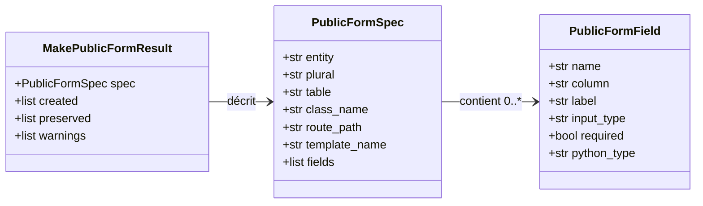
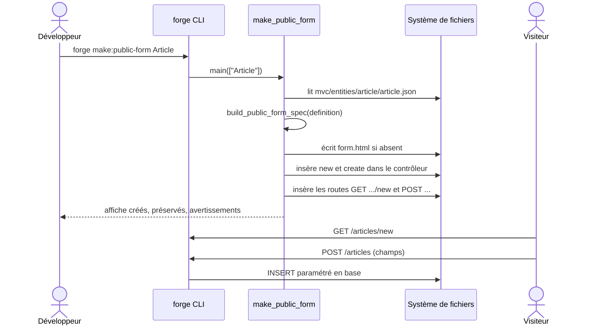

# La commande make:public-form dans Forge

`forge make:public-form` génère un formulaire public d'enregistrement à partir d'une entité.
Le visiteur saisit des données qui sont insérées en base par du SQL visible.

Le code correspondant est dans `cli/public/public_form.py`.

## 1. Rôle

La commande lit la définition JSON validée d'une entité et en déduit un formulaire public.

Elle réalise trois actions :

- elle écrit un gabarit Jinja sous `mvc/views/public/<pluriel>/form.html` ;
- elle écrit ou complète le contrôleur `mvc/controllers/public_<pluriel>_controller.py` avec deux méthodes : `new` (affichage du formulaire) et `create` (validation puis insertion) ;
- elle déclare deux routes publiques : `GET /<pluriel>/new` et `POST /<pluriel>`.

Les champs de saisie et leur type d'`input` HTML sont déduits de la définition de l'entité (type SQL, type Python, nom du champ).
Les champs sensibles sont exclus du formulaire public : `id`, `password`, `password_hash`, `token`, `secret`, `is_admin`, `is_active`, les horodatages, ainsi que tout champ contenant `password`, `token`, `secret` ou `_hash`.
Les clés primaires, les clés étrangères (`*_id`), les types non simples et les colonnes binaires ou JSON sont également écartés.

La méthode `create` générée valide les champs requis, puis insère en base avec un `INSERT` paramétré (SQL visible dans le contrôleur, principe 5).
Le SQL utilise des placeholders `?` et passe les valeurs séparément, ce qui protège contre l'injection SQL.

Forge ne réécrit jamais un fichier utilisateur en silence (principe 9).
Le gabarit suit le mode write-if-new ; le contrôleur et les routes sont complétés par insertion.

## 2. Vue d'ensemble rapide

| Élément | Valeur |
|---|---|
| Commande forge | `forge make:public-form <Entite>` |
| Module Python | `cli.public.public_form` |
| Catégorie | génération de pages publiques (CLI) |
| Rôle | générer un formulaire public d'enregistrement pour une entité |
| Entrées | un nom d'entité ; la définition JSON validée `mvc/entities/<snake>/<snake>.json` |
| Sorties | un gabarit de formulaire, un contrôleur avec `new` et `create`, deux routes |
| Fichiers touchés | `mvc/views/public/<pluriel>/form.html`, `mvc/controllers/public_<pluriel>_controller.py`, `mvc/routes/__init__.py` |
| Mode Forge | lit la définition d'entité, génère (write-if-new pour le gabarit), complète par insertion |
| ADR | ADR-013 (nullable / required), ADR-029 (convention de routes) |

## 3. Schémas UML

### 3.1 Diagramme de classe

Le diagramme montre les structures déduites de l'entité.



À retenir :

- `public_form_fields(definition)` produit la liste des `PublicFormField` publics, après filtrage des champs sensibles ;
- `build_public_form_spec(definition)` assemble la `PublicFormSpec` (table, classe, routes, gabarit) ;
- `MakePublicFormResult` collecte les fichiers créés, préservés et les avertissements.

### 3.2 Diagramme de séquence

Le diagramme montre le déroulé d'un appel à `forge make:public-form` puis la soumission du formulaire par un visiteur.



À retenir :

- la définition d'entité est lue puis validée avant toute génération ;
- la méthode `create` valide les champs requis avant d'insérer ;
- l'insertion utilise un `INSERT` paramétré (placeholders `?`).

## 4. API publique / Commande

Invocation :

```bash
forge make:public-form <Entite>
```

La commande attend exactement un argument ; sinon elle affiche `Usage : forge make:public-form <Entite>`.
Si l'entité est introuvable ou si son JSON est invalide, la commande affiche l'erreur et sort avec le code 1.

| Symbole | Signature | Rôle |
|---|---|---|
| `public_form_fields` | `public_form_fields(definition: dict[str, Any]) -> list[PublicFormField]` | champs de saisie publics d'une entité |
| `build_public_form_spec` | `build_public_form_spec(definition: dict[str, Any]) -> PublicFormSpec` | construit la spécification du formulaire |
| `build_public_form_new_method` | `build_public_form_new_method(spec: PublicFormSpec) -> str` | produit la méthode `new` (affichage) |
| `build_public_form_create_method` | `build_public_form_create_method(spec: PublicFormSpec) -> str` | produit la méthode `create` (validation et insertion) |
| `make_public_form` | `make_public_form(entity_name: str, *, entities_root: Path \| None = None, output_root: Path \| None = None) -> MakePublicFormResult` | exécute la génération complète |
| `main` | `main(args: list[str], *, root: Path \| None = None) -> MakePublicFormResult` | point d'entrée de `forge make:public-form` |
| `PublicFormField` / `PublicFormSpec` / `MakePublicFormResult` | dataclasses | champ, spécification et résultat |

## 5. Contextes d'utilisation

| Besoin | Commande / Élément |
|---|---|
| Recueillir des données depuis un visiteur (inscription, dépôt) | `forge make:public-form` |
| Ne jamais exposer les champs sensibles | filtrage automatique dans `public_form_fields` |
| Lister les champs publics d'une entité | `public_form_fields(definition)` |
| Récupérer la table et les routes déduites | `build_public_form_spec(definition)` |

## 6. Exemples d'utilisation

Générer un formulaire public pour l'entité `Article` :

```bash
forge make:public-form Article
```

Sortie typique :

```text
Formulaire public généré : Article
Routes : GET /articles/new  POST /articles
Template : mvc/views/public/articles/form.html
Contrôleur : mvc/controllers/public_articles_controller.py
```

Appel direct depuis du code Python :

```python
from cli.public.public_form import make_public_form

result = make_public_form("Article")
for f in result.spec.fields:
    print(f.name, f.input_type, f.required)
```

## 7. Sécurité et limites

!!! warning "Champs sensibles exclus"
    Les champs sensibles ne figurent jamais dans le formulaire public : identifiants, mots de passe, jetons, secrets, indicateurs d'administration, horodatages.
    Les clés primaires, les clés étrangères (`*_id`) et les colonnes binaires ou JSON sont aussi écartées.

!!! tip "SQL visible et paramétré"
    L'`INSERT` généré reste lisible dans le contrôleur (principe 5).
    Il utilise des placeholders `?` et passe les valeurs séparément : aucune interpolation de chaîne dans la requête.

!!! note "Entité sans champ public"
    Si aucun champ public n'est détecté, la commande génère quand même les fichiers mais émet l'avertissement « Aucun champ public affichable détecté ».

## Voir aussi

- [La commande make:public-page](public_page.md) : page statique de base réutilisée.
- [La commande make:public-contact](public_contact.md) : page de contact spécialisée.
- [La commande make:public-list](public_list.md) : liste publique paginée.
- [La commande make:public-show](public_show.md) : fiche détaillée publique.
