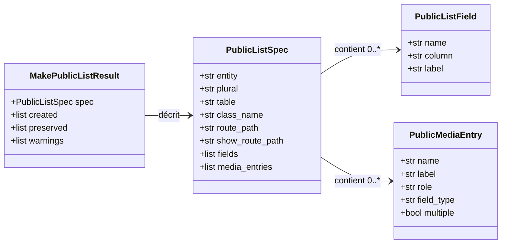
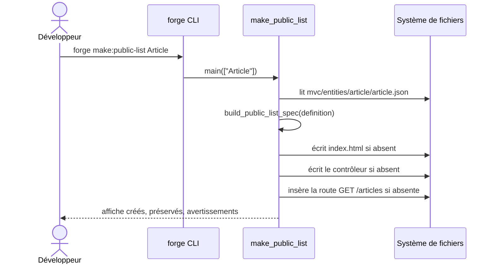

# La commande make:public-list dans Forge

`forge make:public-list` génère une liste publique paginée à partir d'une entité.
Elle expose une collection d'entités en lecture, sans authentification.

Le code correspondant est dans `cli/public/public_list.py`.
Ce module porte aussi la logique de `make:public-show` (voir [public_show.md](public_show.md)).

## 1. Rôle

La commande lit la définition JSON validée d'une entité et en déduit une liste publique.

Elle réalise trois actions :

- elle écrit un gabarit Jinja sous `mvc/views/public/<pluriel>/index.html` ;
- elle écrit le contrôleur `mvc/controllers/public_<pluriel>_controller.py` avec une méthode `index` qui lit la base par SQL visible ;
- elle déclare une route publique `GET /<pluriel>`.

Les champs affichés sont déduits de la définition de l'entité.
Les champs sensibles sont exclus : `id`, `password`, `password_hash`, `token`, `secret`, les horodatages, ainsi que tout champ contenant `password`, `token` ou `secret`.
Les clés primaires, les clés étrangères (`*_id`), les types non simples et les colonnes binaires ou JSON sont également écartés.

Quand l'entité déclare des médias (`image` ou `file`), la commande prend en charge la couverture et la galerie en s'appuyant sur l'opt-in `forge-mvc-images` (`get_cover_media`, `list_media_for_entity`).

Forge ne réécrit jamais un fichier utilisateur en silence (principe 9).
Le gabarit et le contrôleur suivent le mode write-if-new ; la route est complétée par insertion.

## 2. Vue d'ensemble rapide

| Élément | Valeur |
|---|---|
| Commande forge | `forge make:public-list <Entite>` |
| Module Python | `cli.public.public_list` |
| Catégorie | génération de pages publiques (CLI) |
| Rôle | générer une liste publique paginée pour une entité |
| Entrées | un nom d'entité ; la définition JSON validée `mvc/entities/<snake>/<snake>.json` |
| Sorties | un gabarit de liste, un contrôleur avec `index`, une route `GET /<pluriel>` |
| Fichiers touchés | `mvc/views/public/<pluriel>/index.html`, `mvc/controllers/public_<pluriel>_controller.py`, `mvc/routes.py` |
| Mode Forge | lit la définition d'entité, génère (write-if-new), complète par insertion la route |
| Dépendance optionnelle | `forge-mvc-images` (couverture et galerie quand l'entité déclare des médias) |
| ADR | ADR-018 (images), ADR-029 (convention de routes) |

## 3. Schémas UML

### 3.1 Diagramme de classe

Le diagramme montre les structures déduites de l'entité.
La même `PublicListSpec` sert à la liste et à la fiche détaillée (`make:public-show`).



À retenir :

- `public_list_fields(definition)` produit les `PublicListField` publics, après filtrage des champs sensibles ;
- `public_media_entries(definition)` produit les `PublicMediaEntry` (couverture, galerie) ;
- `PublicListSpec` porte à la fois la route de liste et celle de la fiche détaillée.

### 3.2 Diagramme de séquence

Le diagramme montre le déroulé d'un appel à `forge make:public-list`.



À retenir :

- la définition d'entité est lue puis validée avant toute génération ;
- la méthode `index` générée lit la base par SQL visible ;
- la route est insérée seulement si une fabrique `Router` est détectée.

## 4. API publique / Commande

Invocations :

```bash
forge make:public-list <Entite>
forge make:public-show <Entite>
```

`make:public-list` attend exactement un argument ; sinon elle affiche `Usage : forge make:public-list <Entite>`.
`make:public-show` partage ce module via `show_main` (voir [public_show.md](public_show.md)).

| Symbole | Signature | Rôle |
|---|---|---|
| `public_list_fields` | `public_list_fields(definition: dict[str, Any]) -> list[PublicListField]` | champs publics affichables d'une entité |
| `public_media_entries` | `public_media_entries(definition: dict[str, Any]) -> list[PublicMediaEntry]` | entrées média publiques (couverture, galerie) |
| `build_public_list_spec` | `build_public_list_spec(definition: dict[str, Any]) -> PublicListSpec` | construit la spécification de la liste |
| `make_public_list` | `make_public_list(entity_name: str, *, entities_root: Path \| None = None, output_root: Path \| None = None) -> MakePublicListResult` | exécute la génération de la liste |
| `make_public_show` | `make_public_show(entity_name: str, *, entities_root: Path \| None = None, output_root: Path \| None = None) -> MakePublicShowResult` | exécute la génération de la fiche détaillée |
| `main` | `main(args: list[str], *, root: Path \| None = None) -> MakePublicListResult` | point d'entrée de `forge make:public-list` |
| `show_main` | `show_main(args: list[str], *, root: Path \| None = None) -> MakePublicShowResult` | point d'entrée de `forge make:public-show` |
| `PublicListSpec` / `MakePublicListResult` / `MakePublicShowResult` | dataclasses | spécification et résultats |

## 5. Contextes d'utilisation

| Besoin | Commande / Élément |
|---|---|
| Exposer publiquement une collection d'entités en lecture | `forge make:public-list` |
| Produire la fiche détaillée correspondante | `forge make:public-show` |
| Lister les champs publics affichables d'une entité | `public_list_fields(definition)` |
| Repérer les entrées média (couverture, galerie) | `public_media_entries(definition)` |

## 6. Exemples d'utilisation

Générer une liste publique pour l'entité `Article` :

```bash
forge make:public-list Article
```

Sortie typique :

```text
Liste publique générée : Article
Route : /articles
Template : mvc/views/public/articles/index.html
Contrôleur : mvc/controllers/public_articles_controller.py
```

Appel direct depuis du code Python :

```python
from cli.public.public_list import make_public_list

result = make_public_list("Article")
print(result.spec.route_path)       # "/articles"
print(result.spec.show_route_path)  # "/articles/{id}"
```

## 7. Médias et limites

!!! note "Couverture et galerie"
    Quand l'entité déclare des médias `image` ou `file`, la liste prend en charge la couverture et la galerie via `forge-mvc-images`.
    L'import généré dépend du caractère multiple ou non du média (`get_cover_media`, `list_media_for_entity`).

!!! warning "Champs sensibles exclus"
    Les champs sensibles, les clés primaires, les clés étrangères (`*_id`) et les colonnes binaires ou JSON ne sont jamais affichés publiquement.

!!! tip "Entité sans champ public"
    Si aucun champ public n'est détecté, la commande génère quand même les fichiers mais émet l'avertissement « Aucun champ public affichable détecté ».

## Voir aussi

- [La commande make:public-show](public_show.md) : fiche détaillée et logique partagée.
- [La commande make:public-page](public_page.md) : page statique de base.
- [La commande make:public-form](public_form.md) : formulaire public d'enregistrement.
- [La commande make:public-contact](public_contact.md) : page de contact.
