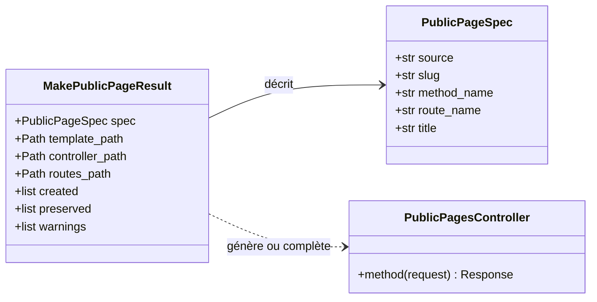
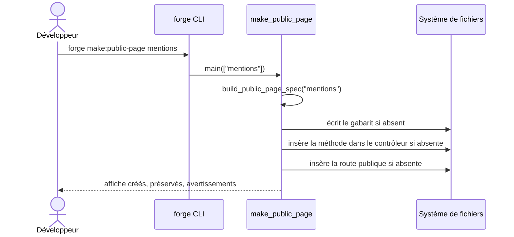

# La commande make:public-page dans Forge

`forge make:public-page` génère une page statique publique : un gabarit de vue et la méthode de contrôleur associée.
C'est la brique de base des pages publiques.
Les autres commandes `make:public-*` réutilisent ses gabarits et ses helpers.

Le code correspondant est dans `cli/public/public_page.py`.

## 1. Rôle

La commande crée une page publique simple, accessible sans authentification.

Elle réalise trois actions complémentaires :

- elle écrit un gabarit Jinja sous `mvc/views/public/<slug>.html` ;
- elle ajoute une méthode de rendu au contrôleur `mvc/controllers/public_pages_controller.py` ;
- elle déclare une route publique `GET /<slug>` dans `mvc/routes.py`.

Le nom passé en argument est réduit à un slug d'URL par le module canonique `core.http.slug` (ADR-017).
Les chemins (`/`, `\`, `..`) sont refusés explicitement, pour ne pas créer une page à partir d'un chemin comme `../admin`.

Forge ne réécrit jamais un fichier utilisateur en silence (principe 9).
Le gabarit suit le mode write-if-new : un fichier déjà présent est préservé.
Le contrôleur et les routes sont complétés par insertion, sans destruction de l'existant ; si l'insertion automatique n'est pas possible, la commande émet un avertissement et indique le geste manuel à faire.

## 2. Vue d'ensemble rapide

| Élément | Valeur |
|---|---|
| Commande forge | `forge make:public-page <nom>` |
| Module Python | `cli.public.public_page` |
| Catégorie | génération de pages publiques (CLI) |
| Rôle | générer une page statique publique (vue, contrôleur, route) |
| Entrées | un nom de page (réduit à un slug d'URL) |
| Sorties | un gabarit, une méthode de contrôleur, une route publique |
| Fichiers touchés | `mvc/views/public/<slug>.html`, `mvc/controllers/public_pages_controller.py`, `mvc/routes.py` |
| Mode Forge | génère (write-if-new pour le gabarit), complète par insertion le contrôleur et les routes |
| ADR | ADR-051 (insertion d'une méthode dans le contrôleur des pages publiques), ADR-017 (slug), ADR-029 (convention de routes) |

## 3. Schémas UML

### 3.1 Diagramme de classe

Le diagramme montre les structures manipulées par la commande : la spécification déduite du nom, et le résultat qui collecte les fichiers créés, préservés et les avertissements.



À retenir :

- `build_public_page_spec(name)` transforme un nom en `PublicPageSpec` (slug, nom de méthode, nom de route, titre) ;
- `MakePublicPageResult` porte les chemins touchés et les listes `created` / `preserved` / `warnings` ;
- la méthode générée appartient au contrôleur `PublicPagesController`.

### 3.2 Diagramme de séquence

Le diagramme montre le déroulé d'un appel à `forge make:public-page`.



À retenir :

- le slug est calculé avant toute écriture ;
- chaque fichier est soit créé, soit préservé, jamais écrasé ;
- la sortie liste précisément ce qui a été fait.

## 4. API publique / Commande

Invocation :

```bash
forge make:public-page <nom>
```

La commande attend exactement un argument ; sinon elle affiche `Usage : forge make:public-page <nom>`.

| Symbole | Signature | Rôle |
|---|---|---|
| `build_public_page_spec` | `build_public_page_spec(name: str) -> PublicPageSpec` | déduit le slug, le nom de méthode, le nom de route et le titre |
| `build_public_template` | `build_public_template(spec: PublicPageSpec) -> str` | produit le gabarit de vue |
| `build_controller` | `build_controller(spec: PublicPageSpec) -> str` | produit le contrôleur complet |
| `build_controller_method` | `build_controller_method(spec: PublicPageSpec) -> str` | produit la seule méthode de contrôleur |
| `make_public_page` | `make_public_page(name: str, *, root: Path \| None = None) -> MakePublicPageResult` | exécute la génération complète |
| `main` | `main(args: list[str], *, root: Path \| None = None) -> MakePublicPageResult` | point d'entrée de `forge make:public-page` |
| `PublicPageSpec` | dataclass | spécification déduite du nom |
| `MakePublicPageResult` | dataclass | résultat de la génération |

## 5. Contextes d'utilisation

| Besoin | Commande / Élément |
|---|---|
| Créer une page institutionnelle simple | `forge make:public-page` |
| Fournir le socle réutilisé par les autres pages publiques | `cli.public.public_page` |
| Construire seulement la spécification d'une page | `build_public_page_spec(name)` |
| Récupérer la liste des fichiers touchés | `MakePublicPageResult.created` / `.preserved` |

## 6. Exemples d'utilisation

Générer une page de mentions légales :

```bash
forge make:public-page mentions
```

Sortie typique :

```text
Page publique générée : mentions
Route : /mentions
Template : mvc/views/public/mentions.html
Contrôleur : mvc/controllers/public_pages_controller.py
```

Appel direct depuis du code Python :

```python
from cli.public.public_page import make_public_page

result = make_public_page("a-propos")
print(result.spec.slug)        # "a-propos"
print(result.spec.route_name)  # "public_pages-a_propos"
```

## 7. Idempotence et écriture write-if-new

!!! note "Préservation des fichiers utilisateur"
    Le gabarit est écrit seulement s'il n'existe pas encore.
    Le contrôleur et `routes.py` sont complétés par insertion : une méthode ou une route déjà présente n'est pas dupliquée.

!!! tip "Insertion sûre dans les routes"
    La fabrique de routes est détectée par analyse AST, pas par recherche de texte.
    Une chaîne ou un commentaire contenant `router = Router()` n'est donc pas pris pour la vraie fabrique.
    Si aucune fabrique n'est trouvée, la commande renonce à modifier le fichier et indique la route à ajouter à la main.

!!! warning "Noms refusés"
    Un nom contenant `/`, `\` ou `..` est rejeté avec l'erreur `Nom de page invalide : les chemins ne sont pas autorisés.`

## Voir aussi

- [La commande make:public-list](public_list.md) : liste publique paginée.
- [La commande make:public-show](public_show.md) : fiche détaillée publique.
- [La commande make:public-form](public_form.md) : formulaire public d'enregistrement.
- [La commande make:public-contact](public_contact.md) : page de contact.
