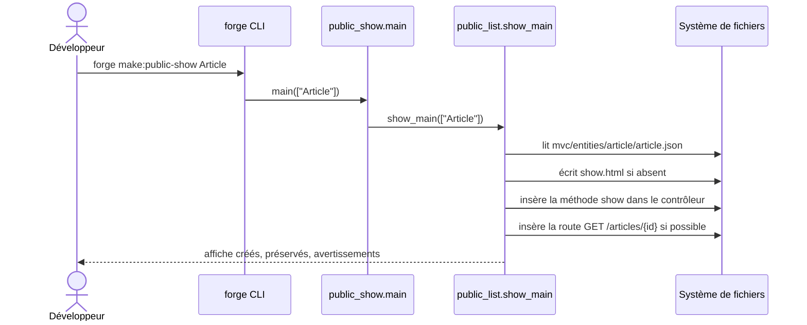

# La commande make:public-show dans Forge

`forge make:public-show` génère une fiche publique détaillée pour une entité.
C'est le pendant « détail »
de [`make:public-list`](public_list.md).

Le code correspondant est dans `cli/public/public_show.py`.

## 1. Rôle

La commande crée la fiche de consultation publique d'une entité unique.

Elle réalise trois actions :

- elle écrit un gabarit Jinja sous `mvc/views/public/<pluriel>/show.html` ;
- elle complète le contrôleur `mvc/controllers/public_<pluriel>_controller.py` avec une méthode `show` qui lit une ligne par SQL visible ;
- elle déclare une route publique `GET /<pluriel>/{id}`.

Ce fichier est une façade mince : il délègue à `show_main` du module `cli.public.public_list`.
La logique de génération vit donc à côté de celle de la liste, pour rester cohérente.
La route n'est ajoutée automatiquement que si le contrôleur a pu être complété ; sinon la commande émet un avertissement et indique le geste manuel à faire.

Forge ne réécrit jamais un fichier utilisateur en silence (principe 9).
Le gabarit suit le mode write-if-new ; le contrôleur et la route sont complétés par insertion.

## 2. Vue d'ensemble rapide

| Élément | Valeur |
|---|---|
| Commande forge | `forge make:public-show <Entite>` |
| Module Python | `cli.public.public_show` (façade vers `cli.public.public_list.show_main`) |
| Catégorie | génération de pages publiques (CLI) |
| Rôle | générer une fiche publique détaillée pour une entité |
| Entrées | un nom d'entité ; la définition JSON validée `mvc/entities/<snake>/<snake>.json` |
| Sorties | un gabarit de fiche, une méthode `show`, une route `GET /<pluriel>/{id}` |
| Fichiers touchés | `mvc/views/public/<pluriel>/show.html`, `mvc/controllers/public_<pluriel>_controller.py`, `mvc/routes/__init__.py` |
| Mode Forge | lit la définition d'entité, génère (write-if-new), complète par insertion |
| ADR | ADR-029 (convention de routes) |

## 3. Schémas UML

### 3.1 Diagramme de séquence

Le diagramme montre le déroulé d'un appel à `forge make:public-show`.
La commande est une façade : son `main` appelle `show_main` du module `public_list`, qui porte toute la logique.



À retenir :

- `public_show.main` ne fait que déléguer à `public_list.show_main` ;
- la même `PublicListSpec` que `make:public-list` est réutilisée ;
- la route n'est insérée que si le contrôleur a pu être complété.

## 4. API publique / Commande

Invocation :

```bash
forge make:public-show <Entite>
```

La commande attend exactement un argument ; sinon elle affiche `Usage : forge make:public-show <Entite>`.
Si l'entité est introuvable ou si son JSON est invalide, la commande affiche l'erreur et sort avec le code 1.

| Symbole | Signature | Rôle |
|---|---|---|
| `main` | `main(args: list[str], *, root: Path \| None = None) -> MakePublicShowResult` | point d'entrée de `forge make:public-show` ; délègue à `cli.public.public_list.show_main` |

La logique métier (`make_public_show`, `show_main`, `MakePublicShowResult`) est documentée dans [public_list.md](public_list.md).

## 5. Contextes d'utilisation

| Besoin | Commande / Élément |
|---|---|
| Exposer une fiche entité accessible depuis une liste publique | `forge make:public-show` |
| Compléter une liste publique avec sa vue de détail | `forge make:public-list` puis `forge make:public-show` |

## 6. Exemples d'utilisation

Générer la fiche détaillée pour l'entité `Article` :

```bash
forge make:public-show Article
```

Sortie typique :

```text
Fiche publique générée : Article
Route : /articles/{id}
Template : mvc/views/public/articles/show.html
Contrôleur : mvc/controllers/public_articles_controller.py
```

Appel direct depuis du code Python :

```python
from cli.public.public_show import main as make_public_show

result = make_public_show(["Article"])
print(result.spec.show_route_path)  # "/articles/{id}"
```

## 7. Délégation et limites

!!! note "Façade vers public_list"
    `make:public-show` ne contient pas sa propre logique : il appelle `show_main` du module `public_list`.
    Pour les structures `PublicListSpec` et `MakePublicShowResult`, voir la page de la liste.

!!! warning "Route conditionnelle"
    Si le contrôleur ne peut pas être complété automatiquement (par exemple s'il est déjà personnalisé), la route n'est pas ajoutée.
    La commande émet alors un avertissement précisant la route à déclarer à la main.

## Voir aussi

- [La commande make:public-list](public_list.md) : liste paginée et logique partagée.
- [La commande make:public-page](public_page.md) : page statique de base.
- [La commande make:public-form](public_form.md) : formulaire public d'enregistrement.
- [La commande make:public-contact](public_contact.md) : page de contact.
