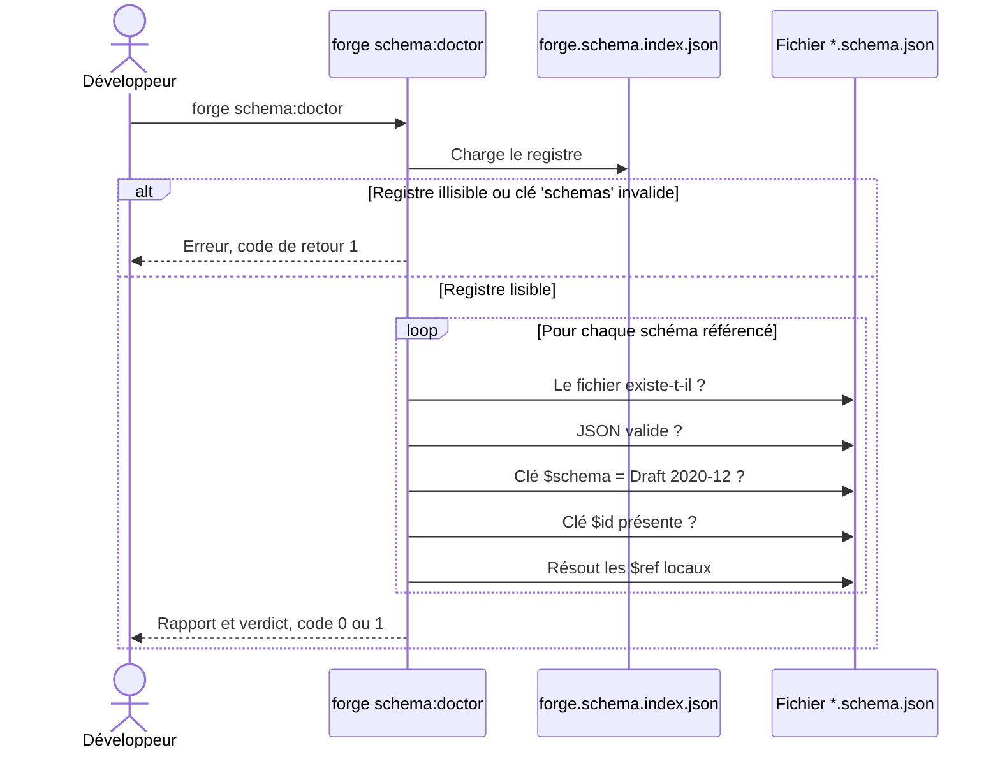

# La commande schema:doctor dans Forge

Cette page décrit la commande CLI `forge schema:doctor`.
Elle diagnostique l'intégrité des schémas JSON Forge référencés dans le registre.
Le fichier de code correspondant est `cli/schemas/schema_doctor.py`.

## 1. Rôle

`forge schema:doctor` diagnostique les schémas JSON Forge référencés dans `forge.schema.index.json`.

Pour chaque schéma, elle vérifie cinq points :

1. le fichier existe ;
2. le fichier est du JSON valide ;
3. la clé `$schema` est présente et pointe vers le Draft 2020-12 ;
4. la clé `$id` est présente ;
5. les `$ref` locaux, hors `#` interne et URI `http` distant, pointent vers des fichiers existants.

Elle ne valide pas les entités utilisateur (`mvc/entities/*.json`).
Cette validation relève de `forge entity:validate`.

C'est une commande en lecture seule.
Elle n'écrit ni ne modifie aucun fichier, conformément au principe 9 de la charte (Forge lit).

## 2. Vue d'ensemble rapide

| Élément | Valeur |
|---|---|
| Commande forge | `forge schema:doctor` |
| Module Python | `cli.schemas.schema_doctor` |
| Point d'entrée | `schema_doctor_main(args)` |
| Catégorie | outillage CLI, schémas JSON |
| Rôle | diagnostiquer la validité et la cohérence des schémas JSON Forge |
| Entrées | le registre `schemas/forge.schema.index.json` et les fichiers `schemas/*.schema.json` |
| Sorties | un rapport lisible sur `stdout` ou un objet JSON avec `--json` |
| Fichiers touchés | aucun |
| Mode Forge | Forge lit |
| Code de retour | `0` si aucune erreur, `1` si au moins une erreur |
| ADR | ADR-043 (doc embarquée du cœur et du CLI) |

## 3. Schémas UML

Le déroulé de la commande se résume à un diagramme de séquence.

### 3.1 Diagramme de séquence

Le diagramme montre l'enchaînement : la commande charge le registre, contrôle chaque schéma sur cinq points, résout les `$ref` locaux, puis produit un verdict.



À retenir :

- la commande part toujours du registre `forge.schema.index.json` ;
- chaque schéma est contrôlé sur l'existence, la validité JSON, la clé `$schema`, la clé `$id` et ses `$ref` locaux ;
- seuls les `$ref` locaux sont résolus : les ancres internes `#...` et les URI distants `http...` sont ignorés ;
- toute erreur rencontrée force le code de retour à `1`.

## 4. Commande et API publique

L'invocation est `forge schema:doctor`, avec une seule option facultative.

| Invocation | Effet |
|---|---|
| `forge schema:doctor` | affiche un rapport lisible (schémas, références locales, verdict) |
| `forge schema:doctor --json` | affiche un objet JSON stable sur `stdout`, sans ligne lisible par un humain |

La fonction publique est le point d'entrée appelé par le dispatch de `forge.py`.

| Symbole | Signature | Rôle |
|---|---|---|
| `schema_doctor_main` | `schema_doctor_main(args: list[str]) -> None` | point d'entrée de la commande `forge schema:doctor` |

Codes de retour :

- `0` : aucune erreur ;
- `1` : au moins une erreur (registre illisible, option inconnue, schéma absent ou invalide, `$ref` mort).

## 5. Contextes d'utilisation

| Besoin | Commande |
|---|---|
| Vérifier que les schémas embarqués sont valides et cohérents | `forge schema:doctor` |
| Faire échouer un pipeline si un schéma est cassé | `forge schema:doctor --json` |
| Détecter un `$ref` mort après un renommage de schéma | `forge schema:doctor` |

## 6. Exemples d'utilisation

Diagnostic lisible des schémas embarqués :

```bash
forge schema:doctor
```

Sortie machine pour l'intégration continue :

```bash
forge schema:doctor --json
```

Faire échouer une étape de CI sur le code de retour :

```bash
forge schema:doctor --json > schemas-report.json || exit 1
```

## 7. Diagnostic, pas validation d'entités

!!! note "Périmètre de la commande"
    `forge schema:doctor` diagnostique les schémas Forge eux-mêmes (`schemas/*.schema.json`).

    Elle ne valide pas vos entités applicatives (`mvc/entities/*.json`) : c'est le rôle de `forge entity:validate`.

!!! tip "Idempotence et lecture seule"
    La commande ne modifie aucun fichier et peut être relancée autant de fois que nécessaire.

    En cas d'erreur, le rapport lisible liste chaque problème et propose de corriger les fichiers `schemas/*.schema.json` ou le registre.

## Voir aussi

- [La commande schema:list](schema_list.md) : inventaire des schémas et de leur présence.
