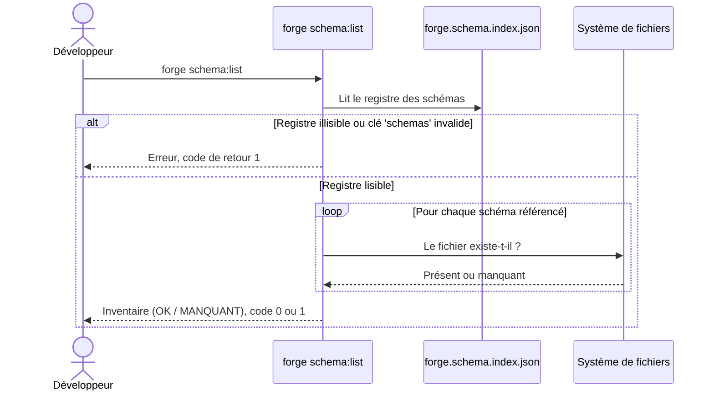

# La commande schema:list dans Forge

Cette page décrit la commande CLI `forge schema:list`.
Elle inventorie les schémas JSON Forge embarqués et indique, pour chacun, s'il est présent.
Le fichier de code correspondant est `cli/schemas/schema_list.py`.

## 1. Rôle

`forge schema:list` liste les schémas JSON Forge disponibles localement.

Elle lit le registre `schemas/forge.schema.index.json`, puis affiche chaque schéma référencé avec son chemin relatif et son statut.
Le statut vaut `OK` si le fichier existe, `MANQUANT` sinon.

C'est une commande en lecture seule.
Elle n'écrit ni ne modifie aucun fichier, conformément au principe 9 de la charte (Forge lit).

## 2. Vue d'ensemble rapide

| Élément | Valeur |
|---|---|
| Commande forge | `forge schema:list` |
| Module Python | `cli.schemas.schema_list` |
| Point d'entrée | `schema_list_main(args)` |
| Catégorie | outillage CLI, schémas JSON |
| Rôle | inventorier les schémas JSON Forge et leur présence |
| Entrées | le registre `schemas/forge.schema.index.json` |
| Sorties | une liste lisible sur `stdout` ou un objet JSON avec `--json` |
| Fichiers touchés | aucun |
| Mode Forge | Forge lit |
| Code de retour | `0` si le registre est lisible et tous les schémas présents, `1` sinon |
| ADR | ADR-043 (doc embarquée du cœur et du CLI) |

## 3. Schémas UML

Le déroulé de la commande se résume à un diagramme de séquence.

### 3.1 Diagramme de séquence

Le diagramme montre l'enchaînement : la commande charge le registre, vérifie la présence de chaque schéma, puis affiche l'inventaire.



À retenir :

- la commande part toujours du registre `forge.schema.index.json` ;
- si le registre est introuvable ou si la clé `schemas` est absente ou invalide, la commande échoue avec le code `1` ;
- chaque schéma est testé individuellement par sa présence sur le disque ;
- la présence d'au moins un schéma manquant force le code de retour à `1`.

## 4. Commande et API publique

L'invocation est `forge schema:list`, avec une seule option facultative.

| Invocation | Effet |
|---|---|
| `forge schema:list` | affiche l'inventaire lisible des schémas |
| `forge schema:list --json` | affiche un objet JSON stable sur `stdout`, sans ligne lisible par un humain |

La fonction publique est le point d'entrée appelé par le dispatch de `forge.py`.

| Symbole | Signature | Rôle |
|---|---|---|
| `schema_list_main` | `schema_list_main(args: list[str]) -> None` | point d'entrée de la commande `forge schema:list` |

Codes de retour :

- `0` : registre lisible et tous les schémas présents ;
- `1` : registre illisible, option inconnue, ou au moins un schéma manquant.

## 5. Contextes d'utilisation

| Besoin | Commande |
|---|---|
| Savoir quels schémas JSON Forge sont embarqués | `forge schema:list` |
| Repérer un schéma manquant avant un diagnostic | `forge schema:list` |
| Alimenter un script ou un pipeline | `forge schema:list --json` |

## 6. Exemples d'utilisation

Inventaire lisible des schémas embarqués :

```bash
forge schema:list
```

Sortie machine pour l'outillage :

```bash
forge schema:list --json
```

Exploiter le code de retour dans un script shell :

```bash
if forge schema:list --json > /dev/null; then
    echo "Tous les schémas sont présents."
else
    echo "Au moins un schéma est manquant."
fi
```

## 7. Idempotence et lecture seule

!!! note "Commande sans effet de bord"
    `forge schema:list` ne crée, ne modifie et ne supprime aucun fichier.

    Elle peut être lancée autant de fois que nécessaire sans changer l'état du projet.

!!! tip "Sortie stable pour l'outillage"
    L'option `--json` produit un objet stable sur `stdout` uniquement.

    Elle convient pour un script ou une étape de pipeline qui consomme la sortie sans la parser ligne à ligne.

## Voir aussi

- [La commande schema:doctor](schema_doctor.md) : diagnostic approfondi des schémas (validité JSON, `$schema`, `$id`, `$ref`).
