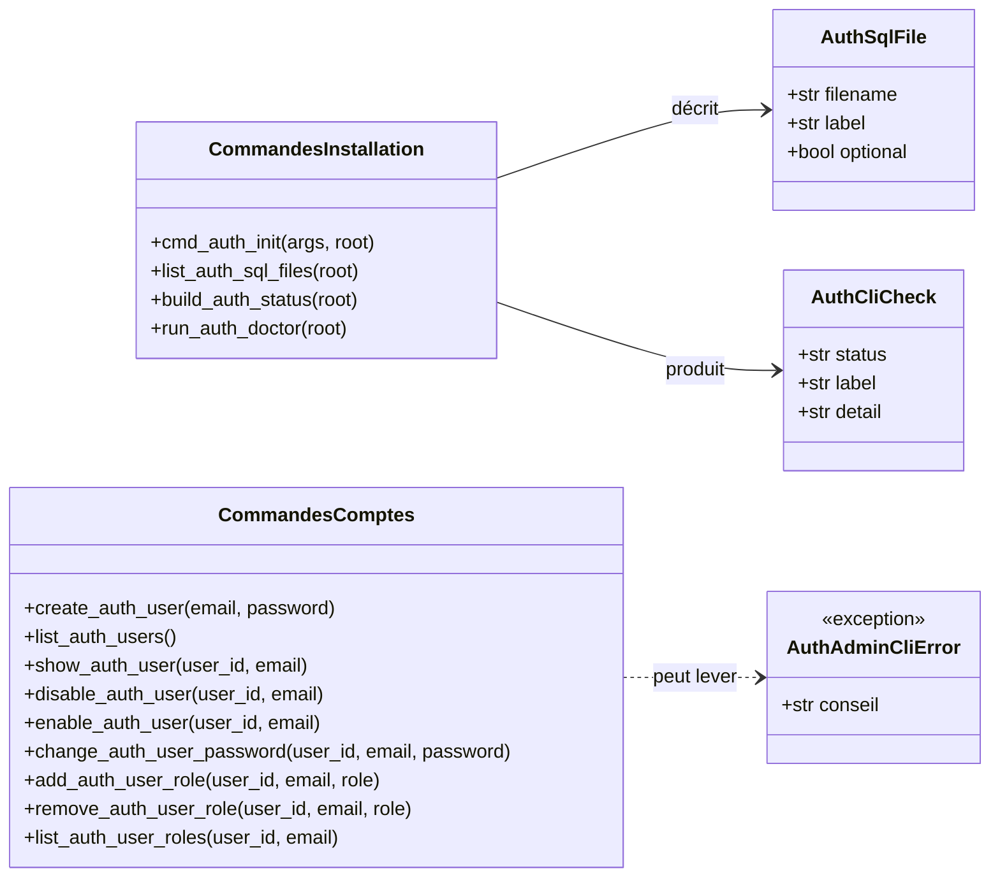
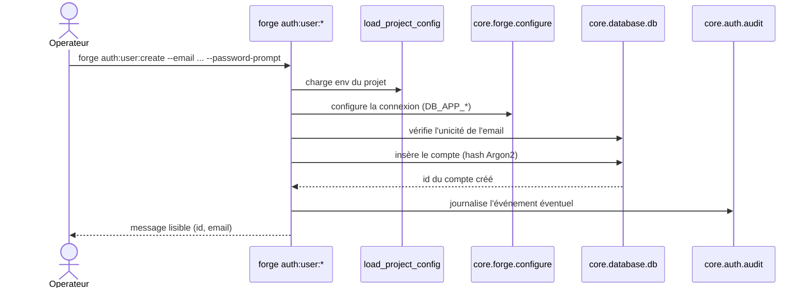

# Les commandes auth:* dans Forge

Cette page décrit la famille de commandes `forge auth:*`, qui installe le socle d'authentification et administre les comptes utilisateurs locaux.

Le code correspondant est `cli/security/auth.py`, sous-paquet CLI sécurité regroupé par l'ADR-043.

L'authentification est optionnelle dans Forge : ces commandes ne s'imposent qu'aux projets qui en ont besoin.

## 1. Rôle

Les commandes `auth:*` couvrent deux usages complémentaires.

Le premier usage est la mise en place du socle : génération du SQL optionnel des tables d'authentification, diagnostic et inventaire.

Le second usage est l'administration des comptes : créer, lister, afficher, désactiver, réactiver un utilisateur, changer son mot de passe, gérer ses rôles RBAC.

Les commandes d'installation suivent le mode Forge génère, en write-if-new : un fichier SQL existant n'est jamais écrasé (principe 9).

Les commandes de diagnostic suivent le mode Forge lit : `auth:status`, `auth:doctor` et `auth:list-sql` inspectent le projet sans toucher aux fichiers.

Les commandes d'administration des comptes parlent à la base avec les identifiants d'application (`DB_APP_*`, avec repli sur `DB_*`).

## 2. Vue d'ensemble rapide

| Élément | Valeur |
|---|---|
| Commandes Forge | `forge auth:init`, `forge auth:status`, `forge auth:doctor`, `forge auth:list-sql`, `forge auth:user:*` |
| Module Python | `cli.security.auth` |
| Catégorie | sécurité / authentification |
| Rôle | installer le socle d'authentification et administrer les comptes locaux |
| Entrées | options de ligne de commande (`--email`, `--password`, `--id`, `--role`, ...), variables d'environnement de connexion base |
| Sorties | fichiers SQL générés sous `mvc/models/sql/`, rapports de diagnostic à l'écran, lignes de comptes ou de rôles |
| Fichiers touchés | `mvc/models/sql/*.sql` en write-if-new pour `auth:init`, aucun fichier pour les autres commandes |
| Mode Forge | génère (`auth:init`), lit (`auth:status`, `auth:doctor`, `auth:list-sql`), administre la base (`auth:user:*`) |
| Erreur lisible | `AuthAdminCliError` (message plus conseil) pour les commandes d'administration |
| ADR liés | ADR-043 (regroupement CLI sécurité), ADR-033 / identifiants de connexion, ADR-084 (rendu dialectal du DDL) |

Tables couvertes par `auth:init` : `users`, `auth_tokens`, `auth_mfa_factors`, `auth_mfa_recovery_codes`, `user_roles`, `auth_audit_log` et `auth_rate_limit_attempts`.
Le SQL de ces tables est rendu dans le dialecte du backend BDD actif (ADR-084) ; sans backend résolu, `auth:init` refuse explicitement.

## 3. Schémas UML

Les deux schémas suivants montrent les structures internes des commandes, puis le déroulé d'une commande d'administration.

### 3.1 Diagramme de classe

Le diagramme de classe montre les structures de données manipulées par le module et les fonctions publiques qui les produisent.

`AuthSqlFile` décrit un fichier SQL optionnel, `AuthCliCheck` décrit une ligne de diagnostic, `AuthAdminCliError` porte un message lisible et un conseil.



À retenir :

- `AuthSqlFile` est la description statique des fichiers SQL optionnels ;
- `AuthCliCheck` est l'unité de rapport des commandes de diagnostic, avec un statut `ok`, `warn` ou `fail` ;
- les commandes d'installation produisent des `AuthCliCheck` ;
- les commandes de comptes lèvent une `AuthAdminCliError` lisible en cas de problème.

### 3.2 Diagramme de séquence

Le diagramme de séquence montre le déroulé d'une commande d'administration de compte, par exemple `auth:user:create`.

Il met en évidence le chargement de la configuration, la connexion base avec les identifiants d'application, puis le traitement de la commande.



À retenir :

- la configuration du projet est chargée avant tout accès base ;
- la connexion utilise les identifiants d'application `DB_APP_*` avec repli sur `DB_*` ;
- le mot de passe n'est jamais stocké en clair : il est haché avant insertion ;
- les commandes d'écriture journalisent un événement d'audit quand le module d'audit le permet ;
- aucun secret, jeton ou hash n'est affiché à l'écran.

## 4. Commandes et API publique

### 4.1 Commandes Forge

| Commande | Rôle | Mode |
|---|---|---|
| `forge auth:init` | crée le SQL optionnel des tables d'authentification | génère (write-if-new) |
| `forge auth:list-sql` | liste les fichiers SQL d'authentification connus et leur présence | lit |
| `forge auth:status` | affiche l'état fonctionnel du socle (modules et SQL) | lit |
| `forge auth:doctor` | diagnostique le socle sans accès base (imports et contrats) | lit |
| `forge auth:user:create` | crée un compte utilisateur local | administre |
| `forge auth:user:list` | liste les comptes, sans secret | administre |
| `forge auth:user:show` | affiche un compte, sans secret | administre |
| `forge auth:user:disable` | désactive un compte | administre |
| `forge auth:user:enable` | réactive un compte | administre |
| `forge auth:user:password` | change le mot de passe d'un compte | administre |
| `forge auth:user:role:add` | attribue un rôle RBAC existant à un compte | administre |
| `forge auth:user:role:remove` | retire un rôle RBAC existant d'un compte | administre |
| `forge auth:user:roles` | liste les rôles attribués à un compte | administre |

Options principales : `--email` et `--id` désignent le compte (un seul des deux), `--password` ou `--password-prompt` fournissent le mot de passe, `--role` désigne un rôle par id, slug ou nom.

### 4.2 Fonctions publiques du module

Les fonctions publiques du module sont réutilisables et acceptent des accès base injectables, ce qui facilite les tests.

| Fonction | Signature |
|---|---|
| `create_auth_user` | `create_auth_user(*, email, password, fetch_one=None, insert=None) -> int` |
| `list_auth_users` | `list_auth_users(*, fetch_all=None) -> tuple[dict, ...]` |
| `show_auth_user` | `show_auth_user(*, user_id=None, email=None, fetch_one=None) -> dict \| None` |
| `disable_auth_user` | `disable_auth_user(*, user_id=None, email=None, fetch_one=None, execute=None) -> int` |
| `enable_auth_user` | `enable_auth_user(*, user_id=None, email=None, fetch_one=None, execute=None) -> int` |
| `change_auth_user_password` | `change_auth_user_password(*, user_id=None, email=None, password, fetch_one=None, execute=None) -> int` |
| `add_auth_user_role` | `add_auth_user_role(*, user_id=None, email=None, role, fetch_one=None, execute=None) -> dict` |
| `remove_auth_user_role` | `remove_auth_user_role(*, user_id=None, email=None, role, fetch_one=None, execute=None) -> dict` |
| `list_auth_user_roles` | `list_auth_user_roles(*, user_id=None, email=None, fetch_one=None, fetch_all=None) -> tuple[dict, ...]` |
| `list_auth_sql_files` | `list_auth_sql_files(root=None) -> tuple[AuthCliCheck, ...]` |
| `build_auth_status` | `build_auth_status(root=None) -> tuple[AuthCliCheck, ...]` |
| `run_auth_doctor` | `run_auth_doctor(root=None) -> tuple[AuthCliCheck, ...]` |

## 5. Contextes d'utilisation

| Besoin | Commande |
|---|---|
| Mettre en place les tables d'authentification | `forge auth:init` puis `forge db:apply` |
| Vérifier l'installation sans base | `forge auth:doctor` |
| Vérifier l'état fonctionnel du socle | `forge auth:status` |
| Savoir quels SQL optionnels sont présents | `forge auth:list-sql` |
| Créer un premier compte | `forge auth:user:create` |
| Consulter les comptes existants | `forge auth:user:list` ou `forge auth:user:show` |
| Bloquer ou rouvrir un accès | `forge auth:user:disable` ou `forge auth:user:enable` |
| Réinitialiser un mot de passe | `forge auth:user:password` |
| Attribuer ou retirer un rôle | `forge auth:user:role:add` ou `forge auth:user:role:remove` |
| Lister les rôles d'un compte | `forge auth:user:roles` |

## 6. Exemples d'utilisation

Installation du socle, puis application des tables.

```bash
forge auth:init
forge db:apply
```

Diagnostic du socle sans accès base.

```bash
forge auth:doctor
```

Création d'un compte avec saisie sécurisée du mot de passe.

```bash
forge auth:user:create --email alice@exemple.fr --password-prompt
```

Liste des comptes, puis affichage d'un compte précis.

```bash
forge auth:user:list
forge auth:user:show --email alice@exemple.fr
```

Désactivation puis réactivation d'un compte.

```bash
forge auth:user:disable --email alice@exemple.fr
forge auth:user:enable --id 42
```

Gestion des rôles RBAC d'un compte.

```bash
forge auth:user:role:add --email alice@exemple.fr --role admin
forge auth:user:roles --email alice@exemple.fr
forge auth:user:role:remove --email alice@exemple.fr --role admin
```

Les fonctions publiques sont aussi appelables depuis du code Python, avec des accès base injectables.

```python
from cli.security.auth import create_auth_user, list_auth_users

user_id = create_auth_user(login="alice", password="motdepasse", email="alice@exemple.fr")
comptes = list_auth_users()
```

## 7. Détails techniques

!!! note "Mode write-if-new pour auth:init"
    `forge auth:init` ne réécrit jamais un fichier SQL existant.

    Un fichier déjà présent est signalé comme préservé et n'est pas touché.

    Cela respecte le principe 9 : Forge n'écrit pas en silence dans le code utilisateur.

!!! tip "Désigner un compte"
    Les commandes de comptes acceptent `--id` ou `--email`, mais jamais les deux à la fois.

    Si aucun des deux n'est fourni, Forge renvoie une erreur lisible avec un conseil.

!!! warning "Aucun secret affiché"
    Les commandes de lecture et de diagnostic n'affichent jamais de secret, de jeton ni de hash de mot de passe.

    Les rapports de diagnostic rappellent explicitement cette garantie en fin de sortie.

!!! note "Idempotence des rôles"
    `auth:user:role:add` ne crée pas de doublon : si le rôle est déjà attribué, la commande l'indique sans réécrire.

    `auth:user:role:remove` est tout aussi sûr : si le rôle est absent, la commande le signale sans erreur.

## Voir aussi

Cette page est la seule de la documentation embarquée du sous-paquet `cli/security`.

Les commandes de validation et d'audit des rôles `rbac:validate` et `rbac:audit` sont fournies par l'opt-in `forge-mvc-rbac` (ADR-056) : voir la documentation de ce paquet.
