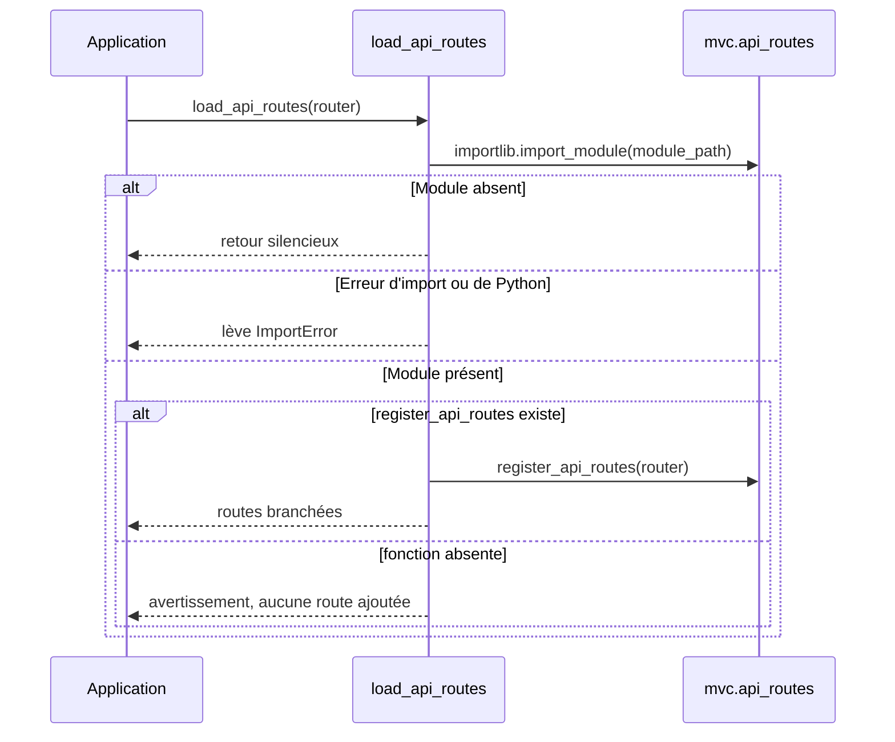

# Le chargeur de routes d'API dans Forge

Ce document décrit le chargement optionnel des routes d'API du projet.

Un projet peut exposer ses routes d'API dans un module séparé `mvc/api_routes.py`.
Ce module charge ce fichier s'il existe et y branche les routes, sans le rendre obligatoire.
Le fichier de code correspondant est `core/app/api_routes_loader.py`.

## 1. Rôle

Le chargeur tente d'importer le module désigné, par défaut `mvc.api_routes`, puis appelle sa fonction `register_api_routes(router)` si elle est présente.

L'absence du module est un cas normal : le chargeur retourne alors silencieusement, sans erreur.
En revanche, si le module existe mais contient une erreur Python, ou s'il importe lui-même un module supprimé, l'erreur est remontée plutôt que masquée.
Si le module existe mais n'expose pas `register_api_routes`, un avertissement est journalisé et aucune route n'est ajoutée.

## 2. Vue d'ensemble rapide

| Élément | Valeur |
|---|---|
| Module Python | `core.app.api_routes_loader` |
| Couche | bootstrap applicatif |
| Rôle | charger et brancher les routes d'API du projet si elles existent |
| Dépend de | `importlib`, le module `logging` |
| API publique | `load_api_routes(router, module_path="mvc.api_routes")` |
| Module attendu côté projet | `mvc/api_routes.py` exposant `register_api_routes(router)` |
| Appelé par | l'`Application` à la construction (voir `application.md`) |

## 3. Schéma de décision

Le chargeur applique une logique simple selon l'état du module ciblé.



À retenir :

- un module absent ne provoque aucune erreur : les routes d'API sont optionnelles ;
- une erreur réelle dans le module est remontée, jamais avalée ;
- l'absence de `register_api_routes` est signalée par un avertissement, pas par une exception.

## 4. API publique

| Fonction | Signature | Rôle |
|---|---|---|
| `load_api_routes` | `load_api_routes(router: Any, module_path: str = "mvc.api_routes") -> None` | charge le module s'il existe et appelle `register_api_routes(router)` |

## 5. Contextes d'utilisation

| Besoin | Élément |
|---|---|
| Brancher les routes d'API au démarrage | `load_api_routes(router)` (appelé par l'`Application`) |
| Charger un autre module de routes | `load_api_routes(router, "mon.module.routes")` |
| Désactiver le chargement | passer `api_routes_module=None` à `Application(...)` |

## 6. Exemples d'utilisation

Côté projet, le module `mvc/api_routes.py` expose la fonction attendue :

```python
def register_api_routes(router):
    router.get("/api/ping", ping_handler)
```

Côté framework, le chargement explicite d'un module de routes :

```python
from core.app.api_routes_loader import load_api_routes

load_api_routes(router)
```

## Voir aussi

- [L'application](application.md) : appelle ce chargeur à la construction.
- [La fabrique d'application](app_factory.md) : assemble l'application et son routeur.
