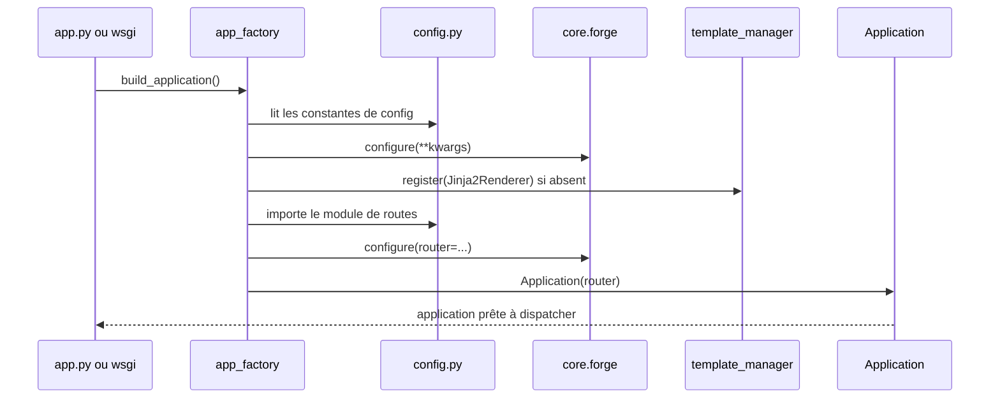

# La fabrique d'application dans Forge

Ce document décrit la construction de l'`Application` Forge configurée.

La fabrique est la source unique d'initialisation : elle lit `config.py`, applique la configuration, branche le renderer Jinja2, charge les routes et construit l'`Application`.
Le fichier de code correspondant est `core/app/app_factory.py`.

## 1. Rôle

Assembler une application Forge demande plusieurs étapes : lire la configuration du projet, l'appliquer via `forge.configure(...)`, brancher le moteur de templates Jinja2, charger le routeur, puis instancier l'`Application`.

La fabrique regroupe ces étapes en un point unique.
Elle est réutilisée par le serveur de développement (`app.py`) et par le callable WSGI de production, pour qu'aucune divergence de configuration ne s'installe entre les deux voies.
Les fonctions sont idempotentes : un second appel reconfigure Forge sans casser l'état précédent.

## 2. Vue d'ensemble rapide

| Élément | Valeur |
|---|---|
| Module Python | `core.app.app_factory` |
| Couche | bootstrap applicatif |
| Rôle | construire l'`Application` configurée à partir de `config.py` |
| Dépend de | le module applicatif `config`, `core.forge`, le gestionnaire de templates, le renderer Jinja2 |
| API publique | `apply_forge_config()`, `build_application()` |
| Objet produit | une instance de `Application` (voir `application.md`) |
| Réutilisée par | le serveur de développement et le callable WSGI |

## 3. Schéma de séquence

Le module est un petit ensemble de fonctions de bootstrap : un diagramme de séquence éclaire mieux l'enchaînement qu'un diagramme de classe.



À retenir :

- `build_application()` exécute la même séquence d'initialisation que `app.py`, sans démarrer de serveur HTTP ;
- la configuration est lue depuis le module applicatif `config`, présent dans un projet généré ;
- le renderer Jinja2 n'est branché que si aucun renderer n'est déjà enregistré (idempotence) ;
- le routeur est chargé depuis le module désigné par `config.APP_ROUTES_MODULE`.

## 4. API publique

| Fonction | Signature | Rôle |
|---|---|---|
| `apply_forge_config` | `apply_forge_config() -> None` | applique la configuration Forge lue depuis `config.py` ; idempotent |
| `build_application` | `build_application() -> Application` | construit l'`Application` complète : config, Jinja2 et routes |
| `load_bootstrap` | `load_bootstrap() -> Any \| None` | module de câblage du projet, ou `None` s'il n'en a pas |
| `project_root` | `project_root() -> Path \| None` | racine du projet, déduite de `config.py` |
| `BOOTSTRAP_MODULE` | `"bootstrap"` | nom du module de câblage, lu par les **deux** points d'entrée |

## 5. Contextes d'utilisation

| Besoin | Élément |
|---|---|
| Démarrer en développement ou en WSGI | `build_application()` |
| Initialiser la configuration sans serveur | `apply_forge_config()` |
| Obtenir une `Application` prête pour des tests | `build_application()` |

## 6. Exemples d'utilisation

Construire l'application complète :

```python
from core.app.app_factory import build_application

app = build_application()
```

Appliquer seulement la configuration, sans construire l'application :

```python
from core.app.app_factory import apply_forge_config

apply_forge_config()
```

## 7. Le câblage du projet : `bootstrap.py`

Les middlewares et les services partagés d'une application ne vivent ni dans `config.py`, qui ne porte que des valeurs, ni dans `app.py`, que cette fabrique ne lit pas.
Ils vivent dans un module `bootstrap.py`, à la racine du projet, que les **deux** points d'entrée chargent (ADR-093).

```python
# bootstrap.py, à la racine du projet
def configure_services() -> None:
    """Services partagés, posés avant la construction de l'application."""


def build_middlewares() -> list:
    """Middlewares, dans leur ordre d'évaluation."""
    return []
```

Les deux fonctions sont appelées dans cet ordre : un middleware peut avoir besoin d'un service, l'inverse ne se produit pas.

Un projet sans `bootstrap.py` n'en a pas besoin : `load_bootstrap()` rend `None`, et le comportement d'avant s'applique.
Forge n'écrit jamais dans un projet existant (principe 9), et il n'y a rien à migrer.

!!! danger "Pourquoi ce fichier existe, et ce qu'il a coûté"
    Ce câblage vivait dans `app.py`. Le chemin WSGI ne le lit pas, et construisait donc une application privée de ses gardes, sauf la première.

    Elle démarrait, répondait 200, authentifiait, et laissait passer tout ce que les gardes suivantes auraient refusé, magasin de sessions compris.
    La panne était silencieuse par nature : rien, dans aucun journal, ne la signalait.

    L'ADR-092 rend cette panne bruyante en la refusant. L'ADR-093, ce fichier, en retire la cause : la divergence devient impossible au lieu d'être détectable.

!!! tip "Source unique d'initialisation"
    La fabrique existe pour éviter que le serveur de développement et le callable WSGI configurent Forge différemment.
    Toute évolution du `forge.configure(...)` central doit être miroitée des deux côtés.
    Cette parité est verrouillée par les tests du projet.

## Voir aussi

- [L'application](application.md) : l'objet construit par la fabrique.
- [Les callables WSGI](wsgi.md) : la voie de production qui appelle la fabrique.
- [Le chargeur de routes d'API](api_routes_loader.md) : branchement optionnel des routes d'API.
