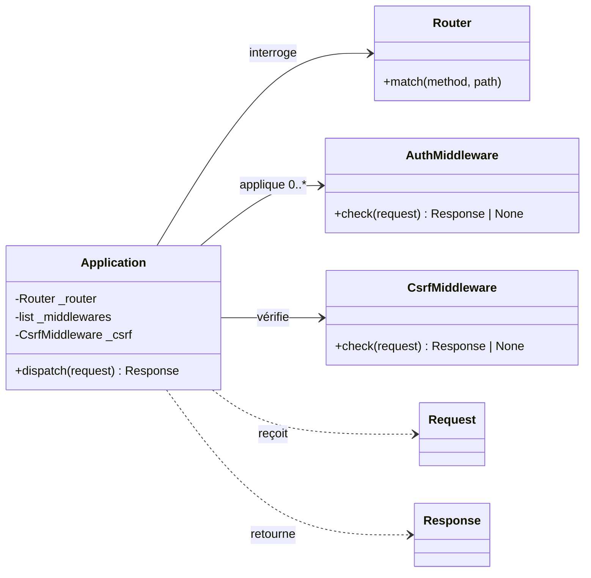
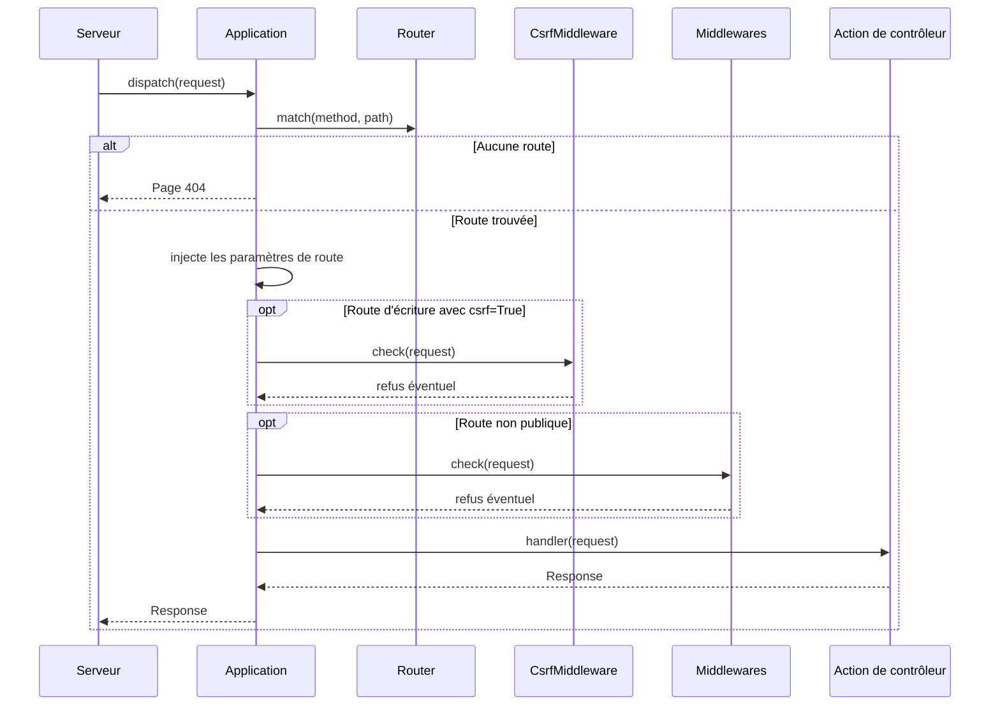

# L'application dans Forge

Ce document décrit l'objet `Application`, le cœur de l'exécution d'un projet Forge.

`Application` reçoit chaque requête déjà construite, choisit la route, applique les contrôles de sécurité, puis appelle l'action de contrôleur.
Le fichier de code correspondant est `core/app/application.py`.

## 1. Rôle

`Application` orchestre le traitement d'une requête de bout en bout.

À chaque appel, elle cherche la route correspondant à la méthode et au chemin, vérifie le jeton CSRF pour les routes d'écriture protégées, applique la chaîne de middlewares pour les routes non publiques, puis exécute le gestionnaire de la route.
Si aucune route ne correspond, elle renvoie une page 404.
Si une exception non gérée survient, elle la journalise et renvoie une page 500.

C'est l'objet que le serveur appelle pour chaque requête, que ce soit le serveur de développement ou le callable WSGI de production.
On construit rarement `Application` à la main : on passe par la fabrique `build_application()` (voir `app_factory.md`).

## 2. Vue d'ensemble rapide

| Élément | Valeur |
|---|---|
| Classe | `Application` |
| Module Python | `core.app.application` |
| Couche | bootstrap applicatif |
| Rôle | orchestrer routage, CSRF, middlewares et résolution de route vers une réponse |
| Dépend de | `Router`, `AuthMiddleware`, `CsrfMiddleware`, le chargeur de routes d'API |
| API publique | la classe `Application` et sa méthode `dispatch(request)` |
| Objet lié | `Request` en entrée, `Response` en sortie |
| Construite par | la fabrique `build_application()` |
| Appelée par | le serveur de développement et le callable WSGI |

## 3. Schémas UML

Les deux schémas suivants montrent la structure de `Application` et le déroulement d'un appel à `dispatch`.

### 3.1 Diagramme de classe

Le diagramme de classe montre les collaborateurs de `Application` : le routeur, les middlewares et le middleware CSRF.



À retenir :

- `Application` détient un routeur, une liste de middlewares et un middleware CSRF ;
- par défaut, la liste de middlewares contient un `AuthMiddleware` pointant sur l'URL de login ;
- le middleware CSRF n'est appliqué qu'aux routes d'écriture qui le demandent ;
- les autres middlewares ne s'appliquent qu'aux routes non publiques.

### 3.2 Diagramme de séquence

Le diagramme de séquence montre l'ordre des contrôles appliqués par `dispatch`.



À retenir :

- la résolution de route précède tous les contrôles ;
- les paramètres dynamiques de route sont injectés dans la requête avant les middlewares ;
- le contrôle CSRF s'applique aux routes d'écriture marquées `csrf=True`, même publiques ;
- les middlewares ne s'appliquent qu'aux routes non publiques ;
- une exception non gérée est journalisée et produit une page 500.

## 4. API publique

| Élément | Signature | Rôle |
|---|---|---|
| `Application` | `Application(router, middlewares=None, login_url="/login", csrf_middleware=None, *, api_routes_module="mvc.api_routes")` | construit l'orchestrateur ; charge les routes d'API si le module existe |
| `dispatch` | `dispatch(request: Request) -> Response` | traite une requête et retourne la réponse |

!!! note "Valeurs par défaut"
    Sans `middlewares`, Forge installe un seul `AuthMiddleware(login_url)`.
    Sans `csrf_middleware`, Forge installe un `CsrfMiddleware()`.
    Passer `api_routes_module=None` désactive le chargement des routes d'API.

## 5. Contextes d'utilisation

| Besoin | Élément |
|---|---|
| Construire l'application complète | `build_application()` (voir `app_factory.md`) |
| Traiter une requête | `application.dispatch(request)` |
| Servir en développement | le serveur de développement enveloppe une `Application` |
| Servir en production | le callable WSGI enveloppe une `Application` (voir `wsgi.md`) |
| Ajouter des middlewares personnalisés | `Application(router, middlewares=[...])` |

## 6. Exemples d'utilisation

Construction minimale à partir d'un routeur :

```python
from core.app.application import Application
from core.http.router import Router

router = Router()
# ... enregistrement des routes ...

app = Application(router)
```

Avec des middlewares personnalisés :

```python
from core.app.application import Application
from core.security.middleware import AuthMiddleware

app = Application(router, middlewares=[AuthMiddleware("/login"), MonMiddleware()])
```

Désactiver le chargement des routes d'API :

```python
app = Application(router, api_routes_module=None)
```

## 7. Comportement en cas d'erreur

!!! warning "Page 500 et environnement"
    Une exception non gérée dans une action de contrôleur est interceptée par `dispatch`.
    L'erreur est journalisée, puis Forge renvoie la page `errors/500.html`.
    En `APP_ENV=dev`, la page peut afficher la cause de l'erreur pour le diagnostic.
    En production, cette cause n'est pas exposée.

## Voir aussi

- [La fabrique d'application](app_factory.md) : `build_application` qui assemble config, Jinja et routes.
- [Les callables WSGI](wsgi.md) : servir l'application en production.
- [Le chargeur de routes d'API](api_routes_loader.md) : branchement optionnel des routes d'API.
